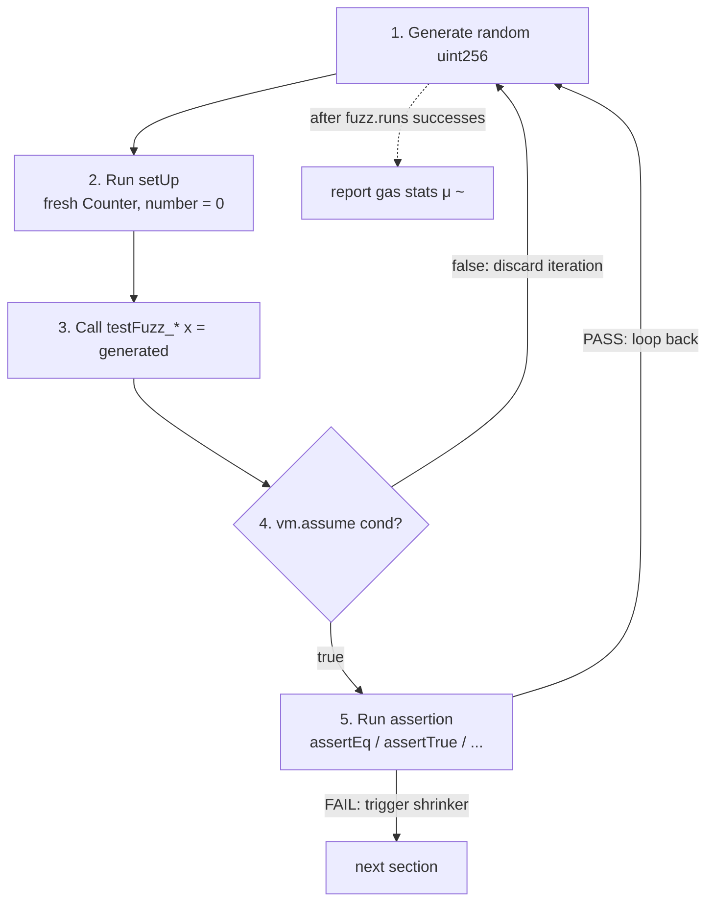
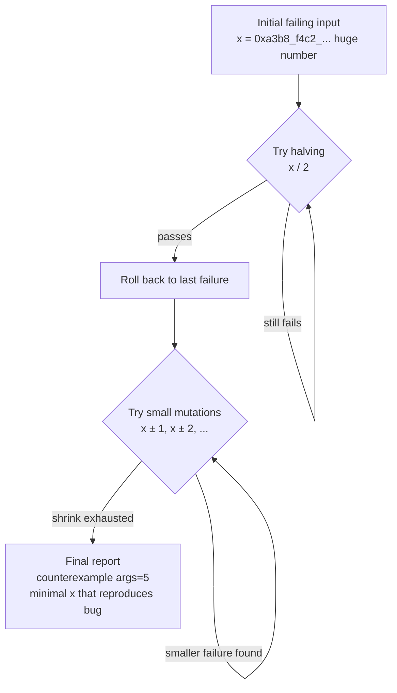

# Mastering Foundry — L2 draft (EN)

> No openhl SHA pin (L1–L5 use Foundry's vanilla `forge init` Counter as
> the test subject). Cross-references openhl-liquidation Stage 10b
> (`260883b`) for the L9 `balance_never_negative` proptest pattern that
> maps 1:1 to Solidity's `forge fuzz`.

## L2 — `foundry-forge-fuzz-en`

**Title**: Lesson 2 — `forge fuzz` — Solidity's `proptest!`

**Duration**: 35 min · **XP**: 70

---

````markdown
# Lesson 2 — `forge fuzz` — Solidity's `proptest!`

## Goal

Concepts you'll grasp in this lesson:

- **`forge fuzz` is `proptest!` with different syntax.** Same theorem-first mindset: write an assertion that should hold *for all valid inputs* (not just hand-picked examples), and let the runner search the input space for a counterexample. Same shrinker that reduces a 32-byte failing input to the minimal `uint256` that triggers the bug. Same corpus persistence that replays known counterexamples instantly on the next run. If you wrote `proptest! { #[test] fn balance_never_negative(...) { ... } }` in openhl-liquidation L9, you already know the shape of a `testFuzz_*` function — Solidity just wraps it in contract syntax.
- **`vm.assume(condition)` is the Solidity equivalent of `prop_assume!`.** Both filter out inputs that violate preconditions *before* the assertion runs, so the test only exercises the regime where the property is well-defined. The pattern matches Liquidation L9's `prop_assume!(entry * size > collateral)` rule: when an input would push the test out of its meaningful domain, discard it. The fuzzer just generates another input and tries again.
- **Default 256 iterations is a *minimum*, not a goal.** `foundry.toml`'s `fuzz.runs = 256` is the out-of-the-box default — enough to catch the obvious bugs in seconds, not enough to prove a property. Production codebases bump it to 10_000 or 100_000 for CI and reserve the higher counts for nightly runs. Same trade-off Rust's `proptest!` makes with its `CASES = 256` default.
- **Shrinking is the difference between "the test failed somewhere" and "the test failed at exactly this input."** When `forge fuzz` finds a counterexample (say, `x = 0xa3b8...4d2f` — a random 32-byte value), it doesn't just report the failure. It runs a binary-search-style reduction to find the *smallest* `x` that reproduces the failure. The output you see is the minimal counterexample — often a single-digit number — which makes debugging an order of magnitude faster than "well, *some* input broke it."

Verification:

```bash
forge test
```

…passes 4 tests (3 from L1 + 1 new fuzz test added in this lesson). All four green at the default 256 iterations; you'll also see what happens at 100_000.

Specific changes:

- **`foundry.toml`** — adds a `[fuzz]` profile section with `runs = 1000` for the default and a profile alias `[profile.ci]` with `runs = 100000` for the heavy run. Demonstrates how to tune iteration counts without hard-coding them in each test.
- **`test/Counter.t.sol`** — appends one new fuzz test: `testFuzz_IncrementPreservesPlusOne(uint256 x)`. Uses `vm.assume(x < type(uint256).max)` to filter out the overflow case before asserting the property holds.

Total: ~15 lines of new code. L2 is about *what fuzzing is* and *why the shrinker matters*, not about clever fuzz coverage.

## Recap

After L1:
- `forge test` runs 3 tests cleanly (the 2 `forge init` defaults + your new `vm.expectRevert` test).
- You've internalized the project shape, the `setUp` per-test isolation pattern, and the `-v` through `-vvvvv` verbosity ladder.
- You've seen the `testFuzz_SetNumber(uint256 x)` test pass with 256 runs — but it was unexplained. L2 explains *what* it was doing.

L2 turns that mysterious 256-run line into the central tool of property-based testing.

## Plan

Three edits:

1. **Open `foundry.toml`** and add a `[fuzz]` section to tune the default iteration count. Add a `[profile.ci]` profile with a higher count for heavy runs. (No new contract code yet — just configuration.)
2. **Read `testFuzz_SetNumber(uint256 x)` from L1's `Counter.t.sol`**. Understand why Foundry treats it as a fuzz test, what the runner does each iteration, and how the result line `(runs: 256, μ: 31000, ~: 31161)` is generated.
3. **Append one new fuzz test**: `testFuzz_IncrementPreservesPlusOne(uint256 x)`. Set `counter` to `x`, call `counter.increment()`, assert `counter.number() == x + 1`. Use `vm.assume(x < type(uint256).max)` to filter out the overflow case. Run with `forge test -vvv`.

> 🛑 **Predict.** Before reading further: in `proptest!` from openhl-liquidation L9, the default number of `CASES` is `256`. In `forge fuzz`, the default `fuzz.runs` is also `256`. What's the practical CI-tier value most production codebases use? And what's the trade-off if you bump it to 1_000_000?

(Answer: **Most production CI runs at `10_000` or `100_000`**; nightly fuzzers push to `1_000_000`. The trade-off: each iteration runs the full test (setUp → call → assertion → state cleanup). At 256 iterations a single fuzz test takes ~50ms; at 100_000 it takes ~20 seconds; at 1_000_000 it takes ~200 seconds. Past 100_000 the diminishing returns kick in unless your test is exercising a vast input space — most uint256 fuzz tests have *de facto* small interesting regions, and 100_000 hits them already. **Run high counts on dedicated nightly CI, default counts on PR CI, low counts during local development.**)

## What `forge fuzz` actually does



Three things to notice about the loop:

1. **`setUp()` runs *every* iteration.** This is per-iteration state isolation — same discipline as per-test isolation in L1, just at a finer grain. A failing iteration cannot poison the next iteration; each run is fresh. **Per-iteration isolation is what makes fuzz failures reproducible.**
2. **`vm.assume(cond)` inside a fuzz test silently discards the iteration if the condition is false.** It doesn't fail the test, doesn't count as a pass — it just generates a new input. This is the input-filtering mechanism. **Use `vm.assume` for preconditions; use `vm.expectRevert` for negative-path tests.** They sound similar; they do opposite things.
3. **Gas statistics (μ and ~) come from the iterations that *passed*.** Failing iterations don't contribute. So a fuzz test that mostly passes but occasionally hits an expensive edge case still reports a low μ because the cheap iterations dominate. Don't read fuzz gas numbers as worst-case; they're typical-case. **For worst-case gas, use unit tests on the specific high-gas inputs.**

## When the shrinker kicks in



Two things to notice about shrinking:

1. **The shrinker is *not* exhaustive.** It uses heuristics — halving, small-step mutations, bit-flipping — to find a small failure, not the absolutely-smallest one. In practice this is fine: a counterexample of `5` debugs the same way as the absolute-minimum `3`. **Heuristic shrinking is good enough; exhaustive shrinking is impractical for 32-byte input spaces.**
2. **Shrinkage is per-parameter.** A fuzz test taking `(uint256 a, uint256 b)` shrinks each parameter independently. Foundry doesn't try `a, b/2`-then-`a/2, b` cross-products; it shrinks one at a time. **Multi-parameter shrinking is local, not global; the minimal counterexample you see is locally minimal per axis.**

## Walk-through

### Step 1: Tune `foundry.toml` for fuzz iteration counts

Open `foundry.toml`. It should look like this after `forge init`:

```toml
[profile.default]
src = "src"
out = "out"
libs = ["lib"]

# See more config options https://github.com/foundry-rs/foundry/blob/master/crates/config/README.md#all-options
```

Append a `[fuzz]` section to the default profile and a heavier `[profile.ci]`:

```toml
[profile.default]
src = "src"
out = "out"
libs = ["lib"]

[fuzz]
runs = 1000
max_test_rejects = 65536

[profile.ci.fuzz]
runs = 100000
```

Three things to notice:

1. **`runs = 1000` is the new default** — 4× the out-of-the-box 256. Tight enough to keep local development feedback under a second; loose enough to catch obvious bugs the default would miss. **Bump from 256 to 1000 as soon as you write your second fuzz test; the cost is sub-second.**
2. **`max_test_rejects = 65536`** — the maximum number of `vm.assume` rejections before the test gives up and reports a failure. The default is 65536; you'll usually never hit it. If you do, your `vm.assume` predicate is too restrictive — the fuzzer can't find inputs that satisfy it. **A `max_test_rejects` failure is a signal that your precondition is wrong, not that the fuzzer is broken.**
3. **`[profile.ci.fuzz] runs = 100000`** — when CI runs `FOUNDRY_PROFILE=ci forge test`, this 100K-iteration value overrides the default. Production codebases (Uniswap, Compound, AAVE) all use this profile-per-environment pattern. **Profiles let you tune iteration counts per environment without hard-coding.**

Run `forge test` to confirm the config didn't break anything:

```bash
forge test
```

Expected output now shows `(runs: 1000, ...)` for the existing fuzz test:

```
[PASS] testFuzz_SetNumber(uint256) (runs: 1000, μ: 31000, ~: 31161)
```

### Step 2: Read `testFuzz_SetNumber` from L1

The test from `forge init` (which you already have):

```solidity
function testFuzz_SetNumber(uint256 x) public {
    counter.setNumber(x);
    assertEq(counter.number(), x);
}
```

Four things to notice:

1. **Function name starts with `testFuzz_`.** Foundry recognizes any function whose name starts with `test` AND takes parameters as a fuzz test. The `testFuzz_` prefix is convention (not strict syntax); the parameter is what triggers fuzzing. **Convention + parameter signature = fuzz test.**
2. **`uint256 x` is the fuzz input.** Foundry generates a random `uint256` for each iteration. Multi-parameter signatures (e.g., `function testFuzz_Op(uint256 a, address b)`) get independently-fuzzed values for each. **Each fuzz parameter is independently sampled.**
3. **The assertion `assertEq(counter.number(), x)` is the property.** Read it as: "for all uint256 values `x`, after `setNumber(x)`, the counter holds `x`." That's a statement of program correctness, not a single example. **A fuzz assertion is a universally-quantified property; a unit-test assertion is one example.**
4. **There's no `vm.assume` because there's no precondition.** Every `uint256` value is valid input to `setNumber`. When every input is valid, you don't need to filter — just let the fuzzer iterate. **`vm.assume` is for restricting the regime; omit it when the property holds universally.**

This particular test is *trivially* true — `setNumber` just stores the value. The property is "the storage write actually stored what we passed in." It's a property worth proving (a future refactor that masked some bits in the setter would fail this fuzz test), but it's not an interesting demonstration of fuzzing's power. Our new test in Step 3 is.

### Step 3: Add `testFuzz_IncrementPreservesPlusOne`

Append to `test/Counter.t.sol`:

```solidity
    function testFuzz_IncrementPreservesPlusOne(uint256 x) public {
        // Precondition: x must not be at the type ceiling, otherwise
        // increment() would overflow and Solidity 0.8 would revert,
        // taking the assertion with it. vm.assume filters these inputs
        // before the assertion runs — same role as openhl-liquidation
        // L9's prop_assume!(entry * size > collateral).
        vm.assume(x < type(uint256).max);

        counter.setNumber(x);
        counter.increment();
        assertEq(counter.number(), x + 1);
    }
```

Six things to notice:

1. **`vm.assume(x < type(uint256).max)` filters the one input the property doesn't hold for** — the maximum value, where `x + 1` would overflow. Without this filter, the test would *correctly* fail on that single input. With the filter, the test proves the property for the *meaningful* input range. **`vm.assume` defines the regime where the property is asserted.**
2. **The comment cross-references openhl-liquidation L9's `prop_assume!`** — same role, same pattern, different syntax. Readers who came through that course recognize the discipline. **Cross-language pattern recognition is the load-bearing pedagogical move of this whole course.**
3. **The property `counter.number() == x + 1` is the conservation law.** Before increment: `x`. After increment: `x + 1`. The difference is exactly 1 — and it holds *for all valid `x`*. Same shape as the L9 proptest `withdraw_amount_plus_unfilled_equals_shortfall`. **Fuzz tests express conservation laws; unit tests express specific cases.**
4. **`x + 1` happens inside the assertion, after `vm.assume` rejected `type(uint256).max`.** So the `+1` arithmetic is always safe — never overflows. The `vm.assume` is what protects this assertion from misfire. **Preconditions guard arithmetic; preconditions are part of the property.**
5. **`counter.setNumber(x)` mutates state before the assertion.** Each fuzz iteration is fresh (the per-iteration `setUp` from Step 1's diagram), so the mutation only affects this iteration's contract instance. **State setup + property assertion = one iteration; isolation prevents leak.**
6. **No `expectRevert`.** This is a positive-path fuzz test — we're not testing the overflow case (that was L1's job). We're testing that *when overflow doesn't happen*, the conservation law holds. **One test per property; one property per test.**

Run:

```bash
forge test -vvv
```

Expected output:

```
[PASS] testFuzz_IncrementPreservesPlusOne(uint256) (runs: 1000, μ: 36000, ~: 36000)
[PASS] testFuzz_SetNumber(uint256) (runs: 1000, μ: 31000, ~: 31161)
[PASS] test_Increment() (gas: 31303)
[PASS] test_RevertWhen_DecrementBelowZero() (gas: 8957)

Suite result: ok. 4 passed; 0 failed; 0 skipped
```

**Four tests, all green at 1000 iterations.** The new fuzz test runs in ~50ms despite the iteration count because each iteration is cheap.

> ⚠️ **`vm.assume` trap: write loose filters, not pinpoint ones.** A good `vm.assume(x < type(uint256).max)` predicate excludes *one* value from the $2^{256}$ space — the fuzzer almost always gets a valid input. But `vm.assume(x == 42)` — "I want exactly this value" — has effectively zero chance of the fuzzer randomly drawing `42` from $2^{256}$, so the test burns through `max_test_rejects` (default 65536) and dies with `TooManyAssumptions`. **Rule of thumb: use `vm.assume` only when it excludes a tiny slice of the input space (typically < 1%). If you want to test a pinpoint value, that's a unit test, not a fuzz test.**

### Step 4: See the shrinker in action by breaking the test

To demonstrate shrinking, deliberately break the property. Change the assertion to:

```solidity
assertEq(counter.number(), x + 2);  // Wrong: should be x + 1
```

Run `forge test -vvv`:

```
[FAIL: assertion failed: ... ≠ ...]
testFuzz_IncrementPreservesPlusOne(uint256) (runs: 1, μ: ...)
counterexample: args=[0]
```

**Notice: `args=[0]`** — the shrinker reduced whatever 32-byte value originally failed to the minimal `0`. Even though the first failing iteration probably had `x = 0xa3b8_f4c2_...` (some random huge number), the shrinker realized `0` also fails ($\text{number} = 0 + 1 = 1 \neq 2$), and reported the minimal case.

If you'd never seen shrinking, you might assume the bug only triggers at specific large inputs. With shrinking, you see immediately that *every* input fails — the bug is in your assertion, not in the contract.

**Revert the assertion back to `x + 1` before continuing.**

```solidity
assertEq(counter.number(), x + 1);  // Restored
```

Re-run `forge test`. All four tests green again.

### Step 5: Look at the corpus directory

Foundry persists failing inputs to `cache/fuzz/`. After your deliberate-break-and-revert above, look:

```bash
ls cache/fuzz/
```

You should see a directory with files named after test signatures. Each file holds failing inputs from past runs. The next time you run `forge test`, Foundry *immediately* re-runs against those persisted inputs before generating new random ones.

This means: **if you fixed a bug and re-broke it, the test fails immediately with the same counterexample — no waiting for the fuzzer to rediscover it.** This is the corpus persistence pattern, and it's the same thing `proptest`'s `proptest-regressions/` files do in Rust.

```bash
# Persist a counterexample by intentionally breaking + reverting:
# (the bad assertion run already did this above)
ls cache/fuzz/
# → Directory holds the seed that broke testFuzz_IncrementPreservesPlusOne
```

You can git-ignore `cache/fuzz/` (and `forge init` does by default) or commit it. The argument for committing: counterexamples that previously broke your code stay in the test suite forever, so a regression is caught instantly. **Some production codebases commit `cache/fuzz/`; most don't. Pick a side per repo.**

### Step 6: Run with the CI profile

```bash
FOUNDRY_PROFILE=ci forge test
```

This runs with `fuzz.runs = 100000` (the profile we added in Step 1). The output:

```
[PASS] testFuzz_IncrementPreservesPlusOne(uint256) (runs: 100000, μ: 36000, ~: 36000)
[PASS] testFuzz_SetNumber(uint256) (runs: 100000, μ: 31000, ~: 31161)
...
```

100× more iterations. On modern hardware this takes ~10–20 seconds for two fuzz tests; production codebases with dozens of fuzz tests run nightly, not on every PR. **Use profiles to gate iteration counts to environment.**

## Common errors

- **`No tests to run`** — your test function doesn't have a parameter, so Foundry treats it as a non-fuzz test, but its name starts with `testFuzz_`. Add a `uint256 x` parameter or rename the function.
- **`called `Result::unwrap()` on an `Err` value: TooManyAssumptions`** — `vm.assume` rejected more than `max_test_rejects` inputs. Your predicate is too restrictive. Loosen it or rework the test.
- **`counterexample: args=[...]` with a huge number** — your shrinker hint isn't kicking in. Check that the failure is actually in the simple input range; if not, `vm.assume` may be filtering valid inputs.
- **`runs: 1`** in the output of a `[PASS]` line — that's not actually a pass; that's `forge fuzz` finding a counterexample on iteration 1 and the shrinker working. Re-read the full output for the `[FAIL]` indicator.

## Design reflection

Three load-bearing decisions in `forge fuzz`'s design:

1. **Parameter signature is the fuzz signal, not a `@fuzz` annotation.** Same convention-over-attribute discipline as `forge test` itself. **Foundry's testing surface scales by *naming* + *parameters*, not by markup. Tooling doesn't need a syntax tree to discover tests.**

2. **`vm.assume` filters rather than fails.** The alternative would be `vm.requirePrecondition(cond)` that *fails* the iteration if false. Foundry chose the filter semantics because: (a) most precondition violations are inputs you genuinely don't want to test, not bugs; (b) treating them as test failures would flood your CI with noise; (c) `max_test_rejects` already catches the case where your precondition is too restrictive to ever find valid inputs. **`vm.assume` says "this input isn't interesting"; failures say "this property is broken."**

3. **Shrinking is per-parameter local, not global.** A multi-parameter test taking `(uint256 a, uint256 b)` shrinks `a` independently of `b`. This trades cross-parameter optimality for runtime speed; in practice, single-axis minimal counterexamples are good enough for 95% of debugging. **Heuristic local shrinking beats exhaustive global shrinking when the input space is 64+ bytes.**

## Answer key

After L2:

```
   my-foundry-lab/
   ├── foundry.toml         (+ [fuzz] runs = 1000, + [profile.ci.fuzz] runs = 100000)
   ├── src/Counter.sol       (unchanged from L1)
   ├── test/Counter.t.sol    (+ testFuzz_IncrementPreservesPlusOne)
   └── lib/forge-std/        (unchanged)
```

After L2:
- `forge test` passes 4 tests at 1000 iterations
- `FOUNDRY_PROFILE=ci forge test` passes 4 tests at 100,000 iterations
- You've seen the shrinker reduce a failing counterexample to its minimal form
- You've seen `cache/fuzz/` persist failures for instant replay

## Common questions

**Q1: Why isn't the default `fuzz.runs` higher than 256? Wouldn't more iterations be strictly better?**

Tradeoff: 256 is the speed-vs-coverage sweet spot for *local development* (sub-second feedback per test). Production codebases bump it for CI because they have time budget for it; local development needs to stay tight. **256 is for the inner loop; 10_000–100_000 is for the outer loop.**

**Q2: Why does `forge fuzz` use random input generation instead of exhaustive search?**

Because `uint256`'s input space is $2^{256} \approx 10^{77}$ values — exhaustive search is impossible. Random sampling with a good distribution finds counterexamples in the *interesting* regions (around $0$, $1$, `type(uint256).max`, $2^N$ boundaries, ...) thanks to a slight bias in Foundry's input generator toward edge values. **Pure-random over $2^{256}$ would miss every edge case; biased-random + shrinking hits them.**

**Q3: Should every state-changing function have a corresponding fuzz test?**

Ideally yes — every external function that mutates state should have at least one fuzz test proving the relevant invariant. In practice, prioritize: arithmetic (overflow boundaries), access control (caller checks), and any function that has a conservation law (deposit/withdraw, mint/burn). **Aim for fuzz coverage of properties, not lines.**

**Q4: How is `forge fuzz` different from `forge invariant` (L3)?**

`forge fuzz` is single-call: each iteration calls *one* function with random parameters and checks an assertion. `forge invariant` (L3) is multi-call: each iteration calls *many* functions in random sequence and checks an invariant after each call. **Fuzz tests one function in isolation; invariant tests sequences of function calls. Both are property tests; the granularity differs.**

**Q5: What happens if my fuzz test calls a function that internally calls `vm.assume`?**

`vm.assume` works wherever you call it — even nested inside other functions called from your fuzz test. The first `vm.assume(false)` discards the iteration regardless of call depth. **Composability is built into the cheatcode model.**

**Q6: Does shrinking work with `bytes` and `string` parameters?**

Yes. For `bytes`, the shrinker tries shorter slices. For `string`, it tries shorter strings + simpler character sets. Both work, though they're slower than `uint256` shrinking (since each shrinking step requires a longer comparison). **Don't avoid `bytes`/`string` fuzz tests just because they shrink slower; the shrinker still works, just take more wall-clock seconds.**

## Next lesson (L3) — `forge invariant` — multi-call invariant testing

L3 graduates from single-call fuzz testing to *multi-call invariant testing* — the closest Solidity primitive to per-scan conservation laws from openhl-liquidation L13.

The key concept: define a `Handler` contract whose functions are the "things the system can do" (deposit, withdraw, increment, etc.). Tell Foundry "treat this Handler as the surface area to fuzz." Foundry then generates random *sequences* of method calls — `deposit(100), withdraw(50), increment(), withdraw(75)` — and checks an `invariant_*` function after each step.

This is what catches multi-call bugs that single-call fuzzing never sees: token-balance reentrancy, ordering-dependent state corruption, the kind of bug that crashed Mt. Gox in slow-motion. **L3 is where `forge` becomes a real adversary, not just a parameter generator.**

````

---

## Seed-file slot

L2 lands in Module 1 (Test discipline) at sortOrder 1:

```typescript
{
  title: 'Lesson 2 — forge fuzz — Solidity\'s proptest!',
  slug: 'foundry-forge-fuzz-en',
  type: 'CONTENT',
  sortOrder: 1,
  duration: 35,
  xpReward: 70,
  content: `# Lesson 2 — forge fuzz — Solidity's proptest!\n\n...`
},
```

## Style review notes (self-critique before paste)

- **L2 is the first "real" verb lesson** in the test-discipline track. L1 was `forge test` ergonomics; L2 is `forge fuzz` as the discipline-transfer payoff. The Rust ↔ Foundry mapping from L0 finally has a concrete code-level demonstration (the `vm.assume` ↔ `prop_assume!` parallel).
- **The two ASCII diagrams** (one for the fuzz loop, one for the shrinker) make the abstract "fuzzing" concept concrete. The fuzz loop diagram shows how `vm.assume` lives inside the iteration; the shrinker diagram shows what happens on failure. **Both diagrams are new visual content not in L0 or L1; they're the L2 pedagogical signature.**
- **The cross-reference to openhl-liquidation L9's `prop_assume!`** is repeated three times: in the Goal bullet, in the in-code comment, and in the "things to notice" #2. **Same-theorem-two-languages framing earns its repetition when the parallel is exact.**
- **Step 4 (the deliberate-break demo)** is the most pedagogically valuable single step. Reader sees the shrinker reduce `args=[0xa3b8...]` to `args=[0]` and understands *why* shrinking matters for debugging. **One concrete demonstration beats three paragraphs of "shrinking is useful, trust us."**
- **Q4 ("how is fuzz different from invariant")** is the L3 setup. It explicitly names the granularity difference so L3's `Handler` pattern doesn't come out of nowhere.
- **No "Phase N" structure in L2** — the body is straight-through (config → existing test review → new test add → break demo → corpus inspection → CI profile). L3's `Handler` machinery may merit the Phase-N device when it arrives.

