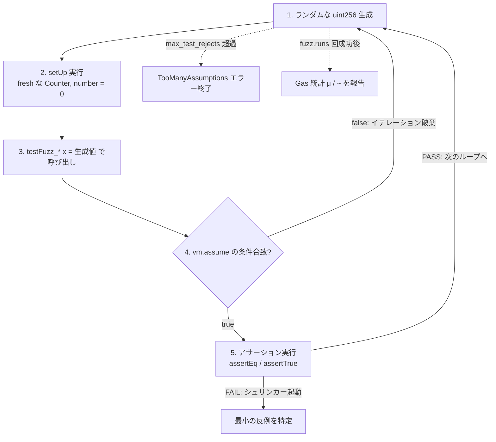
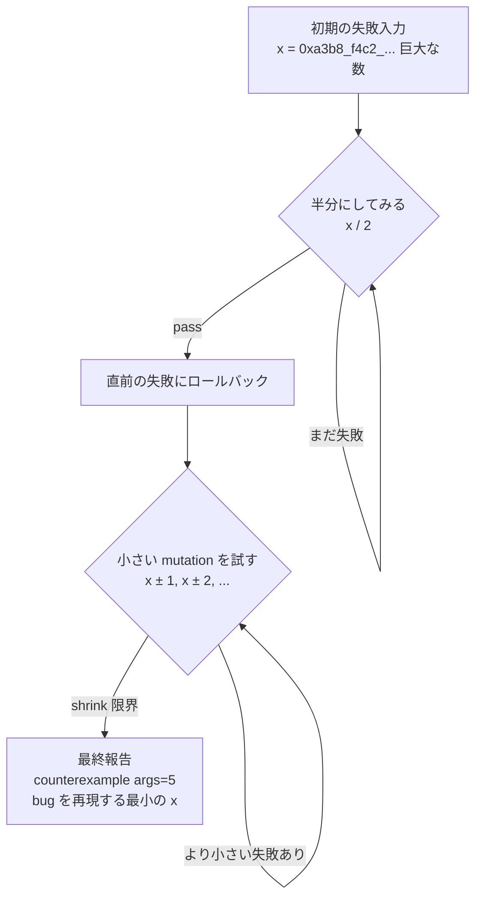

# Mastering Foundry — L2 draft (JA)

> openhl SHA pin はなし（L1–L5 は Foundry の vanilla `forge init` Counter を test subject に使う）。openhl-liquidation Stage 10b (`260883b`) の L9 `balance_never_negative` proptest パターンを cross-reference する — Solidity の `forge fuzz` に 1:1 で map する。

## L2 — `foundry-forge-fuzz-ja`

**Title**: レッスン 2 — `forge fuzz` — Solidity の `proptest!`

**Duration**: 35 分 · **XP**: 70

---

````markdown
# レッスン 2 — `forge fuzz` — Solidity の `proptest!`

## ゴール

このレッスンで掴む概念:

- **`forge fuzz` は別構文の `proptest!`。** 同じ「定理先行（Theorem-first）」のマインドセット: assertion が *すべての valid な入力に対して* 成立するべきと書き（hand-picked example だけではなく）、runner に入力空間の counterexample を探させる。同じ shrinker が 32-byte の失敗入力を、bug を trigger する最小の `uint256` に reduce する。同じ corpus persistence が既知の counterexample を次回 run で即座に replay する。openhl-liquidation L9 で `proptest! { #[test] fn balance_never_negative(...) { ... } }` を書いたなら、`testFuzz_*` 関数の形はすでに知っている。Solidity が contract 構文で包むだけだ。
- **`vm.assume(condition)` は `prop_assume!` の Solidity 等価物。** どちらも前提条件に違反する入力を、assertion が走る *前* に filter する。Test は property の well-defined な regime だけを exercise する。Liquidation L9 の `prop_assume!(entry * size > collateral)` と同じパターン: 入力が test の意味ある domain から外れるなら捨てる。Fuzzer は別の入力を生成して再試行する。それだけ。
- **デフォルト 256 iteration は *最小* であって、ゴールではない。** `foundry.toml` の `fuzz.runs = 256` が out-of-the-box デフォルト。明らかな bug を数秒で catch するには十分、property を証明するには不十分。Production codebase は CI で 10_000 や 100_000 まで bump し、より高い count は nightly run のために予約する。Rust の `proptest!` が `CASES = 256` デフォルトで取るのと同じ trade-off。
- **Shrinking は「test がどこかで失敗した」と「test が *正確にこの入力で* 失敗した」の差。** `forge fuzz` が counterexample (例えば `x = 0xa3b8...4d2f` — ランダムな 32 バイト値) を見つけたとき、失敗を報告して終わりではない。Binary-search スタイルの reduction を走らせ、失敗を再現する *最小* の `x` を見つける。出力に現れるのは minimal counterexample (しばしば 1 桁の数字) で、「ある入力で壊れた」より一桁速く debug できる。

確認:

```bash
forge test
```

…で 4 つの test が pass する (L1 由来の 3 つ + 本レッスンで追加する fuzz test 1 つ)。デフォルト 256 iteration では 4 つすべて green。100_000 iteration での挙動も見る。

具体的な変更:

- **`foundry.toml`** — `[fuzz]` profile セクション (`runs = 1000`) と、heavy run 用のプロファイル alias `[profile.ci]` (`runs = 100000`) を追加。各 test に hard-coding せずに iteration count を tune するやり方のデモ。
- **`test/Counter.t.sol`** — 新規 fuzz test を 1 つ追加: `testFuzz_IncrementPreservesPlusOne(uint256 x)`。`vm.assume(x < type(uint256).max)` で overflow ケースを assertion 前に filter する。

合計で約 15 行の新規コード。L2 の主題は *fuzzing とは何か* と *なぜ shrinker が重要か* であって、賢い fuzz coverage ではない。

## おさらい

L1 の後はこうなっている。
- `forge test` が 3 つの test (forge init デフォルトの 2 + L1 で追加した `vm.expectRevert` test) を clean に走らせる。
- プロジェクト形、`setUp` per-test isolation パターン、`-v` から `-vvvvv` までの verbosity ladder を内面化済み。
- `testFuzz_SetNumber(uint256 x)` test が 256 runs で pass するのを見た。ただし説明はなかった。L2 がその *中身* を説明する。

L2 がその謎の 256-run 行を property-based testing の中心ツールに変える。

## 計画

編集は 3 つ。

1. **`foundry.toml` を開く** — `[fuzz]` セクションを追加してデフォルト iteration count を tune する。Heavy run 用に `[profile.ci]` を追加。(まだ新規 contract code なし。設定のみ。)
2. **L1 の `Counter.t.sol` の `testFuzz_SetNumber(uint256 x)` を読む。** Foundry が fuzz test として扱う理由、runner が各 iteration で何をするか、結果行 `(runs: 256, μ: 31000, ~: 31161)` がどう生成されるかを理解する。
3. **新規 fuzz test を 1 つ追加** — `testFuzz_IncrementPreservesPlusOne(uint256 x)`。`counter` を `x` にセット、`counter.increment()` を呼ぶ、`counter.number() == x + 1` を assert する。`vm.assume(x < type(uint256).max)` で overflow ケースを filter する。`forge test -vvv` で走らせる。

> 🛑 **予測。** 続きを読む前に: openhl-liquidation L9 の `proptest!` で `CASES` のデフォルトは `256`。`forge fuzz` でも `fuzz.runs` のデフォルトは `256`。Production codebase がよく使う CI-tier の実用値は? `1_000_000` に bump するとトレードオフは?

(答え: **ほとんどの production CI は `10_000` か `100_000` で回す**。Nightly fuzzer は `1_000_000` まで push する。トレードオフはこう。各 iteration が full test (setUp → call → assertion → state cleanup) を走らせる。256 iteration なら単一の fuzz test は ~50ms、100_000 で ~20 秒、1_000_000 で ~200 秒。100_000 を超えると収穫逓減（Diminishing returns）が始まる。巨大な入力空間を exercise していない限り、だが。ほとんどの uint256 fuzz test には *de facto* 小さい interesting region があり、100_000 でそこに到達する。**High count は専用 nightly CI で、デフォルト count は PR CI で、低 count はローカル開発で。**)

## `forge fuzz` が実際に何をするか



Loop で押さえる点が 3 つ。

1. **`setUp()` が *毎* iteration 走る。** これが per-iteration state isolation。L1 の per-test isolation と同じ規律だが、より細かい粒度だ。失敗する iteration が次の iteration を poison できない。各 run は fresh。**Per-iteration isolation が fuzz failure を reproducible にする。**
2. **Fuzz test 内の `vm.assume(cond)` は、condition が false なら iteration を暗黙的に破棄（Discard）する。** Test を失敗させず、pass としてもカウントしない。新しい入力を生成するだけだ。これが入力 filtering メカニズム。**Precondition には `vm.assume`、negative-path test には `vm.expectRevert`。** 似て聞こえるが、逆のことをする。
3. **Gas 統計 (μ と ~) は *pass した* iteration から来る。** 失敗 iteration は寄与しない。Fuzz test がほぼ pass するが時々高コストな edge case に当たる場合、cheap iteration が dominant で μ は低く報告される。Fuzz gas 値を worst-case として読まない。typical-case だ。**Worst-case gas が欲しければ、特定の high-gas 入力に対する unit test を使う。**

## Shrinker が発火するとき



Shrinking で押さえる点が 2 つ。

1. **Shrinker は *網羅的ではない*。** ヒューリスティック (半分にする、small-step mutation、bit-flipping) を使い、絶対的な最小ではなく「小さい」失敗を見つける。実務的にはこれで十分。counterexample `5` は absolute-minimum `3` と同じように debug できる。**ヒューリスティック shrinking で十分。32-byte 入力空間に exhaustive shrinking は実用的でない。**
2. **Shrinkage は per-parameter。** `(uint256 a, uint256 b)` を取る fuzz test は各パラメータを独立に shrink する。Foundry は `a, b/2` の後 `a/2, b` のような cross-product を試さない。1 つずつ shrink する。**Multi-parameter shrinking は大域的最適（Global）ではなく局所的最適（Local）。出力に現れる minimal counterexample は per-axis に局所的に minimal。**

## 手を動かす walk-through

### Step 1: Fuzz iteration count のために `foundry.toml` を tune する

`foundry.toml` を開く。`forge init` の後はこう見えるはず:

```toml
[profile.default]
src = "src"
out = "out"
libs = ["lib"]

# See more config options https://github.com/foundry-rs/foundry/blob/master/crates/config/README.md#all-options
```

`[fuzz]` セクションを default profile に追加し、より heavy な `[profile.ci]` も追加:

```toml
[profile.default]
src = "src"
out = "out"
libs = ["lib"]

[fuzz]
runs = 1000
max_test_rejects = 65536

[profile.ci.fuzz]
runs = 100000
```

押さえる点が 3 つ。

1. **`runs = 1000` が新しいデフォルト** — out-of-the-box の 256 の 4 倍。ローカル開発の feedback を 1 秒未満に保つには tight、デフォルトが見逃す明らかな bug を catch するには loose。**2 つ目の fuzz test を書く時点で 256 から 1000 に bump する。コストは sub-second。**
2. **`max_test_rejects = 65536`** — test が失敗を報告する前に許容する `vm.assume` rejection の最大数。デフォルトは 65536、通常は到達しない。到達したならば `vm.assume` predicate が too restrictive だ。fuzzer がそれを満たす入力を見つけられない。**`max_test_rejects` 失敗は、precondition が wrong である signal であって、fuzzer が壊れている signal ではない。**
3. **`[profile.ci.fuzz] runs = 100000`** — CI が `FOUNDRY_PROFILE=ci forge test` を走らせると、この 100K-iteration 値がデフォルトを上書きする。Production codebase (Uniswap、Compound、AAVE) はすべてこの profile-per-environment パターンを使う。**Profile が iteration count を環境ごとに tune させる。hard-coding なしで。**

`forge test` を走らせて config が何も壊していないことを確認:

```bash
forge test
```

期待される出力は既存 fuzz test に `(runs: 1000, ...)` を表示するようになる:

```
[PASS] testFuzz_SetNumber(uint256) (runs: 1000, μ: 31000, ~: 31161)
```

### Step 2: L1 の `testFuzz_SetNumber` を読む

`forge init` 由来の test (すでに持っている):

```solidity
function testFuzz_SetNumber(uint256 x) public {
    counter.setNumber(x);
    assertEq(counter.number(), x);
}
```

押さえる点が 4 つ。

1. **関数名が `testFuzz_` で始まる。** Foundry は名前が `test` で始まり、かつパラメータを取る関数を fuzz test として認識する。`testFuzz_` プレフィックスは慣例 (strict な構文ではない)。パラメータが fuzzing を trigger する。**慣例 + パラメータ signature = fuzz test。**
2. **`uint256 x` が fuzz input。** Foundry は各 iteration でランダムな `uint256` を生成する。Multi-parameter signature (例: `function testFuzz_Op(uint256 a, address b)`) は各パラメータに独立に fuzz された値を得る。**各 fuzz パラメータが独立にサンプリングされる。**
3. **`assertEq(counter.number(), x)` の行が property。** こう読む。「すべての uint256 値 `x` について、`setNumber(x)` 後に counter は `x` を保持する」。これは program correctness の statement で、単一 example ではない。**Fuzz assertion は普遍量化された property、unit-test assertion は 1 つの example。**
4. **`vm.assume` がない。precondition がないから。** すべての `uint256` 値が `setNumber` への valid 入力だ。すべての入力が valid なら filter する必要はない。fuzzer に iterate させるだけだ。**`vm.assume` は regime を制限するためのもの。Property が普遍的に成立するなら省く。**

この特定 test は *trivially* true。`setNumber` がただ値を保存するだけだ。Property は「storage write が渡したものを実際に保存した」。証明する価値はある property (将来 setter で一部 bit をマスクする refactor がこの fuzz test を失敗させる) だが、fuzzing の power の興味深いデモではない。Step 3 の新規 test がそのデモだ。

### Step 3: `testFuzz_IncrementPreservesPlusOne` を追加

`test/Counter.t.sol` に追記:

```solidity
    function testFuzz_IncrementPreservesPlusOne(uint256 x) public {
        // Precondition: x must not be at the type ceiling, otherwise
        // increment() would overflow and Solidity 0.8 would revert,
        // taking the assertion with it. vm.assume filters these inputs
        // before the assertion runs — same role as openhl-liquidation
        // L9's prop_assume!(entry * size > collateral).
        vm.assume(x < type(uint256).max);

        counter.setNumber(x);
        counter.increment();
        assertEq(counter.number(), x + 1);
    }
```

押さえる点が 6 つ。

1. **`vm.assume(x < type(uint256).max)` が、property が成立しない唯一の入力を filter する** — 最大値、`x + 1` が overflow する場所。Filter なしだと test は *正しく* その 1 つの入力で失敗する。Filter ありだと、test は *意味ある* 入力範囲で property を証明する。**`vm.assume` が、property が assert される regime を定義する。** これは L1 の `vm.expectRevert` とは目的が真逆だ。`vm.expectRevert` は「リバートが起きること」を期待する negative-path test であり、リバート発生こそが成功条件。一方 `vm.assume` は「そもそもリバートを引き起こす入力を試験空間から除外する」positive-path test の保護機構で、property assertion が well-defined な domain で走れるようにする。物理現象は同じ（このコントラクトはこの入力でリバートする）— だが test 規律上の意図は正反対。
2. **コメントが openhl-liquidation L9 の `prop_assume!` を cross-reference する。** 同じ役割、同じパターン、別の構文。そのコースを通った読者はこの規律を認識する。**Cross-language pattern recognition がこのコース全体の load-bearing pedagogical move。**
3. **Property `counter.number() == x + 1` が保存則。** Increment 前: `x`。Increment 後: `x + 1`。差はちょうど 1。そして *すべての valid な `x`* で成立する。L9 proptest `withdraw_amount_plus_unfilled_equals_shortfall` と同じ shape。**Fuzz test は保存則を表現する、unit test は特定の case を表現する。**
4. **`x + 1` は assertion 内、`vm.assume` が `type(uint256).max` を reject した後に起きる。** だから `+1` の算術は常に安全 (never overflow)。`vm.assume` がこの assertion を misfire から protect する。**Precondition が算術を guard する。Precondition は property の一部だ。**
5. **`counter.setNumber(x)` が assertion 前に state を mutate する。** 各 fuzz iteration は fresh (Step 1 の図にある per-iteration `setUp`) なので、mutation はこの iteration の contract instance だけに影響する。**State setup + property assertion = 1 iteration、isolation が leak を防ぐ。**
6. **`expectRevert` なし。** これは positive-path fuzz test だ。overflow case を test しているのではない (それは L1 の仕事だった)。Overflow が起きない *とき* に保存則が成立することを test している。**Property 1 つにつき 1 つの test、test 1 つにつき 1 つの property。**

走らせる:

```bash
forge test -vvv
```

期待される出力:

```
[PASS] testFuzz_IncrementPreservesPlusOne(uint256) (runs: 1000, μ: 36000, ~: 36000)
[PASS] testFuzz_SetNumber(uint256) (runs: 1000, μ: 31000, ~: 31161)
[PASS] test_Increment() (gas: 31303)
[PASS] test_RevertWhen_DecrementBelowZero() (gas: 8957)

Suite result: ok. 4 passed; 0 failed; 0 skipped
```

**4 test、すべて 1000 iteration で green。** 新規 fuzz test は iteration count によらず ~50ms で走る。各 iteration が cheap だからだ。

> ⚠️ **`vm.assume` の罠: 緩いフィルタを書け、ピンポイントなフィルタを書くな。** 良い `vm.assume(x < type(uint256).max)` のような predicate は $2^{256}$ 空間から *1 つの* 値だけを除外する。fuzzer はほぼ常に valid な入力を得る。一方で `vm.assume(x == 42)` のような「特定のピンポイント値を期待する」predicate を書くと、fuzzer が $2^{256}$ から偶然 `42` を引く確率は実質ゼロで、`max_test_rejects` (デフォルト 65536) を使い切って `TooManyAssumptions` で自爆する。**経験則: `vm.assume` は入力空間のごく一部 (典型的には < 1%) しか除外しないときだけ使う。pinpoint な値を test したいなら、それは fuzz test ではなく unit test だ。**

### Step 4: Test を意図的に壊して shrinker を見る

Shrinking をデモするため、property を意図的に壊す。Assertion を次のように変更:

```solidity
assertEq(counter.number(), x + 2);  // 誤り: x + 1 のはず
```

`forge test -vvv` を走らせる:

```
[FAIL: assertion failed: ... ≠ ...]
testFuzz_IncrementPreservesPlusOne(uint256) (runs: 1, μ: ...)
counterexample: args=[0]
```

**注目: `args=[0]`。** Shrinker が、最初に失敗した 32-byte 値が何であれ、最小の `0` まで reduce した。最初の失敗 iteration はおそらく `x = 0xa3b8_f4c2_...` (ランダムな巨大な数) だったが、shrinker は `0` も失敗する ($\text{number} = 0 + 1 = 1 \neq 2$) と気づき、最小ケースを報告した。

Shrinking を見たことがなければ、bug は特定の大きな入力でしか trigger しないと想定するかもしれない。Shrinking が入れば *すべての* 入力が失敗するとすぐ分かる。bug は contract ではなく assertion にある。

**続行する前に assertion を `x + 1` に戻す。**

```solidity
assertEq(counter.number(), x + 1);  // 復元
```

`forge test` を再実行。4 test 全部 green に戻る。

### Step 5: Corpus ディレクトリを見る

Foundry は失敗入力を `cache/fuzz/` に persist する。上記の deliberate-break-and-revert の後、見る:

```bash
ls cache/fuzz/
```

Test signature にちなんで名付けられたディレクトリが見えるはず。各ファイルが過去 run からの失敗入力を保持する。次に `forge test` を走らせるとき、Foundry は新しいランダム値を生成する *前に* それらの persist された入力に対して即座に re-run する。

つまり: **bug を直して再度壊した場合、test が同じ counterexample で即座に失敗する。fuzzer が再発見するのを待たない。** これが corpus persistence パターンで、Rust の `proptest` の `proptest-regressions/` ファイルと同じ。

```bash
# 意図的な break + revert で counterexample を persist する:
# (上の bad assertion run がすでにやった)
ls cache/fuzz/
# → ディレクトリが testFuzz_IncrementPreservesPlusOne を壊した seed を保持
```

`cache/fuzz/` は gitignore できる (`forge init` がデフォルトでそうする) し、commit もできる。Commit する理由はこう。以前 code を壊した counterexample が test suite に永遠に残り、regression が即座に catch される。**Production codebase によっては `cache/fuzz/` を commit する。ほとんどはしない。Repo ごとに sides を選ぶ。**

### Step 6: CI profile で走らせる

```bash
FOUNDRY_PROFILE=ci forge test
```

これが `fuzz.runs = 100000` (Step 1 で追加した profile) で走らせる。出力:

```
[PASS] testFuzz_IncrementPreservesPlusOne(uint256) (runs: 100000, μ: 36000, ~: 36000)
[PASS] testFuzz_SetNumber(uint256) (runs: 100000, μ: 31000, ~: 31161)
...
```

100 倍多い iteration。モダンハードウェアでは 2 つの fuzz test に対して ~10-20 秒。Production codebase で十数個の fuzz test があるなら nightly に走らせる。毎 PR ではない。**Profile を使って iteration count を環境に gate する。**

## エラー時にありがちなパターン

- **`No tests to run`** — test 関数にパラメータがないのに、名前が `testFuzz_` で始まっている。Foundry は non-fuzz test として扱う。`uint256 x` パラメータを追加するか、関数名を変える。
- **`called \`Result::unwrap()\` on an \`Err\` value: TooManyAssumptions`** — `vm.assume` が `max_test_rejects` を超える入力を reject した。Predicate が too restrictive。緩めるか test を再構成する。
- **`counterexample: args=[...]` に巨大な数が出る** — shrinker のヒントが効いていない。失敗が simple な入力 range に実際あるか確認する。なければ `vm.assume` が valid 入力を filter している可能性。
- **出力の `[PASS]` 行に `runs: 1`** — それは実際には pass ではない。`forge fuzz` が iteration 1 で counterexample を見つけ、shrinker が動いている。Full output で `[FAIL]` indicator を再読する。

## 設計の振り返り

`forge fuzz` の設計に焼き込んだ load-bearing な決定が 3 つ:

1. **`@fuzz` annotation ではなく parameter signature が fuzz signal。** `forge test` 自体と同じ convention-over-attribute 規律。**Foundry の testing surface は *naming* + *parameters* で scale する。markup ではない。Tooling が test 発見に syntax tree を必要としない。**

2. **`vm.assume` が fail ではなく filter する。** 代替は `vm.requirePrecondition(cond)` で、false なら iteration を *fail* させる形になる。Foundry は filter semantics を選んだ。理由は 3 つ。(a) ほとんどの precondition 違反は genuinely test したくない入力で、bug ではない、(b) それを test failure として扱うと CI がノイズで溢れる、(c) `max_test_rejects` がすでに、precondition が too restrictive で valid 入力を見つけられないケースを catch する。**`vm.assume` は「この入力は interesting でない」を言う、failure は「この property が壊れている」を言う。**

3. **Shrinking は per-parameter で局所的最適（Local）、大域的最適（Global）ではない。** `(uint256 a, uint256 b)` を取る multi-parameter test は `a` を `b` と独立に shrink する。これは cross-parameter optimality を runtime speed と引き換えにする決定だ。実務的には、single-axis minimal counterexample が debugging の 95% で十分。**ヒューリスティックな局所的最適 shrinking は、入力空間が 64+ バイトのとき exhaustive な大域的最適 shrinking に勝つ。**

## 答え合わせ

L2 の後:

```
   my-foundry-lab/
   ├── foundry.toml         (+ [fuzz] runs = 1000、+ [profile.ci.fuzz] runs = 100000)
   ├── src/Counter.sol       (L1 から変更なし)
   ├── test/Counter.t.sol    (+ testFuzz_IncrementPreservesPlusOne)
   └── lib/forge-std/        (変更なし)
```

L2 の後:
- `forge test` が 1000 iteration で 4 test を pass する
- `FOUNDRY_PROFILE=ci forge test` が 100,000 iteration で 4 test を pass する
- Shrinker が失敗 counterexample を minimal form に reduce するのを見た
- `cache/fuzz/` が失敗を persist して即座に replay できるのを見た

## よくある質問

**Q1: なぜ `fuzz.runs` デフォルトが 256 より高くないのか? Iteration が多い方が strictly better では?**

256 が *ローカル開発* の速度-vs-カバレッジ sweet spot (test 1 つあたり sub-second feedback) だからだ。Production codebase は CI で bump する。時間予算があるからだ。ローカル開発は tight に保つ必要がある。**256 は inner loop 用、10_000-100_000 は outer loop 用。**

**Q2: なぜ `forge fuzz` は exhaustive search ではなくランダム入力生成を使うのか?**

`uint256` の入力空間が $2^{256} \approx 10^{77}$ 値だからだ。exhaustive は不可能。良い分布のランダムサンプリングが *interesting* な領域 ($0$ 周辺、$1$、`type(uint256).max`、$2^N$ 境界、...) で counterexample を見つける。Foundry の input generator が edge value に slight bias をかけるおかげだ。**$2^{256}$ 上の pure-random はすべての edge case を miss する。Biased-random + shrinking が hit する。**

**Q3: 状態変更する関数すべてに対応する fuzz test が必要か?**

理想的には yes。state を mutate する external function はすべて、関連する invariant を証明する fuzz test を少なくとも 1 つ持つべきだ。実務的には優先順位を付ける。算術 (overflow boundary)、access control (caller check)、保存則を持つ関数 (deposit/withdraw、mint/burn)。**行ではなく property の fuzz coverage を目指す。**

**Q4: `forge fuzz` は `forge invariant` (L3) とどう違うのか?**

`forge fuzz` は single-call: 各 iteration が *1 つ* の関数をランダムパラメータで呼び、assertion を check する。`forge invariant` (L3) は multi-call: 各 iteration が *多くの* 関数をランダム系列で呼び、各 call 後に invariant を check する。**Fuzz は 1 関数を isolation で test、invariant は関数 call の系列を test。両方とも property test だが、粒度が違う。**

**Q5: Fuzz test が内部で `vm.assume` を呼ぶ関数を call したらどうなるか?**

`vm.assume` はどこから呼んでも動く。fuzz test から呼ばれた別の関数の中にネストされていても、だ。最初の `vm.assume(false)` が call 深さに関係なく iteration を discard する。**Composability が cheatcode モデルに組み込まれている。**

**Q6: Shrinking は `bytes` と `string` パラメータでも動くか?**

Yes。`bytes` には shrinker が短いスライスを試す。`string` には短い文字列 + simpler な文字セットを試す。両方とも動くが、`uint256` shrinking より遅い (各 shrinking step がより長い比較を要するため)。**`bytes`/`string` fuzz test を shrink が遅いという理由だけで避けない。Shrinker は依然動く。wall-clock 秒数が多くかかるだけだ。**

## 次のレッスン (L3) — `forge invariant` — multi-call invariant testing

L3 が single-call fuzz testing から *multi-call invariant testing* に graduate する。openhl-liquidation L13 の per-scan 保存則に最も近い Solidity primitive だ。

Key concept: `Handler` contract を定義する。その関数が「システムができること」(deposit、withdraw、increment 等) を表す。Foundry に「この Handler を fuzz する surface area として扱え」と告げる。Foundry はランダムなメソッド call *系列* を生成し (`deposit(100), withdraw(50), increment(), withdraw(75)`)、各 step 後に `invariant_*` 関数を check する。

これが single-call fuzzing が決して見ない multi-call bug を catch する。token-balance reentrancy、ordering-dependent な state corruption、Mt. Gox をスローモーションでクラッシュさせたタイプの bug。**L3 は `forge` が単なるパラメータ生成器ではなく、real な adversary になる場所だ。**

````

---

## Seed-file slot

L2 は Module 1 (Test discipline) の sortOrder 1 に入る:

```typescript
{
  title: 'レッスン 2 — forge fuzz — Solidity の proptest!',
  slug: 'foundry-forge-fuzz-ja',
  type: 'CONTENT',
  sortOrder: 1,
  duration: 35,
  xpReward: 70,
  content: `# レッスン 2 — forge fuzz — Solidity の proptest!\n\n...`
},
```

## 翻訳セルフレビュー（paste 前）

- **L2 は test-discipline track の最初の「real」動詞レッスン**。L1 は `forge test` の ergonomics、L2 は discipline-transfer の payoff としての `forge fuzz`。L0 の Rust ↔ Foundry マッピングが、ついに concrete な code-level demonstration (`vm.assume` ↔ `prop_assume!` parallel) を得る。
- **2 つの ASCII 図** (fuzz loop 1 つ、shrinker 1 つ) が抽象的な「fuzzing」概念を concrete にする。Fuzz loop 図が `vm.assume` が iteration の中にどう住むかを示す。Shrinker 図が失敗時に何が起きるかを示す。**両方とも L0 や L1 にない新規 visual content; L2 の pedagogical signature。**
- **openhl-liquidation L9 の `prop_assume!` への cross-reference** が 3 回繰り返される: Goal bullet、in-code comment、押さえる点 #2。**Same-theorem-two-languages framing は parallel が exact なときに繰り返しに値する。**
- **Step 4 (deliberate-break デモ)** が pedagogically 最も valuable な single step。読者は shrinker が `args=[0xa3b8...]` を `args=[0]` に reduce するのを見て、shrinking が *なぜ* debug に重要かを理解する。**1 つの concrete デモは「shrinking は有用、trust us」3 段落に勝つ。**
- **Q4 (「fuzz と invariant の違い」)** は L3 の setup。L3 の `Handler` パターンが急に出てこないように、粒度の違いを明示的に名指す。
- **L2 に「Phase N」構造なし** — body が straight-through (config → 既存 test review → 新規 test 追加 → break デモ → corpus 検査 → CI profile)。L3 の `Handler` machinery が来るときには Phase-N device が値するかもしれない。

### JA 特有のスタイル決定

- **専門用語は英語のまま** (`forge fuzz`, `proptest!`, `vm.assume`, `prop_assume!`, `shrinker`, `corpus persistence`, `counterexample`, `setUp`, `vm.expectRevert`, `Handler`, `discipline-transfer`, `same-theorem-two-languages`, `load-bearing`, `cheatcode` など)。
- **Solidity / TOML / bash コードと in-code コメントは英語のまま**。Reader が直接 copy-paste する。
- **`load-bearing` は英語のまま使用**。Liquidation シリーズと同じ。
- **`普遍量化` は意訳的すぎず natural** — `universally-quantified` の直訳より JA reader に通じる。技術用語として確立されている。

