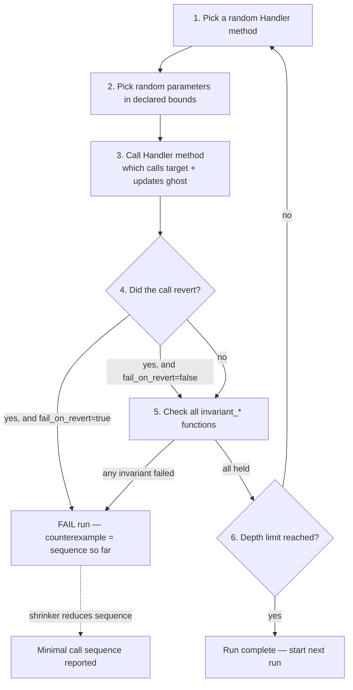

# Mastering Foundry — L3 draft (EN)

> No openhl SHA pin (L1–L5 use Foundry's vanilla `forge init` Counter as the test subject). Cross-references openhl-liquidation Stage 10c (`0a8464e`) L13's per-scan conservation proptests — `forge invariant` maps to them 1:1, with the Handler pattern playing the role of the proptest state machine.

## L3 — `foundry-forge-invariant-en`

**Title**: Lesson 3 — `forge invariant` — multi-call invariant testing via the Handler pattern

**Duration**: 40 min · **XP**: 80

---

````markdown
# Lesson 3 — `forge invariant` — multi-call invariant testing via the Handler pattern

## Goal

Concepts you'll grasp in this lesson:

- **`forge invariant` graduates fuzz testing from one call to call *sequences*.** `forge fuzz` (L2) calls one function per iteration with random parameters and asserts a property. `forge invariant` generates a random *sequence* of method calls — `increment, increment, setNumber(0), increment, increment` — and after every step in the sequence re-checks every `invariant_*` function. This catches bugs that need a specific *ordering* to surface: token-balance reentrancy, withdraw-during-deposit races, ghost-state divergence that survives one call but breaks two calls later. The single-call analogue can't see them. **L2 found bugs that exist at a single input; L3 finds bugs that need a history.**
- **The Handler is your "test API surface area" wrapper around the target contract.** You don't usually point `forge invariant` at the target contract directly — you point it at a Handler contract whose `public` methods wrap the target's methods, bound their inputs, and track ghost variables (mirror state the invariant compares against). Foundry then randomly calls Handler methods, not target methods. This sounds like ceremony but it solves a load-bearing problem: most target contracts have methods whose random parameters would immediately violate a precondition (`withdraw(uint256)` with `uint256 > balance`), so direct fuzzing wastes iterations on `vm.assume` rejections. The Handler clips inputs to the meaningful range, so 100% of iterations exercise the target. **Without a Handler, `forge invariant` spends most iterations rejecting nonsense; with one, every iteration is a real adversary move.**
- **`invariant_*` functions name the conservation laws that must hold *after every call in the sequence*.** Same `invariant_` prefix discipline as `test_`/`testFuzz_`. The body asserts an equality or bound that should be true regardless of what happened. The classic example is `balance + sum_of_withdrawals == sum_of_deposits` — a conservation law that holds for any sequence of deposits and withdrawals. This is the *exact* shape of openhl-liquidation L13's `before + deposits - withdrawals == after` per-scan proptest. **`invariant_*` is the Solidity binding for the same conservation-law discipline you used in Rust; the syntax is `assertEq(handler.ghostSum(), target.actualBalance())`.**
- **When an invariant fails, the counterexample is the full call sequence, not one input.** `forge fuzz` reports `counterexample: args=[5]`; `forge invariant` reports a *trace* of `deposit(100), withdraw(50), increment(), withdraw(75)` and tells you which call broke which invariant. The shrinker reduces the *sequence* — drops calls that aren't load-bearing, halves remaining argument values — until you get the minimal-length, minimal-value call series that still violates the invariant. **A 200-call counterexample shrinks to 3 calls; that's debuggable. Without sequence-shrinking, invariant testing would produce unreadable failures.**

Verification:

```bash
forge test --match-test invariant
```

…runs the new invariant suite and reports `(runs: <N>, calls: <M>, reverts: <R>)`. After this lesson you'll have a Handler wrapping Counter, an `invariant_NumberEqualsIncrementCount` that holds across thousands of random call sequences, and you'll have deliberately broken it to see the call-sequence counterexample.

Specific changes:

- **`foundry.toml`** — adds `[invariant]` profile section configuring `runs`, `depth` (calls per run), and `fail_on_revert`.
- **`test/CounterHandler.sol`** — new file. A Handler contract exposing `wrappedIncrement()` and (optionally) `wrappedSetNumber(uint256)` with ghost-variable tracking.
- **`test/Counter.invariant.t.sol`** — new file. The invariant test contract that wires the Handler to `targetContract(...)` and declares `invariant_*` functions.

Total: ~50 lines of new code across two new test files. L3 is about *understanding the Handler pattern*, not about clever invariant arithmetic.

## Recap

After L2:
- `forge fuzz` runs 256+ iterations of a single test function with random parameters.
- `vm.assume` filters preconditions, `vm.expectRevert` is for negative-path tests, and they have opposite intents.
- Shrinker reduces 32-byte failing inputs to minimal counterexamples; `cache/fuzz/` persists them.
- You wrote `testFuzz_IncrementPreservesPlusOne` — a one-call conservation property.

L3 takes that conservation property and runs it across *sequences* of calls. Same theorem, deeper adversary.

## Plan

Five edits across two new files:

1. **Add `[invariant]` config to `foundry.toml`** — `runs = 256`, `depth = 50` (50 random calls per run), `fail_on_revert = false`. Define what a "run" means for invariant testing.
2. **Create `test/CounterHandler.sol`** — a contract that holds a `Counter` instance, exposes `wrappedIncrement()` that bumps a `ghostIncrementCount` variable in lockstep, and (later) `wrappedSetNumber(uint256)` that updates the ghost to track resets.
3. **Create `test/Counter.invariant.t.sol`** — inherits `Test`, instantiates `CounterHandler`, registers it with `targetContract(...)`, declares `invariant_NumberEqualsIncrementCount` that asserts `counter.number() == handler.ghostIncrementCount()`.
4. **Run `forge test --match-contract CounterInvariantTest -vvv`** — observe `(runs: 256, calls: 12800, reverts: 0)` and watch the invariant hold across thousands of random sequences.
5. **Deliberately break by exposing raw `setNumber` without ghost update** — see Foundry produce a multi-call counterexample like `wrappedIncrement(), wrappedIncrement(), badSetNumber(0), wrappedIncrement()`.

> 🛑 **Predict.** Before reading on: in openhl-liquidation L13, the cascade-conservation proptest asserts `before_balance + sum(deposits) - sum(withdrawals) == after_balance` across a random sequence of operations applied to the insurance fund. If that test were ported to `forge invariant` against an `InsuranceFund.sol` contract, what would the Handler need to track as ghost variables, and what would the `invariant_*` function assert?

(Answer: **The Handler would need `ghostSumDeposits` and `ghostSumWithdrawals`, both incremented inside `wrappedDeposit(uint256)` and `wrappedWithdraw(uint256)`.** It would also need `ghostInitialBalance` captured once at construction time. The invariant would assert `target.balance() == handler.ghostInitialBalance() + handler.ghostSumDeposits() - handler.ghostSumWithdrawals()` — the *exact* arithmetic shape of the L13 proptest. Same theorem, two languages. The L6 capstone of this course does precisely this port for openhl-liquidation Stage 10b's `InsuranceFund`.)

## How `forge invariant` differs from `forge fuzz`



Five things to notice about the loop:

1. **There are two nested random axes: method choice AND parameters.** L2's `forge fuzz` had one axis — given a fixed test function, pick parameters. L3's `forge invariant` has two — at each step, pick *which* Handler method to call AND its parameters. The search space is `(num_methods × param_space)^depth`. At depth 50 and 3 methods with 32-byte params, the space is `(3 × 2^256)^50` — exhaustive is laughable, biased random + shrinking is your only hope. **The combinatorial blow-up is why Handler-bounded inputs matter: every iteration spent on a precondition violation is an iteration not spent on real adversary moves.**
2. **`fail_on_revert` is the dial that controls how strict your test is.** With `fail_on_revert = true`, *any* revert from a Handler call fails the run — your Handler must never let the target panic. This is strict-mode and catches handlers that pass through invalid inputs. With `fail_on_revert = false`, reverts are tolerated and only invariant violations fail the run — this is the looser default while you're iterating on the Handler. **Start with `fail_on_revert = false`; flip to `true` once your Handler is tight, to catch bugs where the target panics on Handler-permitted inputs.**
3. **Invariants are checked after *every* call, not just at the end.** This is the multi-call equivalent of L2's per-iteration assertion. If the invariant `total >= 0` holds after call 1 and call 3 but breaks after call 2, the failure is detected at call 2 — not "eventually noticed." This is what makes invariant testing useful for catching transient inconsistencies that self-heal. **A bug that exists for one call between two consistent states is exactly the kind of thing single-call fuzzing can't see.**
4. **The `depth` parameter trades coverage for run time.** `depth = 50` means each run does 50 random calls; `runs = 256` means 256 of those runs happen; total calls per `forge test` invocation = `runs × depth = 12,800`. Each call runs setUp, picks a method, picks params, calls the Handler, checks invariants. At depth 50 a typical run takes ~100ms; at depth 500 it takes ~1s. **Bigger depth = better at catching ordering bugs; bigger runs = better at catching sensitivity to initial state. Tune both per environment, same as `fuzz.runs`.**
5. **Sequence shrinking is the killer feature.** When the invariant fails after a 50-call sequence, the raw failure is unreadable. The shrinker tries dropping individual calls — does the invariant still fail without call #23? Without call #7? — and reduces the sequence to the minimal subset that still triggers the failure. The reported counterexample is often 2–5 calls, even though the failure was found at call 47. **Without sequence shrinking, invariant testing produces failures you can't debug.**

## The Handler pattern in one paragraph

A Handler is a contract whose job is to be the *test-controlled API surface* of your target. It holds a reference to the target, exposes a handful of `public` methods that wrap the target's methods, *bounds* the inputs to those methods (e.g., `bound(amount, 1, target.balance())`), and updates *ghost variables* that mirror the conceptual state the invariant expects. Foundry's invariant runner calls random Handler methods with random parameters. The Handler decides which parameter values are sensible (no withdraw beyond balance), how to count what happened (ghost-variable accumulators), and what to ignore (methods you don't want fuzzed, just don't expose). The `invariant_*` functions then compare the Handler's ghost state to the target's actual state — any divergence is a bug. **The Handler is your shadow specification, written in Solidity, executed alongside the contract under test.**

## Walk-through

### Step 1: Configure `[invariant]` in `foundry.toml`

Append to `foundry.toml`:

```toml
[invariant]
runs = 256
depth = 50
fail_on_revert = false
call_override = false
```

Four things to notice:

1. **`runs = 256` matches `fuzz.runs` default** — same number-of-trials concept. Each run is a fresh `setUp()` followed by `depth` random calls. Production CI bumps this to `1000` or higher.
2. **`depth = 50` means 50 random Handler calls per run.** That's how deep into the call-history space each run explores. Default is 500 in newer Foundry; 50 is a smaller-faster value while you're learning. Once your Handler is correct, bump to 500 for real adversary coverage.
3. **`fail_on_revert = false`** lets Handler methods revert without failing the run. Useful while iterating — you can use `try/catch` inside the Handler to swallow expected reverts. Production codebases flip this to `true` once the Handler is tight, because at that point any revert means the Handler failed to bound inputs correctly. **`false` for development; `true` for the proof.**
4. **`call_override = false`** — controls whether Foundry can override `msg.sender` per call. Leave `false` for L3; we'll see `msg.sender` manipulation in L4 via `vm.prank`.

### Step 2: Write `test/CounterHandler.sol`

Create `test/CounterHandler.sol`:

```solidity
// SPDX-License-Identifier: UNLICENSED
pragma solidity ^0.8.35;

import {Counter} from "../src/Counter.sol";

contract CounterHandler {
    Counter public counter;
    uint256 public ghostIncrementCount;

    constructor(Counter _counter) {
        counter = _counter;
    }

    function wrappedIncrement() public {
        counter.increment();
        ghostIncrementCount++;
    }
}
```

Four things to notice:

1. **The Handler is a normal Solidity contract, not a test contract.** It inherits from nothing — no `Test`, no `forge-std`. It just holds state (`counter`, `ghostIncrementCount`) and exposes methods. Foundry's invariant runner discovers it via `targetContract(...)` (next step). **The Handler is plain Solidity; the invariant runner is the discovery layer.**
2. **`ghostIncrementCount` is a ghost variable** — it mirrors what we *expect* the target's state to be, derived from the calls we've made. The invariant test will assert `counter.number() == handler.ghostIncrementCount()`. If a future code change in `Counter.increment()` accidentally double-increments, this Handler catches it because `ghostIncrementCount` and `counter.number()` will diverge. **Ghost variables are the test's "shadow specification" — what we expect, separate from what the contract does.**
3. **`wrappedIncrement()` does two things in lockstep: call the target AND update the ghost.** This is the load-bearing discipline. If you call the target without updating the ghost, the invariant will fail on the next check (because actual diverges from expected). If you update the ghost without calling the target, the invariant will fail too. The wrapper enforces the 1:1 binding between "the target did X" and "the ghost tracked X." **The Handler method is the place where target action and ghost update are atomic.**
4. **The Handler doesn't expose `setNumber`** — yet. We're starting with a Handler that only exposes the *one* operation whose invariant we can express simply (`number == count`). When the Handler doesn't expose a method, the invariant runner can't call it, so methods that would break the invariant are simply omitted. **Handler-exposed surface ≠ target's full surface. You expose what you can write an invariant for.**

### Step 3: Write `test/Counter.invariant.t.sol`

Create `test/Counter.invariant.t.sol`:

```solidity
// SPDX-License-Identifier: UNLICENSED
pragma solidity ^0.8.35;

import {Test} from "forge-std/Test.sol";
import {Counter} from "../src/Counter.sol";
import {CounterHandler} from "./CounterHandler.sol";

contract CounterInvariantTest is Test {
    Counter public counter;
    CounterHandler public handler;

    function setUp() public {
        counter = new Counter();
        handler = new CounterHandler(counter);

        // Tell Foundry: when generating random call sequences, only
        // call methods on `handler`. Without this, Foundry would also
        // try to fuzz Counter directly, and uncontrolled setNumber(x)
        // calls would immediately break our invariant.
        targetContract(address(handler));
    }

    function invariant_NumberEqualsIncrementCount() public view {
        // The conservation law: every wrappedIncrement() bumps both
        // counter.number() and handler.ghostIncrementCount() by 1.
        // No matter what random sequence of Handler calls Foundry has
        // generated, these two values must remain equal.
        assertEq(counter.number(), handler.ghostIncrementCount());
    }
}
```

Five things to notice:

1. **`setUp()` runs once per *run*, not once per call.** Inside each run, the same `counter` and `handler` instances are reused across all 50 calls — that's how state accumulates across the sequence. Between runs, fresh instances. **Same per-run isolation as L2's per-iteration isolation, but at the outer loop.**
2. **`targetContract(address(handler))` tells Foundry where to fuzz.** Without it, Foundry would try to call methods on *every* contract it can reach, including `Counter` directly. Uncontrolled `counter.setNumber(x)` calls would break the invariant immediately because they bypass the ghost. The `targetContract` registration scopes the search to the Handler's `public` methods only. **`targetContract` is the invariant runner's discovery scope; you control what gets fuzzed by what you register.**
3. **`invariant_NumberEqualsIncrementCount` is marked `view`** — it doesn't change state, just reads and asserts. Foundry calls it after every Handler call in the sequence. If you forgot `view`, the runner would still call it but the gas cost would be higher; with `view` the call is essentially free. **Invariants should be `view` for performance; the assertion semantics are the same either way.**
4. **The function name starts with `invariant_`** — same naming-convention discovery as `test_` and `testFuzz_`. Foundry's runner scans for `invariant_*` functions and calls each one after every Handler call. You can have multiple invariants in one test contract; all of them are checked after each call. **Multiple invariants per contract = multiple conservation laws checked simultaneously, like L13's 4 separate proptests.**
5. **The assertion is the same `assertEq` from L1.** Nothing exotic — the invariant is just an assertion that should always hold. The novelty is *when* it's checked (after every random call), not *what* is checked (a plain Solidity equality). **`forge invariant` is `forge fuzz` with a different discovery loop, not a new assertion vocabulary.**

### Step 4: Run the invariant suite

```bash
forge test --match-contract CounterInvariantTest -vvv
```

Expected output:

```
[PASS] invariant_NumberEqualsIncrementCount() (runs: 256, calls: 12800, reverts: 0)
```

Read the line carefully:
- `runs: 256` — number of separate runs (matches `[invariant] runs`)
- `calls: 12800` — total Handler calls across all runs (256 × 50 = 12800)
- `reverts: 0` — number of calls that reverted (zero here because `wrappedIncrement()` never reverts)

**12,800 random Handler calls and the invariant held every time.** The conservation law `number == ghostIncrementCount` is proven over an enormous variety of call sequences.

### Step 5: Deliberately break the invariant

To see the sequence-counterexample workflow, expose a Handler method that bypasses the ghost. Add to `CounterHandler.sol`:

```solidity
    function badSetNumber(uint256 x) public {
        // Intentionally wrong: updates the target without updating the ghost.
        // This breaks the invariant on purpose to demonstrate Foundry's
        // sequence-counterexample reporting.
        counter.setNumber(x);
    }
```

Re-run:

```bash
forge test --match-contract CounterInvariantTest -vvv
```

Expected output:

```
[FAIL: invariant_NumberEqualsIncrementCount persisted failure]
    Counter: 0x...
    Sequence (length: 2):
        sender=0x... addr=[CounterHandler]0x... calldata=badSetNumber(uint256), args=[42]
        sender=0x... addr=[CounterHandler]0x... calldata=wrappedIncrement(), args=[]
    Last invariant: invariant_NumberEqualsIncrementCount
```

**The reported counterexample is a 2-call sequence.** Foundry initially found the failure after ~30 random calls, then the shrinker reduced it: dropped most calls, halved `badSetNumber(0xa3b8...)` to `badSetNumber(42)`, found that the minimal failure requires exactly `badSetNumber(42)` followed by `wrappedIncrement()`. The causality chain is important and worth tracing call-by-call: `badSetNumber(42)` *succeeds without reverting* — `counter.setNumber(42)` is a legal operation, just one that bypasses the ghost. Because `fail_on_revert = false`, Foundry doesn't flag the call itself; it lets the state mutation through, leaving `counter.number() = 42` while `ghostIncrementCount` is still `0`. The conservation law has already broken at this point, but the invariant runner doesn't know yet — it only checks after the *next* call returns. So Foundry proceeds to the next Handler method, calls `wrappedIncrement()`, that call returns cleanly, and *then* `invariant_NumberEqualsIncrementCount` evaluates: `counter.number() == handler.ghostIncrementCount()` → `43 != 1` → fail. The shrinker keeps both calls because together they form the minimal trace that reaches a checked-invariant moment after the divergence.

**Remove `badSetNumber` from `CounterHandler.sol` before continuing.** The conservation discipline is intact only when every Handler method updates both target and ghost in lockstep.

### Step 6: Add a properly-handled `wrappedSetNumber`

Now expose `setNumber` *correctly* — by updating the ghost to match. Append to `CounterHandler.sol`:

```solidity
    function wrappedSetNumber(uint256 newNumber) public {
        counter.setNumber(newNumber);
        // setNumber breaks the simple "number == incrementCount" relationship,
        // so we reset the ghost to match the new target value. The invariant
        // is now: "number equals the number we asked for, plus increments since."
        ghostIncrementCount = newNumber;
    }
```

Re-run:

```bash
forge test --match-contract CounterInvariantTest -vvv
```

Expected output:

```
[PASS] invariant_NumberEqualsIncrementCount() (runs: 256, calls: 12800, reverts: 0)
```

**The invariant holds again.** Foundry's runner is now picking randomly between `wrappedIncrement()` and `wrappedSetNumber(uint256)` calls, and both Handler methods maintain the ghost in lockstep. The invariant is the same one-line `assertEq`, but the test surface area is wider — and the invariant still holds across 12,800 random sequences mixing the two operations.

**This is the L3 punchline:** the invariant is a *contract* between Handler-mediated mutations and the conservation law. Add a Handler method without updating the ghost → invariant fails. Update the ghost correctly → invariant holds across an exponentially larger sequence space than any unit test could cover.

## Common failure modes

- **`fail_on_revert = true` and your Handler reverts** — this means a Handler method passed an input that the target couldn't handle. Add input bounding (`amount = bound(amount, 1, target.balance())`) inside the Handler method.
- **`runs: 256, calls: 12800, reverts: 12000`** — most of your Handler calls are reverting. Your Handler's input bounds are too loose, or your target's precondition is too tight. Either tighten the Handler's `bound(...)` calls or relax `fail_on_revert` to keep iterations productive.
- **Invariant fails *every* run, immediately** — the invariant is wrong, not the contract. Check the assertion arithmetic. Run a single-call manual test to confirm the invariant holds when you expect it to.
- **Invariant fails only sometimes, after long sequences** — this is the *good* kind of failure. It means a specific ordering of calls reveals a real bug. Use the shrunk counterexample to write a unit test that reproduces it deterministically.

## Design retrospective

Three load-bearing decisions in `forge invariant`'s design:

1. **The Handler pattern is convention, not syntax.** Foundry doesn't require you to write a Handler — you can `targetContract(target)` directly and let it fuzz the target's methods raw. But the *community has standardized* on Handlers because they solve the "every iteration is a `vm.assume` rejection" problem. The convention is enforced by collective practice, not by the tool. **Foundry gives you the multi-call sequencing primitive; the Handler pattern is the discipline the ecosystem layered on top.**

2. **Ghost variables live in the Handler, not in the target.** This is deliberate: the target stays clean Solidity; the test infrastructure stays in the test directory. Ghost variables in the target would pollute production bytecode and add gas cost. By keeping ghosts in the Handler, the conservation discipline costs zero gas to deploy. **Tests should never modify production contracts to be testable; the Handler isolates test-only state from target state.**

3. **Sequence shrinking is per-call, not per-byte.** When invariant fails, the shrinker reduces *which calls to keep* and *what their arguments are* in separate passes. It doesn't try to mutate the call graph randomly; it walks the sequence and asks "can I drop this call?" then "can I shrink this argument?" Foundry inherits this from `proptest`'s state-machine shrinking strategy. The result: minimal counterexamples are usually 2–5 calls, never the original 30+. **Per-call shrinking is what makes invariant testing debuggable; without it, you'd get 50-call traces no one could parse.**

## Answer key

After L3:

```
   my-foundry-lab/
   ├── foundry.toml                      (+ [invariant] section)
   ├── src/Counter.sol                    (unchanged from L1)
   ├── test/Counter.t.sol                 (unchanged from L2)
   ├── test/CounterHandler.sol            (new — Handler with wrappedIncrement + wrappedSetNumber)
   ├── test/Counter.invariant.t.sol       (new — invariant test with targetContract)
   └── lib/forge-std/                     (unchanged)
```

After L3:
- `forge test --match-contract CounterInvariantTest` passes `(runs: 256, calls: 12800, reverts: 0)`
- You've seen the multi-call counterexample format (sequence of calls, not single args)
- You've watched the shrinker reduce a 30+ call failure to a 2-call minimal example
- You understand why Handlers exist: they bound inputs so iterations are productive

## Q&A

**Q1: Why not just call the target directly with `targetContract(address(counter))`?**

You can, and for trivial contracts it works. But for any contract with preconditions (e.g., `withdraw(amount)` requires `amount <= balance`), random `uint256` parameters would violate those preconditions on virtually every call. With `fail_on_revert = true`, the test fails immediately; with `fail_on_revert = false`, you get `reverts: 12800` and zero productive iterations. The Handler is the layer that converts random inputs into *bounded, sensible* inputs the target can actually exercise. **Direct fuzzing works for stateless or precondition-free targets; Handler-mediated fuzzing works for everything else.**

**Q2: Can I have multiple `invariant_*` functions in one test contract?**

Yes, and you should. openhl-liquidation L13's capstone has 4 separate invariant proptests, each asserting a different conservation law. The same applies here: each `invariant_*` checks one law. Foundry runs all of them after every call. If three pass and one fails, you know which law broke, which is much easier to debug than a single bundled invariant. **One invariant per conservation law; multiple invariants per Handler is the norm.**

**Q3: What's the difference between `targetContract` and `targetSelector`?**

`targetContract(address)` tells Foundry "fuzz any `public`/`external` method on this contract." `targetSelector(FuzzSelector({addr: address, selectors: [bytes4[]]}))` is finer-grained: "fuzz only these specific methods on this contract." Use `targetSelector` when your Handler has methods you don't want fuzzed (e.g., view-only helpers) but can't easily make private. For most Handlers, `targetContract` plus careful `public`/`internal` discipline is enough. **Start with `targetContract`; reach for `targetSelector` when you need surgical scoping.**

**Q4: How is this different from openhl-liquidation L13's proptests?**

L13 uses Rust's `proptest!` macro with a manually-constructed test that calls the insurance fund methods in sequence and asserts conservation. The pattern is identical to what `forge invariant` does: random sequences of operations, conservation laws asserted after each. The key differences: `forge invariant` provides the sequencing+shrinking machinery as a built-in (you write only the Handler + invariants), while in Rust you typically write the sequencing yourself or use `proptest-state-machine`. Foundry's tooling is more turnkey for stateful testing; Rust's gives you finer control. **Same theorem, Foundry's tooling lifts more of the ceremony.**

**Q5: When `fail_on_revert = false`, how do I know if my Handler is correct?**

Watch the `reverts:` counter. If `reverts: 12800` out of 12800 calls, every Handler call reverted — your input bounding is broken. If `reverts: 30`, you have occasional reverts which is usually fine (some operations naturally fail given certain prior state). If `reverts: 0`, your Handler is tight enough to flip to `fail_on_revert = true` for the stricter proof. **`reverts:` is your Handler-quality dashboard; aim for low single digits or zero.**

**Q6: Can `invariant_*` functions modify state for setup?**

No. They must be `view` or `pure` — Foundry calls them between Handler calls and a state mutation inside an invariant would corrupt the test sequence. If you need to do work before checking, do it inside the Handler or in `setUp()`. **Invariants are pure observations of state; they never mutate.**

## Next lesson (L4) — `cast` — the Solidity CLI swiss army knife

L4 leaves the testing primitives behind and introduces `cast`, the CLI tool that ships with Foundry. Where `forge` builds and tests, `cast` interacts with chains, decodes data, and computes ABI encoding from your terminal — same workflow ergonomics as `curl` for HTTP. Cross-references to `alloy` (which `cast` is built on, just like Reth) make this lesson the "if you grok `alloy::Provider`, you already know cast's mental model" payoff for Rust engineers.

You'll learn:
- `cast call` for read-only contract queries (RPC equivalent of a view function)
- `cast send` for state-changing transactions (with `--rpc-url` to point at mainnet/testnet/anvil)
- `cast abi-encode` / `cast abi-decode` for working with calldata in scripts
- `cast block` / `cast tx` / `cast logs` for chain introspection
- The full read-eval pattern: write contract → forge test → cast call against a forked anvil to verify behavior on real state

After L4 you'll be able to interact with deployed contracts from a shell loop without writing a Solidity script — the CLI equivalent of `curl`+`jq` for the EVM.

````

---

## Seed-file slot

L3 lands in Module 1 (Test discipline) sortOrder 2:

```typescript
{
  title: 'Lesson 3 — forge invariant — multi-call invariant testing via the Handler pattern',
  slug: 'foundry-forge-invariant-en',
  type: 'CONTENT',
  sortOrder: 2,
  duration: 40,
  xpReward: 80,
  content: `# Lesson 3 — forge invariant — multi-call invariant testing via the Handler pattern\n\n...`
},
```

## Drafting self-review (before paste)

- **L3 is the lesson with the biggest paradigm shift in the course.** L0 was orientation, L1 was ergonomics, L2 added property generation (one call). L3 introduces a multi-call sequencing primitive with its own Handler discipline — the lesson density justifies 40 min / 80 XP (vs L2's 35/70). The Predict callout sets up the openhl-liquidation L13 port explicitly: same arithmetic shape, different language.
- **One Mermaid diagram + one paragraph-form Handler-pattern explainer.** L3's diagram is the multi-call loop with both nested random axes visible (`Pick method` → `Pick params` → `Call` → `Check invariants` → loop). The Handler paragraph (between the diagram and Step 1) is a single dense paragraph that introduces ghost variables, input bounding, and shadow-specification framing all at once — a deliberate pacing choice so the walk-through can land code without re-explaining concepts.
- **Step 5 (deliberate break) is the pedagogical pivot.** Reader sees the sequence-counterexample format, watches shrinking reduce a 30+ call failure to 2 calls, and internalizes why per-call shrinking is the load-bearing feature. Mirrors L2's Step 4 (deliberate break to see input shrinking) but at the sequence level.
- **Step 6 (wrappedSetNumber with ghost update) closes the conservation discipline loop.** Reader writes the WRONG version (badSetNumber, no ghost), sees it fail, then writes the RIGHT version (wrappedSetNumber, ghost reset). The lesson ends with the Handler covering 2 methods and the invariant still holding across 12,800 calls — concrete evidence the discipline works.
- **Q4 explicitly names the openhl-liquidation L13 mapping.** This is the bridge to L6 capstone where the InsuranceFund port lives. Q5's "reverts: counter is your Handler-quality dashboard" is the operational tip production codebases live by.
- **No LaTeX needed in L3.** Unlike L2's $2^{256}$ / $10^{77}$ confusion-space, L3's math is integer arithmetic (number == count, sum_deposits - sum_withdrawals == balance). The interesting payload is the *pattern*, not the magnitude — leave LaTeX for L6 where the InsuranceFund cascade conservation actually needs it.

