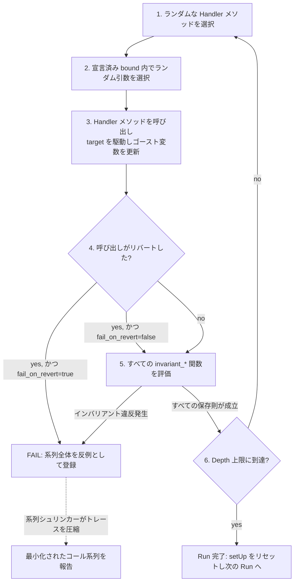

# Mastering Foundry — L3 draft (JA)

> openhl SHA pin はなし（L1–L5 は Foundry の vanilla `forge init` Counter を test subject に使う）。openhl-liquidation Stage 10c (`0a8464e`) の L13 の per-scan 保存則 proptest を cross-reference する — `forge invariant` がそれと 1:1 で map し、Handler パターンが proptest state machine の役割を担う。

## L3 — `foundry-forge-invariant-ja`

**Title**: レッスン 3 — `forge invariant` — Handler パターンによる multi-call invariant testing

**Duration**: 40 分 · **XP**: 80

---

````markdown
# レッスン 3 — `forge invariant` — Handler パターンによる multi-call invariant testing

## ゴール

このレッスンで掴む概念:

- **`forge invariant` は、fuzz testing を 1 call から call の *系列* へと格上げする。** `forge fuzz` (L2) は各 iteration で 1 つの関数をランダム parameter で呼び、property を assert する。`forge invariant` は method call の *ランダム系列* — `increment, increment, setNumber(0), increment, increment` — を生成し、系列の各 step 後に *すべての* `invariant_*` 関数を再 check する。これが、特定の *順序* で初めて顔を出すバグを catch する。token-balance reentrancy、withdraw-during-deposit のレース、1 call は survive するが 2 call 後に壊れる ghost-state divergence。Single-call の系譜ではこれらは見えない。**L2 は単一入力で存在するバグを見つけた。L3 は履歴を必要とするバグを見つける。**
- **Handler は、target contract に対する「test 制御の API surface area」ラッパーだ。** `forge invariant` を target contract に直接向けることは普通しない。代わりに Handler contract に向ける。Handler は target の method を wrap し、入力を bound し（例: `bound(amount, 1, target.balance())`）、ghost variable（invariant が比較するための mirror state）を track する `public` method を一握り公開する。Foundry はその Handler の method をランダムに呼ぶのであって、target の method を直接呼ぶのではない。一見、冗長な手続き（Ceremony）に思えるが、これが load-bearing な問題を解く。target contract の大半は「ランダム parameter だと precondition を即座に violate する」method を持つ（`withdraw(uint256)` に `uint256 > balance` を渡すなど）。直接 fuzz すると iteration の大半が `vm.assume` rejection で無駄になる。Handler は入力を意味ある range に clip するので、iteration の 100% が target を exercise する。**Handler なしの `forge invariant` は iteration の大半をナンセンス拒否で消費する。Handler ありなら、各 iteration が真の adversary move になる。**
- **`invariant_*` 関数は、*系列の各 call 後に* 成立すべき保存則（Conservation law）を名指す。** `test_` / `testFuzz_` と同じ prefix 規律で `invariant_` を使う。Body は何が起きようと成立するべき equality か bound を assert する。古典的な例は `balance + sum_of_withdrawals == sum_of_deposits`。どんな deposit/withdraw 系列でも成立する保存則だ。これは openhl-liquidation L13 の `before + deposits - withdrawals == after` per-scan proptest と *まったく同じ* 形状。**`invariant_*` は Rust で使った保存則規律の Solidity bindings。構文は `assertEq(handler.ghostSum(), target.actualBalance())`。**
- **Invariant が失敗すると、反例（Counterexample）は単一入力ではなく call 系列全体になる。** `forge fuzz` の counterexample は `args=[5]`。`forge invariant` は `deposit(100), withdraw(50), increment(), withdraw(75)` という *trace* を報告し、どの call がどの invariant を壊したかを教える。Shrinker は *系列を* reduce する。load-bearing でない call を drop し、残る引数値を半分にし、invariant をまだ違反する最小長・最小値の call 系列に到達するまで続ける。**200-call 反例が 3 calls まで縮む。それなら debug できる。Sequence shrinking がなければ、invariant testing は読めない失敗を吐き出すだけだ。**

確認:

```bash
forge test --match-test invariant
```

…で新しい invariant suite が走り、`(runs: <N>, calls: <M>, reverts: <R>)` を報告する。本レッスン完走後はこれらを手にする。Counter を wrap する Handler、何千ものランダム call 系列にわたって成立する `invariant_NumberEqualsIncrementCount`、そして意図的に壊して call-sequence 反例を観察した経験。

具体的な変更:

- **`foundry.toml`** — `[invariant]` profile セクションを追加し、`runs`、`depth`（run あたりの call 数）、`fail_on_revert` を設定する。
- **`test/CounterHandler.sol`** — 新規ファイル。`wrappedIncrement()` と（後で）`wrappedSetNumber(uint256)` を ghost-variable tracking 付きで公開する Handler contract。
- **`test/Counter.invariant.t.sol`** — 新規ファイル。Handler を `targetContract(...)` に wire し、`invariant_*` 関数を宣言する invariant test contract。

合計で約 50 行の新規コードを 2 つの新規 test ファイルにまたがって書く。L3 の主題は *Handler パターンを理解すること* であって、賢い invariant 算術ではない。

## おさらい

L2 の後はこうなっている。
- `forge fuzz` が 1 つの test 関数を 256+ iteration、ランダム parameter で走らせる。
- `vm.assume` は precondition を filter し、`vm.expectRevert` は negative-path test のためのもので、目的は真逆。
- Shrinker が 32-byte の失敗入力を minimal counterexample まで reduce する。`cache/fuzz/` がそれらを persist する。
- `testFuzz_IncrementPreservesPlusOne` を書いた。1 call の保存則 property だ。

L3 はその保存則 property を call の *系列* で走らせる。同じ定理、より深い adversary だ。

## 計画

編集は 5 つ、2 つの新規ファイルにまたがる。

1. **`foundry.toml` に `[invariant]` config を追加** — `runs = 256`、`depth = 50` (run あたり 50 ランダム call)、`fail_on_revert = false`。Invariant testing における「run」が何を意味するかを定義する。
2. **`test/CounterHandler.sol` を作る** — `Counter` instance を保持し、`ghostIncrementCount` 変数を lockstep で bump する `wrappedIncrement()` を公開する。後で reset を track する `wrappedSetNumber(uint256)` も追加する。
3. **`test/Counter.invariant.t.sol` を作る** — `Test` を継承し、`CounterHandler` をインスタンス化し、`targetContract(...)` で登録、`counter.number() == handler.ghostIncrementCount()` を assert する `invariant_NumberEqualsIncrementCount` を宣言する。
4. **`forge test --match-contract CounterInvariantTest -vvv` を走らせる** — `(runs: 256, calls: 12800, reverts: 0)` を観察し、何千ものランダム系列を超えて invariant が成立し続けるのを見る。
5. **`setNumber` を ghost 更新なしで公開して意図的に壊す** — `wrappedIncrement(), wrappedIncrement(), badSetNumber(0), wrappedIncrement()` のような multi-call counterexample を Foundry が生成するのを観察する。

> 🛑 **予測。** 続きを読む前に: openhl-liquidation L13 の cascade-conservation proptest は、insurance fund に適用される operation 系列にわたって `before_balance + sum(deposits) - sum(withdrawals) == after_balance` を assert する。この test を `InsuranceFund.sol` contract に対する `forge invariant` へ port するとき、Handler は ghost variable として何を track する必要があり、`invariant_*` 関数は何を assert する?

(答え: **Handler は `ghostSumDeposits` と `ghostSumWithdrawals` の両方を track する必要がある。** どちらも `wrappedDeposit(uint256)` と `wrappedWithdraw(uint256)` の内部で増分する。構築時に 1 回 capture される `ghostInitialBalance` も必要。Invariant は `target.balance() == handler.ghostInitialBalance() + handler.ghostSumDeposits() - handler.ghostSumWithdrawals()` を assert する。L13 proptest と *まったく同じ* 算術形状だ。同じ定理、2 言語。本コースの L6 capstone がまさに openhl-liquidation Stage 10b の `InsuranceFund` についてこの port を行う。)

## `forge invariant` が `forge fuzz` とどう違うか



Loop で押さえる点が 5 つ。

1. **2 つのネストしたランダム軸がある。method 選択と parameter 選択だ。** L2 の `forge fuzz` は軸が 1 つ。固定された test 関数があり、parameter を選ぶだけ。L3 の `forge invariant` は軸が 2 つ。各 step で *どの* Handler method を呼ぶかと、その parameter を選ぶ。探索空間は `(num_methods × param_space)^depth`。Depth 50 で 3 つの method、32-byte parameter なら `(3 × 2^256)^50`。総当たり（Exhaustive）など到底不可能であり、biased random + shrinking だけが頼みの綱。**この組み合わせ爆発こそが Handler-bounded inputs が重要な理由だ。Precondition 違反に費やす iteration は、真の adversary move に費やさない iteration だ。**
2. **`fail_on_revert` が test の strict 度合いを制御する dial。** `fail_on_revert = true` のとき、Handler call からの *任意の* revert が run を失敗させる。Handler は target を panic させてはならない、という strict mode で、Handler が無効入力を素通りさせるバグを catch する。`fail_on_revert = false` のとき、revert は許容され、invariant 違反だけが run を失敗させる。Handler を iterate している間の緩い default だ。**まず `fail_on_revert = false` で始める。Handler が tight になったら `true` に flip して、Handler が許した入力で target が panic するバグを catch する。**
3. **Invariant は終わりだけでなく *毎 call 後に* check される。** これが L2 の per-iteration assertion の multi-call 等価物だ。`total >= 0` invariant が call 1 と call 3 の後では成立するが call 2 の後に壊れる場合、失敗は call 2 で検出される。「いつか気づく」ではない。これが invariant testing を「self-heal する一過性の inconsistency」を catch するのに有用にする所以だ。**一貫した 2 つの状態の間で 1 call の間だけ存在するバグは、single-call fuzzing には絶対に見えない種類だ。**
4. **`depth` parameter が coverage と実行時間を trade off する。** `depth = 50` は各 run が 50 ランダム call を行う。`runs = 256` はその run が 256 回起きる。1 回の `forge test` invocation あたりの total call は `runs × depth = 12,800`。各 call が setUp、method 選択、parameter 選択、Handler 呼び出し、invariant check を走らせる。Depth 50 で typical run は ~100ms、depth 500 で ~1s。**Depth を増やす = 順序バグを catch しやすい。Runs を増やす = 初期状態への sensitivity を catch しやすい。`fuzz.runs` と同じく、環境ごとに両方を tune する。**
5. **Sequence shrinking が killer feature だ。** Invariant が 50-call 系列の後で失敗するとき、生の失敗は読めない。Shrinker は個々の call を drop してみる。call #23 なしでも invariant はまだ失敗するか。call #7 なしでも。そうやって系列を、失敗をまだ trigger する最小 subset まで reduce する。報告される counterexample はしばしば 2–5 calls。失敗が call 47 で発見されたとしてもだ。**Sequence shrinking なしでは、invariant testing は debug できない失敗を吐く。**

## Handler パターンを 1 段落で

Handler とは、target の *test 制御の API surface* となることを仕事にした contract だ。target への参照を保持し、target の method を wrap する `public` method を一握り公開する。それらの method の入力を *bound* し（例: `bound(amount, 1, target.balance())`）、invariant が期待する conceptual state を mirror する *ゴースト変数（Ghost variables）* を更新する。Foundry の invariant runner はランダムな Handler method をランダム parameter で呼ぶ。Handler は 3 つを決める。どの parameter 値が sensible か（balance を超える withdraw はしない）、何が起きたかをどう数えるか（ghost-variable accumulator）、何を無視するか（fuzz したくない method はそもそも公開しない）。`invariant_*` 関数は Handler の ghost state を target の actual state と比較する。一致しなければバグだ。**Handler はあなたの「シャドウ仕様（Shadow Specification）」だ。Solidity で書かれ、test 対象の contract と並走して実行される。**

## 手を動かす walk-through

### Step 1: `foundry.toml` に `[invariant]` を設定する

`foundry.toml` に追記:

```toml
[invariant]
runs = 256
depth = 50
fail_on_revert = false
call_override = false
```

押さえる点が 4 つ。

1. **`runs = 256` は `fuzz.runs` default と同じ** — 同じ「試行回数」概念だ。各 run は fresh な `setUp()` の後に `depth` 回のランダム call。Production CI はこれを `1000` 以上まで bump する。
2. **`depth = 50` は run あたり 50 ランダム Handler call を意味する。** これが各 run が call-history 空間にどれだけ深く分け入るかだ。Newer Foundry の default は 500。50 は学習中の小さく速い値だ。Handler が正しくなったら 500 まで bump して real な adversary coverage を得る。
3. **`fail_on_revert = false`** は Handler method が revert しても run を失敗させない。Iterate 中は便利だ。Handler 内部で `try/catch` を使って expected revert を飲み込める。Production codebase は Handler が tight になったら `true` に flip する。その時点で revert があれば Handler が入力 bounding に失敗した signal だからだ。**開発中は `false`、証明には `true`。**
4. **`call_override = false`** は Foundry が call ごとに `msg.sender` を override できるかを制御する。L3 では `false` のまま。`msg.sender` 操作は L4 で `vm.prank` 経由で見る。

### Step 2: `test/CounterHandler.sol` を書く

`test/CounterHandler.sol` を作る:

```solidity
// SPDX-License-Identifier: UNLICENSED
pragma solidity ^0.8.35;

import {Counter} from "../src/Counter.sol";

contract CounterHandler {
    Counter public counter;
    uint256 public ghostIncrementCount;

    constructor(Counter _counter) {
        counter = _counter;
    }

    function wrappedIncrement() public {
        counter.increment();
        ghostIncrementCount++;
    }
}
```

押さえる点が 4 つ。

1. **Handler は普通の Solidity contract で、test contract ではない。** 何も継承しない。`Test` も `forge-std` もなし。State (`counter`, `ghostIncrementCount`) を保持し、method を公開するだけだ。Foundry の invariant runner は `targetContract(...)` 経由でそれを発見する（次の step）。**Handler は plain Solidity。Invariant runner は discovery layer だ。**
2. **`ghostIncrementCount` は ghost 変数だ。** *これまでの call から* target の state がこうあるべきだと予想する値を mirror する。Invariant test は `counter.number() == handler.ghostIncrementCount()` を assert する。将来 `Counter.increment()` の code 変更で誤って double-increment するようになれば、この Handler はそれを catch する。`ghostIncrementCount` と `counter.number()` が乖離するからだ。**Ghost 変数は test の「shadow specification」だ。Contract が何をするかとは別に、我々が何を期待しているか。**
3. **`wrappedIncrement()` は lockstep で 2 つのことをする。target を呼び、ghost を更新する。** これが load-bearing 規律だ。Ghost を更新せずに target を呼ぶと、次の invariant check で失敗する（actual が expected と乖離するから）。Target を呼ばずに ghost を更新しても失敗する。Wrapper が「target は X をした」と「ghost は X を track した」の 1:1 binding を強制する。**Handler method こそが、target action と ghost update が atomic に起きる場所だ。**
4. **Handler は `setNumber` を公開していない** — まだ、だ。我々は invariant を簡単に表現できる *1 つの* operation だけを公開する Handler から始める (`number == count`)。Handler が method を公開しなければ、invariant runner はそれを呼べない。Invariant を壊す method は単に省くという選択をしているのだ。**Handler が公開する surface ≠ target の full surface。Invariant を書ける範囲だけを公開する。**

### Step 3: `test/Counter.invariant.t.sol` を書く

`test/Counter.invariant.t.sol` を作る:

```solidity
// SPDX-License-Identifier: UNLICENSED
pragma solidity ^0.8.35;

import {Test} from "forge-std/Test.sol";
import {Counter} from "../src/Counter.sol";
import {CounterHandler} from "./CounterHandler.sol";

contract CounterInvariantTest is Test {
    Counter public counter;
    CounterHandler public handler;

    function setUp() public {
        counter = new Counter();
        handler = new CounterHandler(counter);

        // Tell Foundry: when generating random call sequences, only
        // call methods on `handler`. Without this, Foundry would also
        // try to fuzz Counter directly, and uncontrolled setNumber(x)
        // calls would immediately break our invariant.
        targetContract(address(handler));
    }

    function invariant_NumberEqualsIncrementCount() public view {
        // The conservation law: every wrappedIncrement() bumps both
        // counter.number() and handler.ghostIncrementCount() by 1.
        // No matter what random sequence of Handler calls Foundry has
        // generated, these two values must remain equal.
        assertEq(counter.number(), handler.ghostIncrementCount());
    }
}
```

押さえる点が 5 つ。

1. **`setUp()` は call ごとではなく *run ごと* に走る。** 各 run の内部では、同じ `counter` と `handler` instance が 50 call すべてにわたって再利用される。それが state が系列にわたって蓄積する仕組みだ。Run 間では fresh instance。**L2 の per-iteration isolation と同じ規律だが、外側のループで起きる。**
2. **`targetContract(address(handler))` が Foundry にどこを fuzz するか教える。** これがないと、Foundry は到達できる *すべての* contract の method を呼ぼうとする。`Counter` も含めて直接、だ。Uncontrolled な `counter.setNumber(x)` call は ghost を bypass するから invariant を即座に壊す。`targetContract` 登録は探索を Handler の `public` method のみに scope する。**`targetContract` は invariant runner の discovery scope。何を登録するかで何が fuzz されるかをコントロールする。**
3. **`invariant_NumberEqualsIncrementCount` は `view` でマークされている。** State を変えず、ただ読んで assert するだけだ。Foundry は系列の各 Handler call 後にこれを呼ぶ。`view` を忘れても runner はそれでも呼ぶが gas コストが高くなる。`view` ならその call は事実上 free だ。**Performance のために invariant は `view` であるべき。Assertion の意味はどちらでも同じ。**
4. **関数名が `invariant_` で始まる。** `test_` や `testFuzz_` と同じ naming-convention discovery だ。Foundry の runner は `invariant_*` 関数を scan し、Handler call ごとに各 invariant を呼ぶ。1 つの test contract に複数の invariant を持てる。それらすべてが各 call 後に check される。**Test contract あたり複数 invariant = 複数の保存則を同時に check する。L13 の 4 つの独立した proptest と同じ構造だ。**
5. **Assertion は L1 と同じ `assertEq` だ。** 異質なものはない。invariant は単に常に成立するべき assertion。新規性は *いつ* check されるか（ランダム call ごと）であって、*何を* check するか（plain Solidity の equality）ではない。**`forge invariant` は新しい assertion vocabulary ではなく、discovery loop が違う `forge fuzz` だ。**

### Step 4: Invariant suite を走らせる

```bash
forge test --match-contract CounterInvariantTest -vvv
```

期待される出力:

```
[PASS] invariant_NumberEqualsIncrementCount() (runs: 256, calls: 12800, reverts: 0)
```

この行を注意深く読む。
- `runs: 256` — 別々の run の数 (`[invariant] runs` と一致)
- `calls: 12800` — 全 run にわたる total Handler call 数 (256 × 50 = 12800)
- `reverts: 0` — revert した call の数 (`wrappedIncrement()` は決して revert しないからゼロ)

**12,800 ランダム Handler call、invariant は毎回成立した。** 保存則 `number == ghostIncrementCount` が膨大なバリエーションの call 系列にわたって証明された。

### Step 5: 意図的に invariant を壊す

Sequence-counterexample ワークフローを見るため、ghost を bypass する Handler method を公開する。`CounterHandler.sol` に追記:

```solidity
    function badSetNumber(uint256 x) public {
        // Intentionally wrong: updates the target without updating the ghost.
        // This breaks the invariant on purpose to demonstrate Foundry's
        // sequence-counterexample reporting.
        counter.setNumber(x);
    }
```

再実行:

```bash
forge test --match-contract CounterInvariantTest -vvv
```

期待される出力:

```
[FAIL: invariant_NumberEqualsIncrementCount persisted failure]
    Counter: 0x...
    Sequence (length: 2):
        sender=0x... addr=[CounterHandler]0x... calldata=badSetNumber(uint256), args=[42]
        sender=0x... addr=[CounterHandler]0x... calldata=wrappedIncrement(), args=[]
    Last invariant: invariant_NumberEqualsIncrementCount
```

**報告された反例は、わずか 2 コールの系列にまで圧縮されている。** Foundry は最初におそらく ~30 ランダム call 後に失敗を見つけ、shrinker が reduce した。大半の call を drop し、`badSetNumber(0xa3b8...)` を `badSetNumber(42)` まで半分にし、最小失敗が ちょうど `badSetNumber(42)` の後に `wrappedIncrement()` を必要とすることを発見した。ここでの因果連鎖を call-by-call で追うと押さえどころが見える。`badSetNumber(42)` は *リバートせずに成功する* — `counter.setNumber(42)` は合法な操作で、ただ ghost を bypass するだけだ。`fail_on_revert = false` の設定により、Foundry はこの call 自体を問題視せず、state mutation を素通しさせる。結果、`counter.number() = 42` のまま `ghostIncrementCount` は `0` で取り残される。この時点で保存則はすでに崩壊しているが、invariant runner はまだそれを知らない。invariant は *次の* call が返ってきた後にだけ評価されるからだ。Foundry は次の Handler method に進み、`wrappedIncrement()` を呼び、その call が clean に返り、*そこで* `invariant_NumberEqualsIncrementCount` が走る: `counter.number() == handler.ghostIncrementCount()` → `43 != 1` → 失敗。Shrinker が 2 コール両方を残すのは、両者が組み合わさってこそ「乖離発生 → 評価点に到達」までの最短 trace を形成するからだ。

**続行する前に `CounterHandler.sol` から `badSetNumber` を削除する。** 保存則規律は、すべての Handler method が target と ghost を lockstep で更新する場合だけ成立する。

### Step 6: 適切に handle された `wrappedSetNumber` を追加する

今度は `setNumber` を *正しく* 公開する。ghost を一致させて更新することで、だ。`CounterHandler.sol` に追記:

```solidity
    function wrappedSetNumber(uint256 newNumber) public {
        counter.setNumber(newNumber);
        // setNumber breaks the simple "number == incrementCount" relationship,
        // so we reset the ghost to match the new target value. The invariant
        // is now: "number equals the number we asked for, plus increments since."
        ghostIncrementCount = newNumber;
    }
```

再実行:

```bash
forge test --match-contract CounterInvariantTest -vvv
```

期待される出力:

```
[PASS] invariant_NumberEqualsIncrementCount() (runs: 256, calls: 12800, reverts: 0)
```

**Invariant は再び成立する。** Foundry の runner は今、`wrappedIncrement()` と `wrappedSetNumber(uint256)` の call からランダムに選び、両 Handler method が ghost を lockstep で維持する。Invariant は同じ 1 行の `assertEq` だが、test surface area は広い。それでも invariant は 2 つの operation を混ぜた 12,800 のランダム系列にわたって成立する。

**これが L3 の punchline だ。** Invariant は Handler 媒介の mutation と保存則の間の *契約* だ。Handler method を ghost 更新なしで追加 → invariant 失敗。Ghost を正しく更新 → invariant がどんな unit test もカバーできない指数的に大きな系列空間にわたって成立する。

## よくある失敗パターン

- **`fail_on_revert = true` で Handler が revert する** — Handler method が target が扱えない入力を渡したことを意味する。Handler method 内部に入力 bounding (`amount = bound(amount, 1, target.balance())`) を追加する。
- **`runs: 256, calls: 12800, reverts: 12000`** — Handler call の大半が revert している。Handler の入力 bound が緩すぎるか、target の precondition がきつすぎるかのどちらかだ。Handler の `bound(...)` をきつくするか、`fail_on_revert` を緩めて iteration を生産的に保つ。
- **Invariant が *毎* run で即座に失敗する** — invariant が間違っている。contract ではない。Assertion の算術を check する。単一 call の manual test を走らせて期待通りに成立するか確認する。
- **Invariant が時々、長い系列の後でだけ失敗する** — これが *good* な種類の失敗だ。特定の call 順序が本物のバグを暴いている。Shrink された counterexample を使って、それを deterministic に再現する unit test を書く。

## 設計の振り返り

`forge invariant` の設計に焼き込んだ load-bearing な決定が 3 つ。

1. **Handler パターンは syntax ではなく convention だ。** Foundry は Handler を書くことを *要求* しない。`targetContract(target)` を直接呼んで target の method を raw に fuzz できる。だが *コミュニティが Handler に標準化した* のは、それが「すべての iteration が `vm.assume` rejection」問題を解くからだ。Convention は集合的実践によって enforce され、ツールによってではない。**Foundry が multi-call sequencing primitive を与え、Handler パターンはエコシステムがその上に重ねた規律だ。**

2. **Ghost 変数は target ではなく Handler に住む。** これは意図的だ。target は clean Solidity のまま、test infrastructure は test ディレクトリに住む。Target に ghost 変数があれば production bytecode を汚染し、gas コストを上げる。Ghost を Handler に置くことで、保存則規律は deploy 時に zero gas コストだ。**Test は production contract を testable にするために変更してはならない。Handler が test-only state を target state から isolate する。**

3. **Sequence shrinking は per-byte ではなく per-call だ。** Invariant が失敗すると、shrinker は *どの call を残すか* と *引数値を何にするか* を別の pass で reduce する。Call graph をランダムに mutate しようとはしない。系列を walk して「この call を drop できるか」、次に「この引数を shrink できるか」と問う。Foundry はこれを `proptest` の state-machine shrinking strategy から継承している。結果として、最小 counterexample は usually 2–5 calls、決して original の 30+ ではない。**Per-call shrinking が invariant testing を debuggable にする。なしでは誰も parse できない 50-call trace を吐く。**

## 答え合わせ

L3 の後:

```
   my-foundry-lab/
   ├── foundry.toml                      (+ [invariant] セクション)
   ├── src/Counter.sol                    (L1 から変更なし)
   ├── test/Counter.t.sol                 (L2 から変更なし)
   ├── test/CounterHandler.sol            (新規 — wrappedIncrement + wrappedSetNumber を持つ Handler)
   ├── test/Counter.invariant.t.sol       (新規 — targetContract を持つ invariant test)
   └── lib/forge-std/                     (変更なし)
```

L3 の後:
- `forge test --match-contract CounterInvariantTest` が `(runs: 256, calls: 12800, reverts: 0)` で pass する
- Multi-call counterexample 形式を見た (単一引数ではなく call の系列)
- Shrinker が 30+ call の失敗を 2-call minimal example まで reduce するのを見た
- Handler がなぜ存在するかを理解した。入力を bound して iteration を生産的にするためだ

## よくある質問

**Q1: なぜ target を直接 `targetContract(address(counter))` で呼ばないのか?**

呼べる。Trivial な contract には動く。だが precondition を持つ contract (`withdraw(amount)` が `amount <= balance` を要求するなど) にとって、ランダム `uint256` parameter は事実上すべての call で precondition を violate する。`fail_on_revert = true` なら test は即座に失敗する。`fail_on_revert = false` なら `reverts: 12800` と生産的な iteration ゼロを得る。Handler はその間に挟まる layer だ。ランダム入力を、target が実際に exercise できる *bound されて意味ある* 入力に変換する。**直接 fuzz は stateless または precondition-free な target に動く。Handler 媒介の fuzz はそれ以外のすべてに動く。**

**Q2: 1 つの test contract に複数の `invariant_*` 関数を持てる?**

Yes、持つべきだ。openhl-liquidation L13 capstone は 4 つの独立した invariant proptest を持ち、それぞれが異なる保存則を assert する。ここでも同じだ。各 `invariant_*` が 1 つの法則を check する。Foundry は各 call 後にそれらすべてを走らせる。3 つが pass して 1 つが失敗するなら、どの法則が壊れたかが分かる。これは bundle された 1 つの invariant よりずっと debug しやすい。**保存則 1 つにつき 1 つの invariant。Handler あたり複数の invariant が norm だ。**

**Q3: `targetContract` と `targetSelector` の違いは?**

`targetContract(address)` は Foundry に「この contract のすべての `public`/`external` method を fuzz しろ」と告げる。`targetSelector(FuzzSelector({addr: address, selectors: [bytes4[]]}))` はより細かい。「この contract のこれら特定の method *だけ* を fuzz しろ」だ。Fuzz したくない method を持つ Handler に使う (view-only ヘルパーなど、簡単に private にできない場合)。ほとんどの Handler には `targetContract` と慎重な `public`/`internal` 規律で十分。**`targetContract` から始める。Surgical scoping が必要になったら `targetSelector` を出す。**

**Q4: これは openhl-liquidation L13 の proptest とどう違う?**

L13 は Rust の `proptest!` macro と手書きの test を使い、insurance fund method を系列で呼んで保存則を assert する。Pattern は `forge invariant` がやることと同一だ。ランダム operation 系列、call ごとに assert する保存則。鍵となる違いはこれだ。`forge invariant` は sequencing + shrinking machinery を built-in として提供する (Handler と invariant だけ書く)。Rust では sequencing は通常自分で書くか `proptest-state-machine` を使う。Foundry の tooling は stateful testing でより turnkey、Rust の tooling はより細かい制御を与える。**同じ定理、Foundry の tooling が ceremony をより多く持ち上げる。**

**Q5: `fail_on_revert = false` のとき、Handler が正しいかどうやって分かる?**

`reverts:` カウンタを見る。12800 call のうち `reverts: 12800` なら、すべての Handler call が revert した。入力 bounding が壊れているサインだ。`reverts: 30` なら occasional な revert がある。これは usually 大丈夫 (一部の operation は特定の prior state を与えられたら自然に失敗する)。`reverts: 0` なら Handler は `fail_on_revert = true` に flip して strict な証明にできるくらい tight だ。**`reverts:` が Handler-quality dashboard。低い 1 桁台かゼロを目指す。**

**Q6: `invariant_*` 関数は setup 用に state を変更できる?**

No。`view` か `pure` でなければならない。Foundry は Handler call の間に呼ぶからだ。Invariant 内部の state mutation は test 系列を破壊する。Check 前に work が必要なら、Handler 内部か `setUp()` で行う。**Invariant は state の純粋な観察。決して mutate しない。**

## 次のレッスン (L4) — `cast` — Solidity CLI の swiss army knife

L4 が testing primitive を後にして、Foundry に同梱される CLI ツール `cast` を導入する。`forge` がビルドと test を行うのに対し、`cast` は chain と対話し、data を decode し、ABI encoding を terminal から計算する。HTTP の `curl` と同じワークフロー ergonomics だ。`alloy` (Reth と同様、`cast` の構築基盤) への cross-reference が、このレッスンを Rust エンジニアにとって「`alloy::Provider` を grok しているなら、cast の mental model はすでに知っている」という payoff にする。

学ぶこと:
- `cast call` で read-only contract query (view 関数の RPC 等価物)
- `cast send` で state-changing transaction (`--rpc-url` で mainnet/testnet/anvil を指す)
- script で calldata を扱うための `cast abi-encode` / `cast abi-decode`
- Chain introspection 用の `cast block` / `cast tx` / `cast logs`
- Full read-eval パターン: contract を書く → forge test → forked anvil に対して cast call を打って real state で挙動を検証する

L4 完走後は、Solidity script を書かずに shell loop からデプロイされた contract と対話できるようになる。EVM 用の `curl`+`jq` の CLI 等価物だ。

````

---

## Seed-file slot

L3 は Module 1 (Test discipline) の sortOrder 2 に入る:

```typescript
{
  title: 'レッスン 3 — forge invariant — Handler パターンによる multi-call invariant testing',
  slug: 'foundry-forge-invariant-ja',
  type: 'CONTENT',
  sortOrder: 2,
  duration: 40,
  xpReward: 80,
  content: `# レッスン 3 — forge invariant — Handler パターンによる multi-call invariant testing\n\n...`
},
```

## 翻訳セルフレビュー（paste 前）

- **L3 は本コース最大のパラダイムシフト。** L0 は orientation、L1 は ergonomics、L2 は property 生成 (1 call)。L3 は独自の Handler 規律を伴う multi-call sequencing primitive を導入する — レッスン密度が 40 分 / 80 XP (L2 の 35/70 と対比) を正当化する。Predict callout は openhl-liquidation L13 port を明示的に setup する: 同じ算術形状、別言語。
- **Mermaid 図 1 つ + 段落形式の Handler パターン解説 1 つ。** L3 の図は 2 つのネストしたランダム軸が両方見える multi-call loop (`method 選択` → `parameter 選択` → `call` → `invariant check` → loop)。Handler 段落 (図と Step 1 の間) は ghost 変数、入力 bounding、shadow-specification framing を一気に導入する密な段落 — walk-through が概念を再説明せずに code に着地できるよう意図したペーシング選択。
- **Step 5 (意図的な break) が pedagogical pivot。** 読者は sequence-counterexample 形式を見て、shrinker が 30+ call の失敗を 2 calls まで reduce するのを観察し、per-call shrinking が load-bearing feature である理由を内面化する。L2 Step 4 (入力 shrinking を見るための意図的 break) と並行する pedagogical move だが、系列レベルで。
- **Step 6 (ghost 更新付き wrappedSetNumber) が保存則規律のループを閉じる。** 読者は WRONG version (badSetNumber、ghost なし) を書き、失敗を見て、RIGHT version (wrappedSetNumber、ghost reset) を書く。Handler が 2 method をカバーし、invariant が 12,800 call にわたって成立し続けて lesson が終わる — 規律が機能する具体的証拠。
- **Q4 が openhl-liquidation L13 mapping を明示的に名指す。** これが L6 capstone (InsuranceFund port が住む場所) への橋。Q5 の「`reverts:` カウンタは Handler-quality dashboard」は production codebase が使う operational tip。
- **L3 に LaTeX は不要。** L2 の `$2^{256}$` / `$10^{77}$` のような巨大な空間ではなく、L3 の math は integer 算術 (number == count、sum_deposits - sum_withdrawals == balance)。興味深い payload は *pattern* であって magnitude ではない — LaTeX は L6 で InsuranceFund cascade conservation が本当に必要とするときまで取っておく。

### JA 特有のスタイル決定

- **専門用語は英語のまま** (`forge invariant`, `Handler`, `targetContract`, `targetSelector`, `ghostIncrementCount`, `wrappedIncrement`, `invariant_*`, `fail_on_revert`, `depth`, `setUp`, `shadow specification`, `load-bearing`, `discovery loop`, `cheatcode` など)。
- **Solidity / TOML / bash コードと in-code コメントは英語のまま**。Reader が直接 copy-paste する。
- **`Handler パターン`** は確立した呼称として使用。`ハンドラ` には開かない。
- **`ghost 変数`** は技術用語として ghost を英語のまま残し、変数だけ和訳。`シャドウ仕様 (shadow specification)` も同様の混合体。
- **保存則 (Conservation law)** は L9/L10/L13 から確立した用語。`不変条件 (invariant)` は固有名詞 `invariant_*` の機械的訳出を避け、文脈で「保存則」「invariant」を使い分け。
- **`load-bearing`** は英語のまま使用。L0/L1/L2 と同じ。

