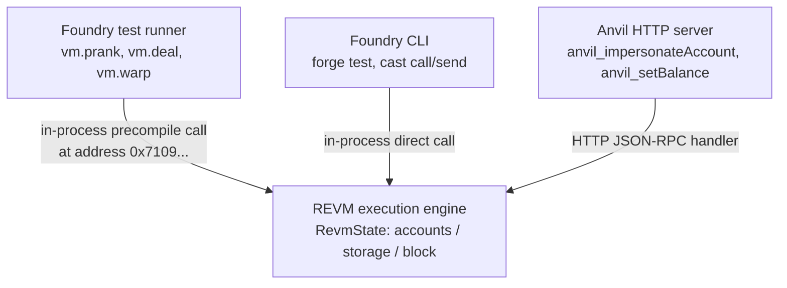

# Mastering Foundry — L5 draft (EN)

> No openhl SHA pin (`anvil` is a Foundry CLI tool). Cross-references L1–L3's `vm.*` cheatcodes (`vm.prank`, `vm.deal`, `vm.warp`) and shows their `anvil_*` RPC equivalents — same REVM machinery exposed through two surfaces. L4's `cast send`/`cast call` invocations now point at anvil instead of mainnet. Public RPC `https://ethereum.reth.rs/rpc` used as the fork source.

## L5 — `foundry-anvil-cheatcodes-en`

**Title**: Lesson 5 — `anvil` + cheatcodes — local development with mainnet state

**Duration**: 35 min · **XP**: 70

---

````markdown
# Lesson 5 — `anvil` + cheatcodes — local development with mainnet state

## Goal

Concepts you'll grasp in this lesson:

- **`anvil --fork-url <URL>` gives you a personal mainnet at `localhost:8545`.** Anvil is an in-process REVM that, when started with `--fork-url`, lazily fetches state from a remote node and serves it locally as if it were the canonical chain. Block N's state, contract storage, account balances — all readable from anvil as they exist on mainnet at the fork block, all modifiable without touching real mainnet. You can deploy contracts that read from Uniswap's actual pools, simulate liquidation cascades against real Aave positions, test governance proposals against the actual DAO state — and reset everything with a `Ctrl-C`. **The forked anvil is the closest thing to a personal mainnet clone you can spin up in 2 seconds.**
- **`anvil_*` RPC methods are the CLI surface for the same machinery `vm.*` cheatcodes expose inside tests.** When you wrote `vm.prank(0xWhale)` in an L1–L3 test, Foundry's test runner sent a call to a magic precompile address that mutates REVM's internal `tx.origin` for the next call. When you run `cast rpc anvil_impersonateAccount 0xWhale` against a forked anvil, you're sending an `anvil_*` JSON-RPC method that mutates REVM's *same* internal state — just from outside the EVM rather than inside. Two surfaces, one machinery. **The lesson you skipped in L0 just landed: cheatcodes-as-precompiles inside tests, `anvil_*` RPC outside tests, identical REVM state mutations underneath.**
- **The 10 deterministic accounts anvil seeds are a feature, not a curiosity.** Anvil uses a fixed BIP-39 mnemonic (`test test test ... junk`) and derives 10 accounts at standard derivation paths, each pre-funded with 10,000 ETH. The deterministic seed means every developer's accounts have the same addresses; the same `--private-key` works in any anvil instance globally. This enables reproducible tutorials, shareable scripts, and CI determinism — at the cost of obviously being completely insecure (you must never use these keys against any real network). **Determinism over secrecy is a deliberate trade-off; anvil is for development, never deployment.**
- **The forking-then-impersonating pattern unlocks tests against any production state.** A typical L5 workflow: fork mainnet at block N → impersonate a USDC whale → call `transfer` from the whale to your test address → use the USDC in subsequent calls to test your contract against real-balance positions. No need to write a fixture that mints synthetic tokens; you're using *the actual USDC*. Same trick works for any account: governance contracts, multisigs, deployers — impersonate and act as them. This is the production-debug pattern that, before Foundry, required a hand-rolled local-node fork and custom RPC handlers. Foundry compressed it into 3 `cast rpc` calls. **Forked-anvil impersonation is the closest thing to "edit-production-state" you can responsibly do.**

Verification:

```bash
# Terminal 1: start a forked anvil
anvil --fork-url https://ethereum.reth.rs/rpc

# Terminal 2: impersonate any address and read your fresh balance
cast rpc anvil_impersonateAccount 0xF977814e90dA44bFA03b6295A0616a897441aceC \
  --rpc-url http://localhost:8545
cast balance 0xF977814e90dA44bFA03b6295A0616a897441aceC \
  --rpc-url http://localhost:8545
```

…spins up a forked mainnet locally, marks Binance's hot wallet address (a known whale) as impersonatable, and queries its real ETH balance via the local node. After this lesson you'll have used anvil's 5 most important RPC methods, mapped 4 of them to the `vm.*` cheatcodes you already used inside tests, and run a real forked-impersonation flow.

Specific changes:

- **No source-file edits.** L5 is shell + RPC. You'll run `anvil` in one terminal and `cast rpc` / `cast call` / `cast send` in another.
- **Optional**: set `ETH_RPC_URL=http://localhost:8545` in your second-terminal session to drop `--rpc-url` from subsequent `cast` invocations.

Total: zero lines of Solidity. The pedagogical move is recognizing that the L1–L3 `vm.*` cheatcodes you wrote inside tests and the `anvil_*` RPC methods you call from the CLI are the same REVM-internal manipulations through two different transports.

## Recap

After L4:
- `cast` is `alloy::Provider` exposed as a terminal command; subcommands map 1:1 to alloy methods.
- `cast call` reads, `cast send` writes; `--rpc-url` makes the chain a per-command parameter.
- `cast abi-encode` / `cast abi-decode` / `cast 4byte` cover the calldata-manipulation surface.

L4 pointed `cast` at *real* mainnet. L5 points `cast` at a *local fork* of mainnet — your machine is now a controllable mainnet clone. The vm.* cheatcodes you saw inside Foundry tests come back as `anvil_*` RPC methods, and the discipline-transfer story completes: same REVM, three surfaces (Solidity `vm.*`, Foundry test runner, anvil JSON-RPC).

## Plan

Six categories of invocation:

1. **Start a forked anvil** — `anvil` (vanilla) vs `anvil --fork-url <mainnet-rpc>`. Inspect the seeded accounts.
2. **`anvil_impersonateAccount`** — mark a real mainnet address as impersonatable, then send transactions *as* that address without its private key.
3. **`anvil_setBalance` / `anvil_setStorageAt`** — directly mutate account balances and contract storage. The "I'm the chain god" RPC methods.
4. **`anvil_mine` / `anvil_setNextBlockTimestamp`** — time-travel: mine N blocks instantly, or jump the next block's timestamp forward. Useful for testing time-dependent logic without waiting 7 days.
5. **The forked-impersonation flow** — fork mainnet → impersonate USDC whale → transfer USDC to your test address → use it in a contract call. The end-to-end demo.
6. **The `vm.*` ↔ `anvil_*` mapping table** — same pedagogical role as L4's `cast` ↔ `alloy::Provider` table, but for cheatcodes.

> 🛑 **Predict.** Before reading on: in your L1 test you wrote `vm.deal(alice, 10 ether)` to give alice a fresh balance for the test. Anvil exposes the same machinery via RPC. What's the `cast rpc anvil_*` invocation that does the same thing against a running forked anvil at `localhost:8545`?

(Answer: **`cast rpc anvil_setBalance 0xAliceAddress 0x8AC7230489E80000 --rpc-url http://localhost:8545`** — where `0x8AC7230489E80000` is hex for 10 × 10^18 wei (10 ether). The shape is identical: name an address, set its balance to a value. Anvil's RPC takes the balance as a hex-encoded uint256; the test cheatcode takes it as a Solidity `uint256`. **Same REVM state field is being written. The difference is whether you're inside Foundry's test runner (cheatcode) or talking to anvil over JSON-RPC (RPC method). Two surfaces, one machinery — and the values you write end up in the exact same `RevmState::accounts` map.**)

## How `vm.*` cheatcodes map to `anvil_*` RPC methods

The architecture in one diagram — same REVM, three surfaces:



Three different *transports* arriving at the *same* mutation API. The table below enumerates the specific cheatcode-to-RPC-method correspondences:

```
┌────────────────────────────────────┬──────────────────────────────────────────────┐
│  Inside Foundry tests (cheatcode)  │  Against a running anvil (RPC method)        │
├────────────────────────────────────┼──────────────────────────────────────────────┤
│  vm.prank(addr)                    │  cast rpc anvil_impersonateAccount addr      │
│  vm.deal(addr, value)              │  cast rpc anvil_setBalance addr <hex-value>  │
│  vm.warp(timestamp)                │  cast rpc anvil_setNextBlockTimestamp <ts>   │
│  vm.roll(blockNumber)              │  cast rpc anvil_mine <blockcount>            │
│  vm.store(addr, slot, value)       │  cast rpc anvil_setStorageAt addr slot value │
│  vm.etch(addr, bytecode)           │  cast rpc anvil_setCode addr <bytecode>      │
│  vm.snapshot() / vm.revertTo(id)   │  evm_snapshot / evm_revert (standard, not    │
│                                    │      anvil-namespaced — works on hardhat too)│
├────────────────────────────────────┼──────────────────────────────────────────────┤
│  (lives inside the test contract;  │  (called over HTTP JSON-RPC from any client; │
│   precompile at 0x710970...)       │   handled by anvil's RpcHandler in Rust)     │
└────────────────────────────────────┴──────────────────────────────────────────────┘
```

The structural takeaway: **`vm.*` and `anvil_*` are two transport surfaces over the same REVM state-mutation API.** Inside a Solidity test, the cheatcode goes through Foundry's precompile-intercept path; from a shell, the same mutation goes through anvil's JSON-RPC handler. Both call into the same Rust function that writes to REVM's `accounts` / `storage` / `block` fields. **If you grok L1–L3's `vm.*`, you already know what every `anvil_*` does; you just need the RPC method name.**

## Walk-through

### Step 1: Start anvil and inspect what you got

```bash
anvil
```

In one terminal. Anvil prints (abbreviated):

```
                              _   _
                             (_) | |
      __ _   _ __   __   __  _  | |
     / _` | | '_ \  \ \ / / | | | |
    | (_| | | | | |  \ V /  | | | |
     \__,_| |_| |_|   \_/   |_| |_|

    1.7.x ( ... )    https://github.com/foundry-rs/foundry

Available Accounts
==================

(0) "0xf39Fd6e51aad88F6F4ce6aB8827279cfFFb92266" (10000.000000000000000000 ETH)
(1) "0x70997970C51812dc3A010C7d01b50e0d17dc79C8" (10000.000000000000000000 ETH)
...
(9) "0xa0Ee7A142d267C1f36714E4a8F75612F20a79720" (10000.000000000000000000 ETH)

Private Keys
==================

(0) 0xac0974bec39a17e36ba4a6b4d238ff944bacb478cbed5efcae784d7bf4f2ff80
(1) 0x59c6995e998f97a5a0044966f0945389dc9e86dae88c7a8412f4603b6b78690d
...

Wallet
==================
Mnemonic:          test test test test test test test test test test test junk
Derivation path:   m/44'/60'/0'/0/

Chain ID
==================
31337

Listening on 127.0.0.1:8545
```

Five things to notice about the startup banner:

1. **The mnemonic is `test test test ... junk`.** Anvil uses this fixed seed phrase by default; every anvil instance on Earth, when started without `--mnemonic`, has the same 10 accounts. This is intentional — it lets tutorial code use known private keys without each reader having to set up their own seed. **The keys are public knowledge; never use them outside local development.**
2. **Account 0 is `0xf39Fd6...` with private key `0xac0974...`.** Memorize these — they appear constantly in tutorials, Foundry's own docs, and CI configs. You can paste `0xac0974...` as `--private-key` for any anvil-targeting `cast send` and it will work.
3. **Chain ID is `31337`.** That's the anvil default. Hardhat also defaults to `31337`. If you accidentally point a tx at a real network with chain ID `31337`, none will accept it — chain ID is the explicit shield against cross-chain replay. **The funny number is a safety feature.**
4. **The RPC listens on `127.0.0.1:8545`.** Standard Ethereum RPC port. Anvil binds to localhost only by default; `--host 0.0.0.0` opens it to the network (don't, on shared machines).
5. **No `--fork-url` means anvil starts from genesis with empty state.** No contracts deployed, no transactions in history. Useful for unit-testing your own contracts in isolation, useless for testing against production protocols. We'll restart with `--fork-url` in Step 2.

Stop this anvil (`Ctrl-C`) and start a forked one:

```bash
anvil --fork-url https://ethereum.reth.rs/rpc
```

The banner adds a `Fork` section:

```
Fork
==================
Endpoint:       https://ethereum.reth.rs/rpc
Block number:   <recent mainnet block number>
Block hash:     0x...
Chain ID:       1
```

**Chain ID is now `1` — mainnet.** The 10 deterministic accounts are still present (anvil seeds them regardless of fork status), but the chain state is now mainnet's view at the fork block. Every USDC balance, every Uniswap pool, every governance vote — readable as it exists on real Ethereum right now.

> ⚠️ **Safety note — Chain ID 1 fork + the wrong `--rpc-url`.** Your local fork now reports Chain ID `1`, the same value real mainnet reports. The chain-ID check that protects you from cross-chain replay between, say, mainnet and Sepolia *won't help here* — both endpoints report `1`. If a real mainnet RPC URL is sitting in another env var or in your shell history and you accidentally point `cast send --private-key <REAL-KEY>` at it instead of `http://localhost:8545`, the transaction broadcasts to real mainnet. `--unlocked` is harmless (no signed tx produced without a key), but `--private-key` is not. The defense: `export ETH_RPC_URL=http://localhost:8545` explicitly in your fork-working terminal and never paste real-mainnet private keys into that shell. **Discipline on `--rpc-url` is the only defense once you start forking.**

### Step 2: Read forked mainnet state from your local anvil

In a second terminal — set `ETH_RPC_URL` to the local anvil for the rest of the session:

```bash
export ETH_RPC_URL=http://localhost:8545
```

Now any `cast` command without `--rpc-url` goes to anvil. Read USDC's totalSupply:

```bash
cast call 0xA0b86991c6218b36c1d19D4a2e9Eb0cE3606eB48 "totalSupply()(uint256)"
```

Same output as L4 against real mainnet — because anvil's forking layer transparently fetches the contract code + storage from the fork source the first time you query it, caches it locally, and serves subsequent queries instantly. **Lazy state fetching: anvil only pulls state on demand, so spinning up a fork is fast (seconds), and the cached state is local for the session.**

### Step 3: Impersonate a real mainnet address

The killer feature. Pick any mainnet address — Binance's hot wallet at `0xF977814e90dA44bFA03b6295A0616a897441aceC` (a publicly-known whale, holds ~billions in various tokens):

```bash
cast rpc anvil_impersonateAccount 0xF977814e90dA44bFA03b6295A0616a897441aceC
```

Output: `null` (success — anvil RPC methods return `null` for "done").

Now you can send transactions *as* that address without its private key. Send 1 ETH from the impersonated whale to anvil's account 0 (`0xf39Fd6...`):

```bash
cast send --unlocked \
  --from 0xF977814e90dA44bFA03b6295A0616a897441aceC \
  --value 1ether \
  0xf39Fd6e51aad88F6F4ce6aB8827279cfFFb92266
```

The `--unlocked` flag tells `cast send` to ask the node to sign (anvil handles it for impersonated accounts; no private key needed). The transaction completes and anvil prints a receipt.

Verify the recipient's balance went up:

```bash
cast balance 0xf39Fd6e51aad88F6F4ce6aB8827279cfFFb92266 --ether
```

The starting `10000` ETH is now `10001` ETH. **You just sent 1 ETH from Binance's wallet to your local test account without their private key, against a local fork of mainnet state.** No real mainnet was touched.

Five things to notice:

1. **Impersonation works because anvil isn't enforcing signature verification on impersonated accounts.** The forked state shows Binance's address with a real ETH balance; anvil's transaction-execution path treats `from = impersonated_addr` as legitimate. **The signature check is what private keys exist to satisfy; impersonation simply turns the check off for designated addresses.**
2. **`anvil_impersonateAccount` is persistent until you stop impersonating.** Until you call `anvil_stopImpersonatingAccount`, the address stays in anvil's impersonation set. Useful for multi-step tests; harmful if you forget and another test step expects normal signature enforcement.
3. **`cast send --unlocked` is the CLI equivalent of `vm.prank` inside a test.** Both say "execute the next call as if it came from this address," both rely on the underlying machinery being permissive. **`--unlocked` is the magic word that tells cast not to expect a private key.**
4. **The whale's ETH balance reflects mainnet's view at fork time.** When anvil first served the `eth_getBalance(0xF977...)` query, it fetched the real balance from `https://ethereum.reth.rs/rpc`, cached it, and now serves locally-modified versions of that balance. Subsequent `cast send` operations subtract from anvil's local cache, not from real mainnet.
5. **Real mainnet is untouched.** The Binance address's actual ETH balance hasn't changed. You're sending ETH on your local fork; the global ledger doesn't know this happened.

Stop impersonating when done:

```bash
cast rpc anvil_stopImpersonatingAccount 0xF977814e90dA44bFA03b6295A0616a897441aceC
```

### Step 4: Edit state directly with `anvil_setBalance` / `anvil_setStorageAt`

Sometimes you don't want to impersonate — you just want to *give* an address a balance:

```bash
# Give anvil account 0 exactly 1,000,000 ETH (0x33B2E3C9FD0803CE8000000 wei)
cast rpc anvil_setBalance 0xf39Fd6e51aad88F6F4ce6aB8827279cfFFb92266 \
  0x33B2E3C9FD0803CE8000000

# Verify
cast balance 0xf39Fd6e51aad88F6F4ce6aB8827279cfFFb92266 --ether
# → 1000000.000000000000000000
```

This is the RPC equivalent of `vm.deal(addr, value)` from L1–L3 tests.

For ERC-20 token balances, you don't have an `anvil_setTokenBalance` — but you can use `anvil_setStorageAt` to directly write the storage slot that holds the balance:

```bash
# USDC's `_balances` mapping is at storage slot 9. The slot for balanceOf(addr)
# is keccak256(abi.encode(addr, 9)). Compute that:
SLOT=$(cast index address 0xf39Fd6e51aad88F6F4ce6aB8827279cfFFb92266 9)

# Set the balance to 1,000,000 USDC (1e12 in 6-decimal precision = 0xe8d4a51000)
cast rpc anvil_setStorageAt 0xA0b86991c6218b36c1d19D4a2e9Eb0cE3606eB48 \
  $SLOT \
  0x000000000000000000000000000000000000000000000000000000e8d4a51000

# Verify
cast call 0xA0b86991c6218b36c1d19D4a2e9Eb0cE3606eB48 \
  "balanceOf(address)(uint256)" \
  0xf39Fd6e51aad88F6F4ce6aB8827279cfFFb92266
# → 1000000000000
```

**You just gave yourself 1 million USDC on the local fork without buying any.** Same trick works for any storage slot of any contract — change a `totalSupply`, flip an `owner`, set a price feed's last value. The only thing you need is the storage slot, which Foundry's `forge inspect <contract> storage` reveals for any contract with source.

Three things to notice:

1. **`cast index address <addr> <base-slot>` computes the mapping slot.** `keccak256(abi.encode(addr, baseSlot))` is the Solidity storage layout for `mapping(address => X)`. `cast index` exposes this as a CLI helper, so you don't have to compute the keccak by hand.
2. **`anvil_setStorageAt` is the most powerful and most dangerous of anvil's mutators.** You can break contracts in interesting ways by setting storage to invalid states (e.g., set USDC's `paused` slot to a non-boolean). Use it for tests that verify your contract handles edge cases, not for "just making numbers match."

   > [!IMPORTANT]
   > **EVM Storage Alignment and Zero-Padding**
   > EVM storage slots are strictly aligned to 32-byte (256-bit) words. When calling `anvil_setStorageAt`, you must supply a **complete 32-byte hex value (`0x` followed by exactly 64 hex characters)**, padded with leading zeros (e.g., `0x000000000000000000000000000000000000000000000000000000e8d4a51000`).
   >
   > If you write a shorter hex value without explicit zero-padding (e.g., just `0xe8d4a51000`), it may violate word boundary rules and **risk corrupting or overwriting adjacent packed variables** sharing that same storage slot. Solidity's compiler optimization (Storage Packing) packs multiple small variables (e.g., an `address` and a `uint96`) into a single 32-byte slot to save gas. Writing to a slot without accounting for all variables in it will overwrite everything. The professional approach to updating single variables in a packed slot is to read the existing 32-byte value, apply a bitwise mask to update only the target bytes, and write the combined 32-byte word back.
3. **Real production contracts often have non-obvious storage layouts.** USDC's mapping at slot 9 is correct as of this writing, but contracts upgraded via proxy patterns can have arbitrary layouts. `forge inspect <contract> storage` is the source of truth.

### Step 5: Time travel with `anvil_mine` and `anvil_setNextBlockTimestamp`

Mine 100 blocks instantly (useful for testing time-locked withdrawals, vesting cliffs):

```bash
cast rpc anvil_mine 0x64  # 0x64 = 100
cast block-number
# → <fork_block + 100>
```

Jump the next block's timestamp forward by 7 days:

```bash
# Get current timestamp from latest block
CURRENT=$(cast block latest --field timestamp)
SEVEN_DAYS_LATER=$((CURRENT + 7 * 86400))

# Set next block's timestamp
cast rpc anvil_setNextBlockTimestamp $SEVEN_DAYS_LATER

# Mine one block so the timestamp takes effect
cast rpc anvil_mine 0x1

# Verify
cast block latest --field timestamp
# → <fork_timestamp + 7*86400>
```

This is the RPC equivalent of `vm.warp` + `vm.roll` from tests. Useful for: testing vesting that unlocks in N days, testing auction-end logic that requires N hours, testing rate-limiting that resets daily — all without waiting real time.

### Step 6: The full forked-impersonation flow as a recipe

Putting it together — the workflow you'll use most:

```bash
# Terminal 1: forked anvil
anvil --fork-url https://ethereum.reth.rs/rpc

# Terminal 2:
export ETH_RPC_URL=http://localhost:8545

# 1. Find a whale of the token you want
WHALE=0xF977814e90dA44bFA03b6295A0616a897441aceC  # Binance hot wallet
TOKEN=0xA0b86991c6218b36c1d19D4a2e9Eb0cE3606eB48  # USDC
ME=0xf39Fd6e51aad88F6F4ce6aB8827279cfFFb92266     # anvil account 0

# 2. Impersonate the whale
cast rpc anvil_impersonateAccount $WHALE

# 3. Whale needs ETH to pay gas — give them some
cast rpc anvil_setBalance $WHALE 0x8AC7230489E80000  # 10 ETH

# 4. Whale transfers USDC to you
cast send --unlocked --from $WHALE \
  $TOKEN "transfer(address,uint256)" $ME 1000000000  # 1000 USDC

# 5. Verify your new USDC balance
cast call $TOKEN "balanceOf(address)(uint256)" $ME
# → 1000000000  (1000 USDC in 6-decimal precision)

# 6. Now use this real USDC against your test contract
#    (deploy your contract via `forge create` or `cast send --create`,
#     then call it with your now-funded test account)
```

This 6-line recipe replaces what used to be a 200-line Hardhat fixture + custom mock-USDC + manual nonce management. **The compression is what makes Foundry productive.**

## Common errors

- **`Error: missing field "from"` on `cast send --unlocked`** — the `--from` flag wasn't passed. `--unlocked` requires `--from`, since there's no private key to derive the sender from.
- **`Error: nonce too low`** — you sent transactions from an account that anvil doesn't have the latest nonce for. Restart anvil (resets all nonces) or use `anvil_setNonce`.
- **`Error: insufficient funds for gas * price + value`** — the impersonated account doesn't have ETH to pay gas. Send it some via `anvil_setBalance` (Step 4) before sending the transaction.
- **`Error: --fork-url cannot be combined with empty-state options`** — you passed conflicting flags. `--fork-url` and the no-fork options are mutually exclusive. Drop one.
- **Anvil dies silently after long-running tests** — check anvil's terminal for OOM or panic messages. Long-running tests with many `anvil_setStorageAt` calls can grow anvil's state cache; restart between unrelated test runs.

## Design retrospective

Three load-bearing decisions in `anvil`'s design:

1. **Anvil reuses Reth's REVM execution engine; it's not a separate EVM impl.** Anvil isn't a from-scratch chain client — it's an HTTP server wrapped around the same `revm` crate Foundry's test runner uses, and the same `revm` Reth uses. The implication: if Reth supports a new EVM feature (EOF, custom precompiles, hard-fork rules), anvil gets it on the same release cycle. **One EVM implementation, three surfaces: Foundry tests (inline), Foundry CLI (`forge` / `cast`), local node (`anvil`).**

2. **`anvil_*` RPC method names are namespaced separately from `eth_*` standard methods.** Standard JSON-RPC methods like `eth_getBalance`, `eth_call`, `eth_sendTransaction` work identically on anvil as on any node. Anvil-specific methods like `anvil_impersonateAccount`, `anvil_setStorageAt` use the `anvil_` prefix. This is convention (also used by `hardhat_*` for Hardhat-specific methods), and it serves a discipline purpose: client code that calls `eth_*` is portable to mainnet, code that calls `anvil_*` is local-dev-only. **Namespace separation is a deployment-safety guard at the method-name level.**

3. **Forking is lazy, not eager.** Anvil doesn't download the entire mainnet state on `--fork-url`; it downloads state *on demand* as queries reference it. This means startup is fast (seconds, not hours), but the first query for any uncached state has a round-trip latency. Subsequent queries for the same state are instant. **Lazy forking is the trade-off that makes forking practical — eager forking would be unusably slow.**

## Answer key

After L5, your shell history should include something like:

```bash
# Terminal 1
anvil --fork-url https://ethereum.reth.rs/rpc

# Terminal 2 — the recipes you'll reach for most
export ETH_RPC_URL=http://localhost:8545
cast rpc anvil_impersonateAccount 0x...
cast rpc anvil_setBalance 0x... 0x...
cast rpc anvil_setStorageAt 0x... <slot> <value>
cast rpc anvil_mine 0x64
cast rpc anvil_setNextBlockTimestamp <unix-ts>
cast send --unlocked --from 0x... 0x<contract> "<sig>" <args...>
```

After L5 you can:
- Spin up a forked mainnet locally in 2 seconds
- Impersonate any account (no key required) and act as them
- Mutate any account's balance or contract's storage directly
- Time-travel forward by blocks or seconds for time-locked logic testing
- Build a full "fork → impersonate whale → fund test address → call contract" flow

## Q&A

**Q1: How is anvil different from Hardhat Network?**

Same core idea (local Ethereum node, RPC-compatible, supports forking + impersonation + state manipulation), different implementation language and ergonomics. Anvil is Rust + REVM, single binary, starts in ~100ms; Hardhat Network is JavaScript + ethereumjs-vm, npm-installed, starts in seconds. Anvil's RPC methods use the `anvil_*` prefix; Hardhat's use `hardhat_*`. For most workflows they're interchangeable. **Anvil wins on speed and zero-deps; Hardhat wins on plugin ecosystem if you've already invested in it.**

**Q2: Can I run anvil as a long-running development node?**

Yes — anvil is daemon-ready, supports background mode (`&`), and you can leave it running for hours. The state is in-memory only by default, so a restart loses all changes. For persistent state across restarts, use `--state <file>` to save/load state to disk. Note: state files can grow large (gigabytes) for long-running forks; clean them up periodically. **Anvil is fine for hour-long sessions; for longer, manage `--state` files.**

**Q3: What's the relationship between anvil and forge test?**

`forge test` runs your tests against an in-process REVM (the test runner spins one up per test). `anvil` runs an in-process REVM as an HTTP server. **Same EVM, different transport.** You can also point `forge test` at a running anvil with `--fork-url http://localhost:8545` if you want shared state between tests, but this defeats forge's per-test isolation; most workflows use forge's built-in REVM for tests and anvil for ad-hoc CLI work. **Tests = built-in REVM; CLI work = anvil.**

**Q4: Can I impersonate a contract address, not just an EOA?**

Yes. `anvil_impersonateAccount` works on any address; the address doesn't need to be an EOA. Useful for testing what happens when a specific contract calls your contract — you can impersonate the Uniswap V3 router and call your contract as if a real swap was routing through you. **Impersonation is address-keyed, not EOA-keyed.**

**Q5: What happens to the fork state when I `Ctrl-C` anvil?**

Lost (unless you used `--state <file>`). All `anvil_setBalance`, `anvil_setStorageAt`, `anvil_impersonateAccount` mutations and any transactions you sent disappear. Next `anvil --fork-url` re-fetches state from the fork source. **This is a feature, not a bug — fresh forks per session prevent state pollution between unrelated test runs.**

**Q6: Why doesn't `--fork-url` work with the `anvil` Docker image?**

It does — but the Docker image binds to localhost inside the container by default. You need `-p 8545:8545` to expose the port to your host. Also remember Docker's `--fork-url <host-RPC>` references the *container's* network view; if your fork source is on the host, use `host.docker.internal:<port>` (Docker Desktop) or your host's LAN IP. **Networking + Docker = the usual gotchas, not an anvil-specific issue.**

**Q7: My fork has Chain ID 1, the same as real mainnet. Doesn't this defeat the chain-ID safety check?**

Yes — and this is the L5 trap to internalize.

When you fork mainnet, local anvil reports Chain ID `1`. The chain-ID safety check only compares endpoint IDs, so if both endpoints report `1`, it passes silently.  
If a real-mainnet RPC URL is still in another env var or shell history, and you accidentally run `cast send --private-key <REAL-KEY> --rpc-url $REAL_RPC` instead of `http://localhost:8545`, the transaction will broadcast to real mainnet.

`--unlocked` impersonation is harmless against real mainnet (no signed tx is produced), but `--private-key` is not.  
The defense is operational, not architectural:

1. Explicitly set `export ETH_RPC_URL=http://localhost:8545` in fork-working sessions.
2. Never paste real-mainnet private keys into a shell that has been used for local-fork work.

**Once you start forking, `--rpc-url` discipline is your only defense. Chain-ID checks protect between different chains, not between a fork and its source chain.**

## Next lesson (L6) — Capstone — port openhl-liquidation's `InsuranceFund` to Solidity

L6 is the capstone where everything in L0–L5 comes together. You'll take openhl-liquidation Stage 10b's `InsuranceFund` — the Rust implementation you wrote (or studied) in the openhl-liquidation course — and port it to Solidity. Same 4 conservation laws, same precondition checks, same close-outcome decomposition. Then you'll prove the 4 invariants with `forge invariant` using a Handler that mirrors the Rust `proptest!` shape from L13. The capstone deliverable lives in-repo at `examples/foundry-capstone/`:

- `examples/foundry-capstone/src/InsuranceFund.sol` — the Solidity port
- `examples/foundry-capstone/test/InsuranceFundHandler.sol` — Handler with `wrappedDeposit` / `wrappedWithdraw` / `wrappedAbsorb` and the 3 ghost variables
- `examples/foundry-capstone/test/InsuranceFund.invariant.t.sol` — the 4 `invariant_*` functions: conservation, monotonicity-of-deposits, non-negative-balance, fee-residual-equivalence

By the end of L6 you'll have proven the same theorem in two languages, mechanically, against the same `forge invariant` engine you learned in L3. **That's the discipline transfer that makes the whole rethlab framework click: it was never about Rust *or* Solidity — it was about the conservation-law discipline that survives the language boundary.**

````

---

## Seed-file slot

L5 lands in Module 2 (CLI & state-aware testing) sortOrder 1:

```typescript
{
  title: 'Lesson 5 — anvil + cheatcodes — local development with mainnet state',
  slug: 'foundry-anvil-cheatcodes-en',
  type: 'CONTENT',
  sortOrder: 1,
  duration: 35,
  xpReward: 70,
  content: `# Lesson 5 — anvil + cheatcodes — local development with mainnet state\n\n...`
},
```

## Drafting self-review (before paste)

- **L5 closes Module 2 (CLI & state-aware testing).** L4 introduced cast against real mainnet; L5 pulls mainnet *into* your laptop and shows you how to mutate it. The pedagogical arc finishes: L1–L3 (tests inside Solidity) + L4 (CLI against external RPC) + L5 (CLI against your own RPC running a mainnet fork) — same REVM machinery, three surfaces.
- **The `vm.*` ↔ `anvil_*` mapping table is the load-bearing pedagogical move** (mirrors L4's `cast` ↔ `alloy::Provider` table). Same discipline-transfer framing applied to cheatcodes: if you wrote `vm.prank` inside L1–L3 tests, you already know what `anvil_impersonateAccount` does — you just need the RPC method name.
- **Step 3 (impersonate Binance hot wallet) is the killer demo.** Sending 1 ETH from Binance's wallet to your test account without their private key is the moment Foundry's local-dev story crystallizes for Rust engineers. The 5 things-to-notice unpack *why* impersonation works (signature check turned off for designated addresses) — not just *that* it works.
- **Step 4 (anvil_setStorageAt with USDC mapping slot 9) is the most powerful technique in the lesson.** `cast index address` exposes the keccak slot computation so readers don't have to compute by hand. The 1-million-USDC self-grant demo is concrete enough to drive home the "you control all state on the fork" point.
- **Step 6 (full recipe) is intentionally a copy-paste runnable script.** 6 lines of bash that replace what used to be a 200-line Hardhat fixture. The compression IS the lesson.
- **Q3 (forge test ↔ anvil relationship) clears up a common confusion** — same REVM, different transports. Q4 (impersonating a contract address) is the "wait, I can do that?" payoff. Q5 (state lost on Ctrl-C) is the "feature, not bug" framing.
- **Next-lesson preview names the L6 deliverable files explicitly.** Three files at `examples/foundry-capstone/` — readers know exactly what artifact they're building. The closing claim ("it was never about Rust or Solidity, it was about conservation-law discipline") is the course-spanning thesis that L0 promised and L6 will deliver.
