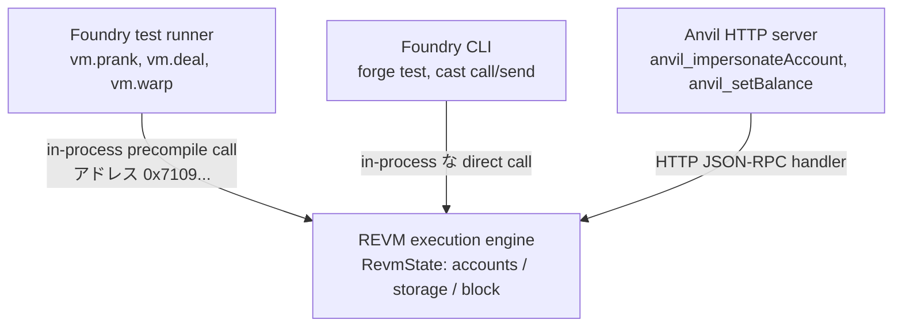

# Mastering Foundry — L5 draft (JA)

> openhl SHA pin はなし（`anvil` は Foundry の CLI ツール）。L1–L3 の `vm.*` cheatcode (`vm.prank`、`vm.deal`、`vm.warp`) を cross-reference し、それらの `anvil_*` RPC 等価物を示す — 同じ REVM 機構（REVM machinery）が 2 つの surface で露出されている。L4 の `cast send` / `cast call` invocation は今や mainnet ではなく anvil を指す。Public RPC `https://ethereum.reth.rs/rpc` を fork source として使う。

## L5 — `foundry-anvil-cheatcodes-ja`

**Title**: レッスン 5 — `anvil` + cheatcodes — real な mainnet state でのローカル開発

**Duration**: 35 分 · **XP**: 70

---

````markdown
# レッスン 5 — `anvil` + cheatcodes — real な mainnet state でのローカル開発

## ゴール

このレッスンで掴む概念:

- **`anvil --fork-url <URL>` が `localhost:8545` にあなた専用の mainnet を与える。** Anvil は in-process な REVM だ。`--fork-url` で起動すると、リモートノードから state を lazy に fetch し、それを canonical chain であるかのようにローカルで serve する。Block N の state、contract storage、account balance — すべて fork block 時点の mainnet 上の姿で anvil から読める。そして real mainnet に触れずに変更できる。Uniswap の実 pool を読む contract を deploy する、real な Aave position に対して liquidation cascade を simulate する、実 DAO state に対して governance proposal を test する — すべて `Ctrl-C` 1 つで reset できる。**Forked anvil は、ローカルマシン上に 2 秒で瞬時に展開される「パーソナル・メインネット・クローン（Personal mainnet clone）」だ。**
- **`anvil_*` RPC method は、test 内部で `vm.*` cheatcode が露出するのと同じ機構の CLI surface だ。** L1–L3 の test で `vm.prank(0xWhale)` を書いたとき、Foundry の test runner は REVM の内部 `tx.origin` を次の call に対して mutate する magic precompile address への call を送った。Forked anvil に対して `cast rpc anvil_impersonateAccount 0xWhale` を走らせるとき、あなたは REVM の *同じ* 内部 state を mutate する `anvil_*` JSON-RPC method を送っている。違いは EVM の内部からではなく外部から、それだけだ。2 つの surface、1 つの機構。**L0 で先送りにしたレッスンが今着地する: test 内では cheatcode-as-precompile、test 外では `anvil_*` RPC、下層は同一の REVM state mutation だ。**
- **anvil が seed する 10 個の決定的（Deterministic）アカウントは feature であって curiosity ではない。** Anvil は固定の BIP-39 mnemonic (`test test test ... junk`) を使い、標準 derivation path で 10 個の account を導出する。それぞれ事前に 10,000 ETH funded されている。決定的シード（Deterministic seed）は、すべての開発者の account が同じ address を持つことを意味する。同じ `--private-key` が地球上の任意の anvil instance で動く。これが reproducible なチュートリアル、shareable なスクリプト、CI determinism を可能にする。引き換えは明らかな完全な insecure さだ (これらの key を任意の real network に対して決して使ってはならない)。**機密性（Secrecy）を完全に犠牲にし、確定性（Determinism）を選択した意図的なトレードオフ（Deliberate trade-off）。Anvil は開発用であって deployment 用ではない。**
- **「Fork してから impersonate」パターンが、任意の production state に対する test を解き放つ。** 典型的な L5 ワークフロー: block N で mainnet を fork → USDC whale を impersonate → whale から自分の test address へ `transfer` を call → 後続の call でその USDC を使って自分の contract を real-balance position に対して test する。Synthetic token を mint する fixture を書く必要はない。*実 USDC* を使っているのだ。同じ trick が任意の account に対して動く。governance contract、multisig、deployer — impersonate して彼らとして動く。これが production-debug パターンだ。Foundry 以前は、これに手書きの local-node fork とカスタム RPC handler が要った。Foundry はそれを 3 つの `cast rpc` call まで圧縮した。**Forked-anvil impersonation は、責任を持ってできる「production state を編集する」に最も近いものだ。**

確認:

```bash
# Terminal 1: forked anvil を起動
anvil --fork-url https://ethereum.reth.rs/rpc

# Terminal 2: 任意の address を impersonate し、その fresh な balance を読む
cast rpc anvil_impersonateAccount 0xF977814e90dA44bFA03b6295A0616a897441aceC \
  --rpc-url http://localhost:8545
cast balance 0xF977814e90dA44bFA03b6295A0616a897441aceC \
  --rpc-url http://localhost:8545
```

…で forked mainnet をローカルに立ち上げ、Binance のホットウォレット address (既知の whale) を impersonatable としてマークし、その real な ETH 残高を local node 経由でクエリする。本レッスン完走後は、anvil の最も重要な 5 つの RPC method を使い、そのうち 4 つを test 内部ですでに使った `vm.*` cheatcode に map し、real な forked-impersonation flow を走らせている。

具体的な変更:

- **ソースファイル編集なし。** L5 は shell + RPC。1 つの terminal で `anvil` を走らせ、別 terminal で `cast rpc` / `cast call` / `cast send` を走らせる。
- **オプション**。2 つ目の terminal session で `ETH_RPC_URL=http://localhost:8545` を設定し、以降の `cast` invocation から `--rpc-url` を落とす。

合計で Solidity ゼロ行。Pedagogical move は、test 内部で書いた L1–L3 の `vm.*` cheatcode と CLI から call する `anvil_*` RPC method が、異なる 2 つの transport を通った同じ REVM 内部 mutation だと認識することだ。

## おさらい

L4 の後はこうなっている。
- `cast` は `alloy::Provider` を terminal command として露出させたもの。Subcommand は alloy method に 1:1 で map する。
- `cast call` は読み、`cast send` は書く。`--rpc-url` がチェーンを per-command parameter にする。
- `cast abi-encode` / `cast abi-decode` / `cast 4byte` が calldata 操作の surface をカバーする。

L4 は `cast` を *real な* mainnet に向けた。L5 は `cast` を mainnet の *ローカル fork* に向ける。マシンが今やコントロール可能な mainnet クローンだ。Foundry test 内部で見た `vm.*` cheatcode が `anvil_*` RPC method として戻ってくる。Discipline-transfer の物語が完結する。同じ REVM、3 つの surface (Solidity の `vm.*`、Foundry test runner、anvil JSON-RPC)。

## 計画

invocation のカテゴリが 6 つ。

1. **Forked anvil を起動する** — `anvil`（vanilla）vs `anvil --fork-url <mainnet-rpc>`。Seed された account を検査する。
2. **`anvil_impersonateAccount`** — real な mainnet address を impersonatable としてマークし、その private key なしでその address *として* transaction を送る。
3. **`anvil_setBalance` / `anvil_setStorageAt`** — account 残高と contract storage を直接 mutate する。チェーンの絶対的な創造主として振る舞う（God-mode）ための RPC method。
4. **`anvil_mine` / `anvil_setNextBlockTimestamp`** — タイムトラベル: N block を瞬時に mine する、または次 block の timestamp を前方にジャンプさせる。7 日待たずに時間依存のロジックを test するのに有用。
5. **Forked-impersonation flow** — mainnet を fork → USDC whale を impersonate → 自分の test address に USDC を transfer → contract call でそれを使う。エンドツーエンドのデモ。
6. **`vm.*` ↔ `anvil_*` マッピング表** — L4 の `cast` ↔ `alloy::Provider` 表と同じ pedagogical な役割だが、cheatcode 用。

> 🛑 **予測。** 続きを読む前に: L1 test で `vm.deal(alice, 10 ether)` と書き、test 用に alice に fresh 残高を与えた。Anvil は同じ機構を RPC で露出する。`localhost:8545` で走っている forked anvil に対して同じことをする `cast rpc anvil_*` invocation は何か?

(答え: **`cast rpc anvil_setBalance 0xAliceAddress 0x8AC7230489E80000 --rpc-url http://localhost:8545`**。ここで `0x8AC7230489E80000` は 10 × 10^18 wei (10 ether) の hex だ。Shape は同一。address を名指して、その balance を value に set する。Anvil RPC は balance を hex-encoded uint256 として取る。Test cheatcode は Solidity の `uint256` として取る。**同じ REVM state field に書き込まれている。違いは Foundry test runner の内部 (cheatcode) にいるか、JSON-RPC で anvil と話している (RPC method) かだ。2 つの surface、1 つの機構。書き込む値は exact に同じ `RevmState::accounts` map に着地する。**)

## `vm.*` cheatcode が `anvil_*` RPC method にどう map するか

アーキテクチャを 1 枚で — 同じ REVM、3 つの surface:



3 つの異なる *transport* が *同じ* mutation API に到達する。下の表が cheatcode と RPC method の具体的対応を列挙する:

```
┌────────────────────────────────────┬──────────────────────────────────────────────┐
│  Inside Foundry tests (cheatcode)  │  Against a running anvil (RPC method)        │
├────────────────────────────────────┼──────────────────────────────────────────────┤
│  vm.prank(addr)                    │  cast rpc anvil_impersonateAccount addr      │
│  vm.deal(addr, value)              │  cast rpc anvil_setBalance addr <hex-value>  │
│  vm.warp(timestamp)                │  cast rpc anvil_setNextBlockTimestamp <ts>   │
│  vm.roll(blockNumber)              │  cast rpc anvil_mine <blockcount>            │
│  vm.store(addr, slot, value)       │  cast rpc anvil_setStorageAt addr slot value │
│  vm.etch(addr, bytecode)           │  cast rpc anvil_setCode addr <bytecode>      │
│  vm.snapshot() / vm.revertTo(id)   │  evm_snapshot / evm_revert (standard, not    │
│                                    │      anvil-namespaced — works on hardhat too)│
├────────────────────────────────────┼──────────────────────────────────────────────┤
│  (lives inside the test contract;  │  (called over HTTP JSON-RPC from any client; │
│   precompile at 0x710970...)       │   handled by anvil's RpcHandler in Rust)     │
└────────────────────────────────────┴──────────────────────────────────────────────┘
```

構造的に押さえるべきこと。**`vm.*` と `anvil_*` は、同じ REVM state-mutation API の上にある 2 つの transport surface だ。** Solidity test の内部では cheatcode が Foundry の precompile-intercept パスを通る。Shell からは同じ mutation が anvil の JSON-RPC handler を通る。両者とも、REVM の `accounts` / `storage` / `block` フィールドに書き込む同じ Rust 関数を呼ぶ。**L1–L3 の `vm.*` を grok 済みなら、すべての `anvil_*` が何をするかをすでに知っている。RPC method 名を覚えるだけだ。**

## 手を動かす walk-through

### Step 1: Anvil を起動して何を得たか検査する

```bash
anvil
```

を 1 つ目の terminal で。Anvil が表示する (短縮版):

```
                              _   _
                             (_) | |
      __ _   _ __   __   __  _  | |
     / _` | | '_ \  \ \ / / | | | |
    | (_| | | | | |  \ V /  | | | |
     \__,_| |_| |_|   \_/   |_| |_|

    1.7.x ( ... )    https://github.com/foundry-rs/foundry

Available Accounts
==================

(0) "0xf39Fd6e51aad88F6F4ce6aB8827279cfFFb92266" (10000.000000000000000000 ETH)
(1) "0x70997970C51812dc3A010C7d01b50e0d17dc79C8" (10000.000000000000000000 ETH)
...
(9) "0xa0Ee7A142d267C1f36714E4a8F75612F20a79720" (10000.000000000000000000 ETH)

Private Keys
==================

(0) 0xac0974bec39a17e36ba4a6b4d238ff944bacb478cbed5efcae784d7bf4f2ff80
(1) 0x59c6995e998f97a5a0044966f0945389dc9e86dae88c7a8412f4603b6b78690d
...

Wallet
==================
Mnemonic:          test test test test test test test test test test test junk
Derivation path:   m/44'/60'/0'/0/

Chain ID
==================
31337

Listening on 127.0.0.1:8545
```

起動 banner で押さえる点が 5 つ。

1. **Mnemonic は `test test test ... junk` だ。** Anvil は default でこの固定シード phrase を使う。`--mnemonic` なしで起動するすべての anvil instance が、地球上のどこでも同じ 10 account を持つ。これは意図的だ。チュートリアルコードが既知の private key を使えるようにし、reader それぞれが自分のシードをセットアップする必要をなくす。**Key は public knowledge。ローカル開発以外で決して使うな。**
2. **Account 0 は `0xf39Fd6...` で private key は `0xac0974...`。** これらは memorize しろ — チュートリアル、Foundry 自身の docs、CI config に常に現れる。`0xac0974...` を anvil 向けの任意の `cast send` の `--private-key` として paste すれば動く。
3. **Chain ID は `31337`。** これが anvil の default。Hardhat も default で `31337`。誤って chain ID `31337` の tx を real network に向けても受け入れられない。chain ID は cross-chain replay に対する明示的なシールドだ。**そのおかしな数字は safety feature。**
4. **RPC は `127.0.0.1:8545` で listen する。** 標準 Ethereum RPC port。Anvil は default で localhost のみに bind する。`--host 0.0.0.0` がネットワークに開く (共有マシンではするな)。
5. **`--fork-url` なしだと anvil は genesis から空 state で起動する。** Contract は deploy されておらず、history に transaction はない。自分の contract を isolation で unit-test するには有用。Production protocol に対して test するには無用。Step 2 で `--fork-url` で再起動する。

この anvil を stop (`Ctrl-C`) して、forked one を起動する:

```bash
anvil --fork-url https://ethereum.reth.rs/rpc
```

Banner に `Fork` セクションが追加される:

```
Fork
==================
Endpoint:       https://ethereum.reth.rs/rpc
Block number:   <recent mainnet block number>
Block hash:     0x...
Chain ID:       1
```

**Chain ID は今や `1` — mainnet。** 10 個の決定的 account はまだ存在する (anvil が fork status に関係なく seed する)。だが chain state は今や fork block 時点の mainnet の view だ。すべての USDC balance、すべての Uniswap pool、すべての governance vote — real な Ethereum に今存在するそのままに読める。

> ⚠️ **安全注意 — Chain ID 1 fork と間違った `--rpc-url`。** ローカル fork は今や Chain ID `1` を返す。Real な mainnet が返すのと同じ値だ。Mainnet と Sepolia の間など、cross-chain replay から守ってくれる chain-ID check が *ここでは効かない* — 両 endpoint とも `1` を返すからだ。Real な mainnet RPC URL が別の env var や shell 履歴に残っていて、誤って `cast send --private-key <REAL-KEY>` を `http://localhost:8545` の代わりにそれに向けると、transaction は real mainnet に broadcast される。`--unlocked` は無害だ (key なしでは signed tx が生成されない) が、`--private-key` は無害ではない。防御は: fork を扱う terminal で `export ETH_RPC_URL=http://localhost:8545` を明示的に export し、real-mainnet private key をその shell に paste しない。**Fork し始めた瞬間から、`--rpc-url` への規律だけが唯一の防御だ。**

### Step 2: Forked mainnet state をローカル anvil から読む

2 つ目の terminal で。残りのセッションのために `ETH_RPC_URL` をローカル anvil に設定する:

```bash
export ETH_RPC_URL=http://localhost:8545
```

これで `--rpc-url` なしの任意の `cast` コマンドが anvil に向かう。USDC の totalSupply を読む:

```bash
cast call 0xA0b86991c6218b36c1d19D4a2e9Eb0cE3606eB48 "totalSupply()(uint256)"
```

L4 で real mainnet に対して見たのと同じ出力だ。anvil の forking layer が fork source から contract code + storage を最初のクエリ時に透過的に fetch し、ローカルに cache し、以降のクエリを瞬時に serve する。**遅延フェッチ（Lazy fetching）。anvil は state を on-demand でのみ pull する。だから fork の立ち上げは速く (秒単位)、cached state はセッション中ローカルに残る。**

### Step 3: Real な mainnet address を impersonate する

キラー機能（Killer feature）だ。任意の mainnet address を選ぶ — Binance のホットウォレットの `0xF977814e90dA44bFA03b6295A0616a897441aceC` (公開既知の whale、各種トークンで数十億を保有):

```bash
cast rpc anvil_impersonateAccount 0xF977814e90dA44bFA03b6295A0616a897441aceC
```

出力: `null` (success — anvil RPC method は「done」に対して `null` を返す)。

これでその private key なしにその address *として* transaction を送れる。Impersonate した whale から anvil account 0 (`0xf39Fd6...`) へ 1 ETH を送る:

```bash
cast send --unlocked \
  --from 0xF977814e90dA44bFA03b6295A0616a897441aceC \
  --value 1ether \
  0xf39Fd6e51aad88F6F4ce6aB8827279cfFFb92266
```

`--unlocked` フラグが `cast send` にノードへ sign を依頼するよう指示する (anvil が impersonated account 向けにそれを処理する。Private key 不要)。Transaction が complete し、anvil が receipt を表示する。

Recipient の残高が増えたことを検証:

```bash
cast balance 0xf39Fd6e51aad88F6F4ce6aB8827279cfFFb92266 --ether
```

開始時の `10000` ETH が今や `10001` ETH。**Binance のウォレットから自分のローカル test account へ、Binance の private key なし、mainnet のローカル fork に対して、1 ETH を送ったところだ。** Real mainnet には触れていない。

押さえる点が 5 つ。

1. **偽装（Impersonation）が動くのは、anvil が impersonated account に対して signature verification を強制していないからだ。** Forked state が Binance の address を real な ETH balance で表示する。Anvil の transaction-execution パスは `from = impersonated_addr` を legitimate として扱う。**Signature check こそが private key の存在理由だ。Impersonation は単にその check を designated address に対して off にする。**
2. **`anvil_impersonateAccount` は impersonate を stop するまで persistent だ。** `anvil_stopImpersonatingAccount` を call するまで、address は anvil の impersonation set に居続ける。Multi-step test には有用。だが別の test step が normal な signature enforcement を期待しているのに impersonation を忘れていると有害だ。
3. **`cast send --unlocked` は test 内部の `vm.prank` の CLI 等価物だ。** 両者とも「次の call をこの address から来たかのように execute する」と言う。両者とも underlying な機構が permissive であることに依存する。**`--unlocked` が cast に private key を期待するなと告げる魔法の言葉だ。**
4. **Whale の ETH 残高は fork 時点での mainnet の view を反映している。** Anvil が初めて `eth_getBalance(0xF977...)` クエリを serve したとき、`https://ethereum.reth.rs/rpc` から real な balance を fetch し、cache した。今やローカル変更版の balance を serve している。後続の `cast send` operation は real mainnet ではなく anvil のローカル cache から差し引く。
5. **Real mainnet には触れていない。** Binance address の実際の ETH balance は変わっていない。あなたはローカル fork で ETH を送っている。グローバル台帳はこれが起きたことを知らない。

Done になったら impersonate を stop する:

```bash
cast rpc anvil_stopImpersonatingAccount 0xF977814e90dA44bFA03b6295A0616a897441aceC
```

### Step 4: `anvil_setBalance` / `anvil_setStorageAt` で state を直接編集する

時に impersonate したくないこともある。単に address に balance を *与え* たいだけ:

```bash
# anvil account 0 にちょうど 1,000,000 ETH を与える (0x33B2E3C9FD0803CE8000000 wei)
cast rpc anvil_setBalance 0xf39Fd6e51aad88F6F4ce6aB8827279cfFFb92266 \
  0x33B2E3C9FD0803CE8000000

# 検証
cast balance 0xf39Fd6e51aad88F6F4ce6aB8827279cfFFb92266 --ether
# → 1000000.000000000000000000
```

これが L1–L3 test の `vm.deal(addr, value)` の RPC 等価物だ。

ERC-20 token balance には `anvil_setTokenBalance` はない。だが `anvil_setStorageAt` を使えば balance を保持する storage slot に直接書き込める:

```bash
# USDC の `_balances` mapping は storage slot 9。balanceOf(addr) の slot は
# keccak256(abi.encode(addr, 9)) だ。それを計算する:
SLOT=$(cast index address 0xf39Fd6e51aad88F6F4ce6aB8827279cfFFb92266 9)

# Balance を 1,000,000 USDC (6-decimal 精度で 1e12 = 0xe8d4a51000) に set
cast rpc anvil_setStorageAt 0xA0b86991c6218b36c1d19D4a2e9Eb0cE3606eB48 \
  $SLOT \
  0x000000000000000000000000000000000000000000000000000000e8d4a51000

# 検証
cast call 0xA0b86991c6218b36c1d19D4a2e9Eb0cE3606eB48 \
  "balanceOf(address)(uint256)" \
  0xf39Fd6e51aad88F6F4ce6aB8827279cfFFb92266
# → 1000000000000
```

**ローカル fork で、何も買わずに 100 万 USDC を自分に与えたところだ。** 同じ trick が任意の contract の任意の storage slot に対して動く。`totalSupply` を変える、`owner` をフリップする、price feed の last value を set する。必要なのは storage slot だけだ。それは Foundry の `forge inspect <contract> storage` がソース付き任意の contract に対して明らかにする。

押さえる点が 3 つ。

1. **`cast index address <addr> <base-slot>` が mapping slot を計算する。** `keccak256(abi.encode(addr, baseSlot))` が `mapping(address => X)` の Solidity storage layout だ。`cast index` がこれを CLI ヘルパーとして露出する。手で keccak を計算する必要はない。
2. **`anvil_setStorageAt` が anvil の mutator のうち最も強力で最も危険だ。** Storage を invalid な state にすると面白い壊れ方をする (例: USDC の `paused` slot に non-boolean を入れる)。それを「単に数字を合わせる」ためではなく、自分の contract が edge case を扱うことを検証する test に使え。
3. **Real production contract はしばしば non-obvious な storage layout を持つ。** USDC の mapping が slot 9 にあるのはこの執筆時点で正しい。だが proxy パターン経由でアップグレードされた contract は任意の layout を持ち得る。`forge inspect <contract> storage` がソースオブトゥルースだ。

### Step 5: `anvil_mine` と `anvil_setNextBlockTimestamp` でタイムトラベルする

100 block を瞬時に mine する (time-locked withdrawal や vesting cliff の test に有用):

```bash
cast rpc anvil_mine 0x64  # 0x64 = 100
cast block-number
# → <fork_block + 100>
```

次 block の timestamp を 7 日先にジャンプさせる:

```bash
# Latest block から現在の timestamp を取得
CURRENT=$(cast block latest --field timestamp)
SEVEN_DAYS_LATER=$((CURRENT + 7 * 86400))

# 次 block の timestamp を set
cast rpc anvil_setNextBlockTimestamp $SEVEN_DAYS_LATER

# 1 block mine して timestamp を適用させる
cast rpc anvil_mine 0x1

# 検証
cast block latest --field timestamp
# → <fork_timestamp + 7*86400>
```

これが test の `vm.warp` + `vm.roll` の RPC 等価物だ。N 日後に unlock する vesting、N 時間を要する auction-end ロジック、日次 reset する rate-limit — 全部 real な時間を待たずに test できる。

### Step 6: Forked-impersonation flow の full レシピ

組み合わせる。一番使うことになる workflow だ:

```bash
# Terminal 1: forked anvil
anvil --fork-url https://ethereum.reth.rs/rpc

# Terminal 2:
export ETH_RPC_URL=http://localhost:8545

# 1. 欲しい token の whale を見つける
WHALE=0xF977814e90dA44bFA03b6295A0616a897441aceC  # Binance ホットウォレット
TOKEN=0xA0b86991c6218b36c1d19D4a2e9Eb0cE3606eB48  # USDC
ME=0xf39Fd6e51aad88F6F4ce6aB8827279cfFFb92266     # anvil account 0

# 2. Whale を impersonate
cast rpc anvil_impersonateAccount $WHALE

# 3. Whale が gas を払うために ETH が必要 — 与える
cast rpc anvil_setBalance $WHALE 0x8AC7230489E80000  # 10 ETH

# 4. Whale が自分に USDC を transfer
cast send --unlocked --from $WHALE \
  $TOKEN "transfer(address,uint256)" $ME 1000000000  # 1000 USDC

# 5. 新しい USDC balance を検証
cast call $TOKEN "balanceOf(address)(uint256)" $ME
# → 1000000000  (1000 USDC、6-decimal 精度)

# 6. 今やこの real な USDC を自分の test contract に対して使える
#    (`forge create` か `cast send --create` で contract を deploy し、
#     今や funded された test account からそれを call する)
```

この 6 行のレシピが、かつての 200 行 Hardhat fixture + custom mock-USDC + manual nonce 管理を置き換える。**この圧縮こそが Foundry を productive にしている。**

## よくある失敗パターン

- **`Error: missing field "from"` が `cast send --unlocked` で出る** — `--from` フラグが渡されていない。`--unlocked` は `--from` を要求する。Sender を導出する private key がないからだ。
- **`Error: nonce too low`** — anvil が latest nonce を持っていない account から transaction を送った。Anvil を再起動する (すべての nonce をリセット) か `anvil_setNonce` を使う。
- **`Error: insufficient funds for gas * price + value`** — impersonate された account に gas を払う ETH がない。Transaction を送る前に `anvil_setBalance` (Step 4) 経由で ETH を送る。
- **`Error: --fork-url cannot be combined with empty-state options`** — 競合するフラグを渡した。`--fork-url` と no-fork オプションは相互に排他。1 つ落とせ。
- **長い test の後 anvil が silent に死ぬ** — anvil の terminal で OOM や panic メッセージを check する。`anvil_setStorageAt` call の多い長い test は anvil の状態キャッシュ（State cache）を膨らませる。無関係な test run の合間に再起動する。

## 設計の振り返り

`anvil` の設計に焼き込んだ load-bearing な決定が 3 つ:

1. **Anvil は Reth の REVM execution engine を再利用する。別の EVM 実装ではない。** Anvil は from-scratch なチェーンクライアントではない。Foundry の test runner が使う同じ `revm` crate、Reth が使う同じ `revm` の上に被せた HTTP server だ。含意はこうだ。Reth が新しい EVM 機能 (EOF、カスタム precompile、ハードフォークルール) をサポートすると、anvil は同じリリースサイクルでそれを得る。**1 つの EVM 実装、3 つの surface。Foundry test (inline)、Foundry CLI (`forge` / `cast`)、ローカルノード (`anvil`)。**

2. **`anvil_*` RPC method 名は `eth_*` 標準 method から名前空間で分離されている。** `eth_getBalance`、`eth_call`、`eth_sendTransaction` のような標準 JSON-RPC method は anvil でも任意のノードと同一に動く。`anvil_impersonateAccount`、`anvil_setStorageAt` のような anvil 固有 method は `anvil_` prefix を使う。これは convention だ (Hardhat 固有 method 用に `hardhat_*` も同様に使われる)。そして規律の目的を持つ。`eth_*` を call する client code は mainnet に portable、`anvil_*` を call する code はローカル開発専用。**名前空間分離（Namespace separation）は method 名レベルでの deployment-safety guard だ。**

3. **Forking は eager ではなく lazy だ。** Anvil は `--fork-url` 時に mainnet state 全体をダウンロードしない。クエリがそれを参照したときに on demand でダウンロードする。起動は速い (時間単位ではなく秒単位)。だが任意のキャッシュされていない state への最初のクエリには round-trip latency がある。同じ state への後続のクエリは瞬時だ。**Lazy forking が forking を実用的にするトレードオフだ。eager forking は使えないほど遅い。**

## 答え合わせ

L5 の後、shell history にはこんなものが残る:

```bash
# Terminal 1
anvil --fork-url https://ethereum.reth.rs/rpc

# Terminal 2 — 一番手を伸ばすことになるレシピ
export ETH_RPC_URL=http://localhost:8545
cast rpc anvil_impersonateAccount 0x...
cast rpc anvil_setBalance 0x... 0x...
cast rpc anvil_setStorageAt 0x... <slot> <value>
cast rpc anvil_mine 0x64
cast rpc anvil_setNextBlockTimestamp <unix-ts>
cast send --unlocked --from 0x... 0x<contract> "<sig>" <args...>
```

L5 の後はこれができる:
- Forked mainnet をローカルに 2 秒で立ち上げる
- 任意の account (key 不要) を impersonate し、それとして動く
- 任意の account の balance や任意の contract の storage を直接 mutate する
- Time-locked ロジック test 用に、block か秒数で時間を前方ジャンプさせる
- Full な「fork → whale を impersonate → test address を fund → contract を call」flow を組む

## よくある質問

**Q1: Anvil は Hardhat Network とどう違う?**

Core idea は同じだ。ローカル Ethereum ノード、RPC-compatible、forking + impersonation + state 操作をサポート。違うのは実装言語と ergonomics。Anvil は Rust + REVM、シングルバイナリ、~100ms で起動する。Hardhat Network は JavaScript + ethereumjs-vm、npm-installed、秒単位で起動する。RPC method の prefix も別だ — anvil は `anvil_*`、Hardhat は `hardhat_*`。ほとんどの workflow で交換可能。**Anvil は速度と zero-deps で勝つ。Hardhat はすでに投資済みなら plugin エコシステムで勝つ。**

**Q2: Anvil を long-running な開発ノードとして走らせられる?**

Yes。Anvil は daemon-ready、バックグラウンドモード (`&`) をサポートし、何時間も走らせておける。State は default では in-memory のみ。再起動はすべての変更を失う。再起動越しに persistent な state には `--state <file>` を使い、disk に state を保存・load する。注意。state ファイルは long-running fork で大きく成長する (ギガバイト級)。定期的にクリーンアップする。**Anvil は時間単位のセッションには問題ない。それより長くなら `--state` ファイルを管理しろ。**

**Q3: Anvil と forge test の関係は?**

同じ REVM、違う transport だ。`forge test` はあなたの test を in-process な REVM に対して走らせる (test runner が test 1 つにつき 1 つ立ち上げる)。`anvil` は in-process な REVM を HTTP server として走らせる。`forge test` を `--fork-url http://localhost:8545` で走っている anvil に向けることもできる。test 間で state を共有したい場合だ。だがこれは forge の per-test isolation を defeat する。ほとんどの workflow は test 用に forge built-in REVM を使い、ad-hoc CLI 作業用に anvil を使う。**Test = built-in REVM、CLI 作業 = anvil。**

**Q4: EOA だけでなく contract address も impersonate できる?**

Yes。`anvil_impersonateAccount` は任意の address で動く。EOA である必要はない。特定の contract が自分の contract を call したとき何が起きるかを test するのに有用だ。Uniswap V3 router を impersonate すれば、real な swap が自分を経由したかのように自分の contract を call できる。**Impersonation は address-keyed であって、EOA-keyed ではない。**

**Q5: Anvil を `Ctrl-C` したら fork state はどうなる?**

失われる (`--state <file>` を使った場合を除いて)。すべての `anvil_setBalance`、`anvil_setStorageAt`、`anvil_impersonateAccount` mutation と、送信したすべての transaction が消える。次の `anvil --fork-url` が fork source から state を再 fetch する。**これは bug ではなく feature だ。セッションごとに fresh な fork が、無関係な test run 間の state pollution を防ぐ。**

**Q6: なぜ `anvil` Docker image で `--fork-url` が動かない?**

動く。だが Docker image は default でコンテナ内部の localhost に bind する。Host に port を露出するには `-p 8545:8545` が必要だ。また忘れるな、Docker の `--fork-url <host-RPC>` は *コンテナの* network view を参照する。Fork source が host にあるなら `host.docker.internal:<port>` (Docker Desktop) かホストの LAN IP を使う。**ネットワーキング + Docker = 通常の落とし穴。Anvil 固有の問題ではない。**

**Q7: 私の fork は Chain ID 1 で、real mainnet と同じだ。これが chain-ID safety check を骨抜きにしないか?**

Yes — そしてこれが L5 で内面化すべき罠だ。Mainnet を fork すると、ローカル anvil は Chain ID `1` を返す。Mainnet と Sepolia の間で誤った replay を防いでくれる chain-ID check は、2 つの endpoint の chain ID を比較する。両 endpoint とも `1` を返すなら、check は silently に pass する。Real な mainnet RPC URL が別の env var や shell 履歴に残っていて、誤って `cast send --private-key <REAL-KEY> --rpc-url $REAL_RPC` を (`http://localhost:8545` を指す代わりに) 実行すると、transaction は real mainnet に文句なく broadcast される。`--unlocked` の impersonation は real mainnet に対して無害だ (signed tx は生成されない) が、`--private-key` はそうではない。防御は architectural ではなく operational だ。**Fork を扱う session で `export ETH_RPC_URL=http://localhost:8545` を明示的に export し、real-mainnet private key をローカル fork 作業をしてきた shell に paste しない。Fork を始めた瞬間から、`--rpc-url` への規律だけが唯一の防御だ — chain-ID check は異なるチェーン間で守ってくれる。Fork とそれが fork したチェーンの間では守ってくれない。**

## 次のレッスン (L6) — Capstone — openhl-liquidation の `InsuranceFund` を Solidity へ port する

L6 が capstone で、そこで L0–L5 のすべてが集結する。openhl-liquidation Stage 10b の `InsuranceFund` — openhl-liquidation コースで書いた (あるいは研究した) Rust 実装 — を取り、それを Solidity へ port する。同じ 4 つの保存則、同じ precondition check、同じ close-outcome decomposition。それから 4 つの invariant を `forge invariant` で証明する。Handler は L13 の Rust `proptest!` shape をミラーする。Capstone deliverable は in-repo で `examples/foundry-capstone/` に住む:

- `examples/foundry-capstone/src/InsuranceFund.sol` — Solidity port
- `examples/foundry-capstone/test/InsuranceFundHandler.sol` — `wrappedDeposit` / `wrappedWithdraw` / `wrappedAbsorb` と 3 つの ghost 変数を持つ Handler
- `examples/foundry-capstone/test/InsuranceFund.invariant.t.sol` — 4 つの `invariant_*` 関数: conservation、monotonicity-of-deposits、non-negative-balance、fee-residual-equivalence

L6 完走後、同じ定理を 2 言語で機械的に証明している。L3 で学んだ同じ `forge invariant` engine に対してだ。**それが rethlab framework 全体を腹落ちさせる discipline transfer だ: それは決して Rust *か* Solidity の話ではなかった — それは言語境界を survive する保存則規律の話だった。**

````

---

## Seed-file slot

L5 は Module 2 (CLI & state-aware testing) の sortOrder 1 に入る:

```typescript
{
  title: 'レッスン 5 — anvil + cheatcodes — real な mainnet state でのローカル開発',
  slug: 'foundry-anvil-cheatcodes-ja',
  type: 'CONTENT',
  sortOrder: 1,
  duration: 35,
  xpReward: 70,
  content: `# レッスン 5 — anvil + cheatcodes — real な mainnet state でのローカル開発\n\n...`
},
```

## 翻訳セルフレビュー（paste 前）

- **L5 が Module 2 (CLI & state-aware testing) を閉じる。** L4 が cast を real な mainnet に向けた。L5 が mainnet を laptop に *引き込み*、それを mutate する方法を見せる。Pedagogical arc が完成する: L1–L3 (Solidity 内 test) + L4 (外部 RPC への CLI) + L5 (mainnet fork を走らせる自分の RPC への CLI) — 同じ REVM 機構、3 つの surface。
- **`vm.*` ↔ `anvil_*` マッピング表が load-bearing pedagogical move** (L4 の `cast` ↔ `alloy::Provider` 表をミラー)。Cheatcode に対して同じ discipline-transfer framing を適用: L1–L3 test 内で `vm.prank` を書いたなら、`anvil_impersonateAccount` が何をするかはすでに知っている — RPC method 名を覚えるだけだ。
- **Step 3 (Binance ホットウォレットを impersonate) が killer デモ。** Binance のウォレットから自分の test account へ private key なしに 1 ETH を送ることが、Foundry のローカル開発物語が Rust エンジニア向けに結晶化する瞬間だ。5 つの押さえる点が *なぜ* impersonation が動くか (designated address 向けに signature check が off になる) を解きほぐす — それが動くという *事実* だけではない。
- **Step 4 (USDC mapping slot 9 で `anvil_setStorageAt`) がレッスン中最強の technique。** `cast index address` が keccak slot 計算を露出する。reader が手で計算する必要をなくす。100 万 USDC 自己付与デモが「fork 上のすべての state をコントロールできる」点を打ち込むのに十分 concrete だ。
- **Step 6 (full レシピ) は意図的に copy-paste runnable なスクリプト。** かつての 200 行 Hardhat fixture を 6 行 bash が置き換える。圧縮そのものがレッスンだ。
- **Q3 (forge test ↔ anvil の関係) がよくある混乱を晴らす** — 同じ REVM、違う transport。Q4 (contract address の impersonate) が「待って、それできるの?」な payoff。Q5 (Ctrl-C で state が失われる) が「bug ではなく feature」framing。
- **次のレッスンプレビューが L6 deliverable ファイルを明示的に名指す。** `examples/foundry-capstone/` の 3 ファイル — reader はどの artifact を build するかを exact に知る。閉じる主張 (「Rust *か* Solidity の話ではなかった、言語境界を survive する保存則規律の話だった」) が、L0 が約束し L6 が deliver するコース全体の thesis だ。

### JA 特有のスタイル決定

- **専門用語は英語のまま** (`anvil`, `forge test`, `cast send`, `cast call`, `cast rpc`, `vm.prank`, `vm.deal`, `vm.warp`, `anvil_impersonateAccount`, `anvil_setBalance`, `anvil_setStorageAt`, `anvil_mine`, `anvil_setNextBlockTimestamp`, `--fork-url`, `--unlocked`, `--rpc-url`, `--from`, `REVM`, `JSON-RPC`, `precompile`, `cheatcode`, `EOA`, `mainnet`, `testnet`, `load-bearing`, など)。
- **Bash / コードと in-code コメントは英語のまま**。Reader が直接 copy-paste する。
- **ASCII vm.*↔anvil_* マッピング表は header だけ翻訳しなかった**。`Inside Foundry tests (cheatcode)` と `Against a running anvil (RPC method)` は英語のまま — セル値も英語、混合させると読みづらい。
- **`load-bearing`、`killer feature`、`pedagogical move`、`discipline transfer` は英語のまま**。L0–L4 と一貫。
- **Bilingual annotation** は first-mention にのみ適用: `決定的（Deterministic）`/`決定的シード（Deterministic seed）`、`偽装（Impersonation）`、`遅延フェッチ（Lazy fetching）`、`状態キャッシュ（State cache）`、`名前空間分離（Namespace separation）`。

