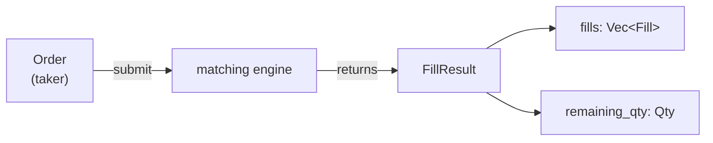

# Building OpenHL CLOB — L2 draft (EN) — build-along

> Drafted against openhl SHA `55a9dff` (Stage 8a — CLOB pure state machine).
> Course: `building-openhl-clob-en` (track: `reth-l1-architect`).

---

## L2 — `openhl-clob-types-records-en`

- **Module:** 1 (CLOB types), sortOrder 1 within module
- **Course-level sortOrder:** 1 (lesson 2 of 12)
- **Duration:** 20 min
- **XP reward:** 50
- **Type:** CONTENT

### Content

````markdown
# Lesson 2 — `Order`, `Fill`, `FillResult`

## Goal

Concepts you'll grasp in this lesson:

- **Self-contained messages cross module boundaries cleanly** — `Fill` carries both `maker_order_id` AND `maker_account` even though one could be derived from the other; this decouples Fill consumers (precompiles, payload assembly) from the engine's internal index.
- **Separating "fills" from "remainder" is a type-level decision** — `FillResult { fills, remaining_qty }` makes a submit's two distinct outputs explicit, instead of overloading `Vec<Fill>` with a phantom remainder entry.
- **Compute, don't cache, for derived totals** — `total_filled()` is a method, not a field; caching would force every fill-list mutation to keep a counter in sync, while computing on demand keeps `FillResult` a pure data record.
- **`Copy` reflects semantics, not convenience** — `Order` (5 small fields, ~48 bytes) is `Copy`; `FillResult` (owns a `Vec<Fill>`) is not. `Copy` only fits when `=` is one bit-blit.

Verification:

```bash
cargo check -p openhl-clob
```

…still compiles.

Specific changes:

You'll have **3 record types** in `crates/clob/src/types.rs`, built from L1's newtypes:

- **`Order`** — the input to the matching engine (id, account, side, qty, order_type).
- **`Fill`** — the output of a single match between a maker and a taker (maker_order_id, taker_order_id, maker_account, taker_account, price, qty).
- **`FillResult`** — the wrapper around a submit's return: `fills: Vec<Fill>` + `remaining_qty: Qty` + a `total_filled()` helper.

That completes the **type vocabulary**. L3+ uses these types to build the matching state machine.

## Recap

After L1, your `crates/clob/src/types.rs` has:

```rust
// L1 — field-level types
pub struct AccountId(pub u64);
pub struct OrderId(pub u64);
pub struct Price(pub u64);
pub struct Qty(pub u64);
pub enum Side { Buy, Sell }
pub enum OrderType { Limit { price: Price }, Market }
// + Display impls for OrderId, Price, Qty
```

About 65 lines. `cargo check -p openhl-clob` passes. **What's missing**: types that combine these — what does an order look like, what does a fill look like, what does the engine return after a submit. L2 fills exactly that gap.

## Plan

Three records to add, all to the same `types.rs`:

1. **`Order`** — 5 fields, all from L1's types. The matching engine takes one `Order` and returns one `FillResult`.
2. **`Fill`** — 6 fields naming maker + taker explicitly. **Both** maker_order_id AND maker_account are stored because the chain integration (course 8) needs the account to credit/debit balances.
3. **`FillResult`** — collects the fills plus the unmatched-and-not-rested remainder. Includes a `total_filled()` helper so callers can ask "how much got matched?" without iterating.

The three records relate like this:



`Order` is the engine's input; `FillResult` is the output, split into "what matched" (a list of `Fill`s) and "what didn't" (`remaining_qty`). This is the single dataflow one `submit_order` call produces inside the L4-L5 matching engine.

No new dependencies. No code changes outside `types.rs`. The lesson is ~35 lines of code.

> 🛑 **Predict.** Before scrolling: `Fill` carries **both** `maker_order_id` AND `maker_account`. Why duplicate? The maker's `OrderId` should be enough to look up the account, right? Hint: think about who consumes a `Fill`. The chain's `clob_place_order` precompile (course 8) credits a balance — it needs the account directly. Looking up `OrderId → AccountId` would require the precompile to hold a reference to the order book's internal index. **Carrying both fields in the Fill itself decouples consumers from the engine's internal state.** Same idea as message-passing vs. shared-state.

## Walk-through

### Step 1: Add `Order` below `OrderType`

Open `crates/clob/src/types.rs`. After the `OrderType` enum, before the `Display` impls, add:

```rust
/// A new order entering the book or arriving as a taker.
#[derive(Clone, Copy, Debug, PartialEq, Eq)]
pub struct Order {
    pub id: OrderId,
    pub account: AccountId,
    pub side: Side,
    pub qty: Qty,
    pub order_type: OrderType,
}
```

5 fields. **All `Copy`** — Order is 8 (OrderId) + 8 (AccountId) + 1 (Side) + 8 (Qty) + 16 (OrderType — discriminant + Price) = 41 bytes. With padding, around 48 bytes. Small enough to pass by value freely; we don't need `Box<Order>` or `&Order` in normal code.

> **Memory-layout note:** under Rust's default `#[repr(Rust)]`, the compiler reorders fields automatically to align them optimally and minimize padding. The declaration order above is for human readability — you don't have to sacrifice it to get the smallest size. Confirm with `std::mem::size_of::<Order>()`.

The field order is meaningful:
- **`id` first** — the most-used field (lookups, equality, debug).
- **`account`** — who placed it.
- **`side`** — Buy or Sell.
- **`qty`** — how much.
- **`order_type` last** — the most complex field (an enum), and the field that controls dispatch (Limit vs Market drives different matching logic in L4-L5).

> 🛑 **Anti-fluency.** "`order_type` is redundant — if `OrderType::Limit { price }` carries the price, why not just put `price: Price` on `Order` directly?" **Because Market orders don't have a price.** Putting `price: Price` on Order would force every Market order to carry a placeholder price, which then has to be ignored everywhere. The enum encodes "either there's a price, or there isn't" exactly once. **`Option<Price>` would also work but loses the "Market" tag** — `OrderType` is the right shape because the distinction has a *name*, not just a presence/absence.

### Step 2: Add `Fill`

Below `Order`:

```rust
/// A fill between a maker (resting order) and a taker (incoming order).
#[derive(Clone, Copy, Debug, PartialEq, Eq)]
pub struct Fill {
    pub maker_order_id: OrderId,
    pub taker_order_id: OrderId,
    pub maker_account: AccountId,
    pub taker_account: AccountId,
    pub price: Price,
    pub qty: Qty,
}
```

6 fields. The maker-vs-taker distinction is the most important concept in matching-engine code:

- **Maker** = the order that was already resting on the book. They "made" liquidity available; they get the better deal economically (usually a rebate on real exchanges).
- **Taker** = the incoming order that consumed liquidity. They paid the spread; on real exchanges, they pay the fee.

Each `Fill` represents one matched pair. A single taker order can produce **multiple Fills** if it crosses multiple maker price levels (e.g., a market buy that walks up the ask side, eating each resting ask in turn).

**Note `price` is the maker's price** — when a taker hits the book, it matches at the maker's resting price, not the taker's limit. Limit-buyer at $101 matching a resting limit-seller at $100 fills at $100 (maker's price); the buyer wins. This is "price-time priority" in action.

> 🛑 **Anti-fluency.** "Storing both account IDs feels redundant — every `Fill` could just look up account by `OrderId` at consumer time." **No — that requires the consumer to hold a reference to the book's `HashMap<OrderId, RestingOrder>` and to keep it alive after the book has moved on.** Fills are emitted at match time and consumed asynchronously (in our case, drained into a payload that's committed later). If the book has since cancelled the maker order, looking up `OrderId → AccountId` returns `None` and the consumer is stuck. **Self-contained Fills don't have that problem.**

### Step 3: Add `FillResult` + `total_filled()` helper

Below `Fill`:

```rust
/// Result of submitting a taker order.
///
/// `fills` is the list of matched fills, in order of execution. `remaining_qty`
/// is the leftover taker quantity that was *not* rested on the book (Market
/// orders discard their remainder; fully-filled Limit orders return zero).
/// A partially-filled Limit order that rested on the book also returns zero
/// here — the remainder is in the book, not in the return value.
#[derive(Clone, Debug, PartialEq, Eq)]
pub struct FillResult {
    pub fills: Vec<Fill>,
    pub remaining_qty: Qty,
}

impl FillResult {
    /// Total quantity matched across all fills.
    #[must_use]
    pub fn total_filled(&self) -> Qty {
        Qty(self.fills.iter().map(|f| f.qty.0).sum())
    }
}
```

**Note `FillResult` is NOT `Copy`** — it owns a `Vec<Fill>` which is heap-allocated. It's `Clone` for tests and debug paths, but the engine returns it by value (no clone needed on the happy path).

Three things in the doc comment that the L3+ code will rely on:

1. **`fills` is in order of execution**. If a market buy walks 3 ask levels, fills[0] is the cheapest match, fills[1] is the next, fills[2] is the most expensive. This ordering matters for replay determinism (L8's proptest will assert this).
2. **`remaining_qty` is for unrested taker quantity only**. A Market order with remainder 100 means 100 units couldn't be matched at any price (because the book ran out of liquidity). A Limit order with remainder 0 might still have an unfilled remainder — but that remainder is **now in the book** as a resting order, not in the return value.
3. **`total_filled` is a helper, not a stored field**. It's an O(N) sum over fills. We don't cache it because (a) `Vec::len()` is usually what callers really want when they just need "did anything fill?", and (b) the actual quantity total is only needed by tests/inspection code, where O(N) doesn't matter. On top of that, `Vec<Fill>` is contiguous memory — for small N (1-3 in practice) the iteration fits in a single CPU cache line and runs much faster than `O(N)` notation suggests. Mechanical sympathy says: caching buys little here.

> 🛑 **Anti-fluency.** "Why isn't `remaining_qty` part of the per-fill data instead of a separate field?" **Because there's at most one remainder per submit, and it's not associated with any fill** — it's the *unfilled* part. Putting it in `Fill` would either force every fill to carry a meaningless 0 or require a "phantom fill" entry just to hold it. Keeping it separate on `FillResult` is the right shape.

### Step 4: Confirm `lib.rs` still re-exports everything

You wrote `pub use types::*;` in L1's `lib.rs`. That `*` automatically picks up the 3 new types you just added — no edit needed. Verify by quickly checking:

```rust
// crates/clob/src/lib.rs (no change needed)
pub mod types;
pub use types::*;
```

If your `lib.rs` has individual re-exports like `pub use types::{AccountId, OrderId, ...};`, you'd need to add the 3 new types. **But `*` is what L1 set up, so you don't.**

## Test

```bash
cargo check -p openhl-clob
```

Still compiles. Output is the same as L1 (no new warnings or errors, just slightly more code being checked).

You can also do a quick sanity test that the types are visible from another crate, e.g., from a future `crates/evm/Cargo.toml` perspective. We don't add a dep yet (that's L9), but you can prove the types are public:

```bash
cargo doc -p openhl-clob --no-deps --open
```

Browse the rendered docs. You should see `Order`, `Fill`, `FillResult` listed under "Structs" alongside `AccountId`/`OrderId`/`Price`/`Qty`. `total_filled` should appear under `FillResult`'s methods.

Common errors and fixes:

- **`error[E0277]: 'FillResult' doesn't implement 'Copy'`** — you tried to `#[derive(Copy)]` on `FillResult`. **It can't be Copy** because of the inner `Vec<Fill>`. Remove `Copy` from its derive; leave `Clone`.
- **`error[E0599]: no method named 'total_filled' for ...`** — you wrote the helper outside `impl FillResult { ... }`. The function needs to be inside an impl block.
- **`warning: field 'X' is never read`** — you wrote a field but no test/usage references it. **Ignore for now** — L3+ will use everything. The matching engine has no consumers yet.

## Design reflection

Three load-bearing decisions encoded here:

1. **`Fill` is self-contained.** Both maker_order_id AND maker_account are stored, even though one could be derived from the other given the order book's internal index. This decouples Fill consumers (precompiles, payload assembly, chain integration) from the engine's internal data structures. **Self-contained messages are easier to pass across module boundaries than references back to live state.**

2. **`FillResult` separates "fills" from "remainder."** A submit produces zero-or-more fills AND zero-or-one remainder. Modeling them as a single `Vec<Fill>` would force a "phantom fill" for the remainder, or special-case logic to detect it. The two-field record makes the types do the work.

3. **`total_filled()` is computed, not cached.** Caching would force every fill-list mutation to update a counter — error-prone. Computing on demand keeps `FillResult` a pure data record with no derived state. The O(N) cost is negligible because N is typically 1-3 (single fills are most common; a market order eating 10 levels is unusual).

## Answer key

```bash
cd ~/code/openhl-reference
git checkout 55a9dff
diff -u ~/code/my-openhl/crates/clob/src/types.rs ./crates/clob/src/types.rs
```

After L2, your types.rs is approximately the full ~109 lines of the reference. The only diff should be doc-comment wording / whitespace. **L1 + L2 together = complete types.rs**.

Return:

```bash
git checkout main
```

## Common questions

**Q: Why is `Order` `Copy` but `FillResult` isn't?**
`Order` has 5 fields, all `Copy` (newtypes over `u64` + small enums). Total ~48 bytes — cheap to memcpy. `FillResult` owns a `Vec<Fill>`, which is heap-allocated; copying it would require allocator calls. `Copy` is only for types where `=` is a single bit-blit. The trait reflects that semantic.

**Q: Why does `Fill` have `qty: Qty` instead of just a `u64`?**
Consistency with the rest of the engine. All quantities are `Qty`-typed; mixing `u64` here would force conversions at the boundary (and risk forgetting them). The newtype discipline is per-engine, not per-struct.

**Q: Could `FillResult` use `Box<[Fill]>` instead of `Vec<Fill>`?**
Yes, slightly more memory-efficient for the "no more pushes" case. But `Vec<Fill>` is what `submit_order` builds incrementally (push on each match); converting to `Box<[Fill]>` at the end would be one extra allocation. Until profiling shows it matters, `Vec` is the simpler choice.

**Q: What if a fill's `qty` is 0? Is that a valid Fill?**
No — the matching engine in L4-L5 will never produce a zero-qty Fill (it would mean "we matched 0 units," which is just "we didn't match"). The type system doesn't enforce this; the engine's invariants do. Tests in L7-L8 will catch any regression.

## Next lesson (L3)

The type vocabulary is complete. L3 introduces the **matching state machine** — the `Book` struct that holds resting bid/ask orders, plus the helper methods (`best_bid`, `best_ask`, accessors for inspecting the book). No `submit` logic yet (that's L4); just the data structure and the `Reverse<Price>` trick for walking bids in highest-first order.
````

---

## Seed-file slot

L2 lands in Module 1 (CLOB types) at sortOrder 1:

```typescript
{
  title: 'Lesson 2 — Order, Fill, FillResult',
  slug: 'openhl-clob-types-records-en',
  type: 'CONTENT',
  sortOrder: 1,
  duration: 20,
  xpReward: 50,
  content: `# Lesson 2 — \`Order\`, \`Fill\`, \`FillResult\`\n\n...`
},
```

## SHA pinning discipline

Same as L1 — `55a9dff` (Stage 8a). After L2, the reader's `types.rs` is approximately equivalent to the reference at this SHA.

## Style review notes (self-critique before paste)

- **§Plan's Predict callout** about why `Fill` duplicates the maker account is the conceptually important question — it teaches the message-passing-vs-shared-state lesson before introducing the engine logic where the trade-off matters.
- **3 anti-fluency callouts** — (a) why `order_type` not `price: Price` directly on Order, (b) why store both account IDs on Fill, (c) why `remaining_qty` separate from Fill.
- **Step 3's three doc-comment annotations** (ordering, semantics of remainder, why total_filled is a method) preempt the questions that would come up when reading L4-L5.
- **§Common questions's "what about zero-qty fills"** is the kind of edge case that's natural to wonder about; answering "the engine's invariants prevent it" is more honest than "the type system enforces it."
